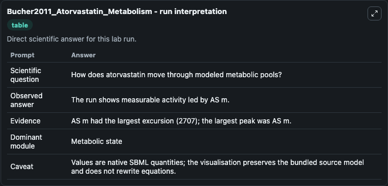
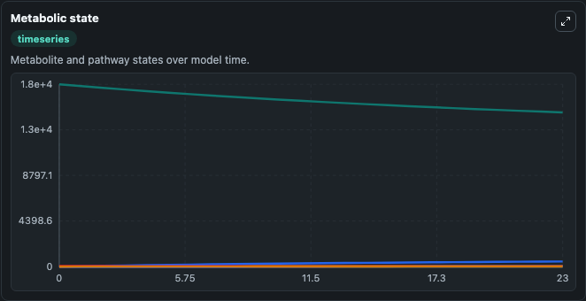
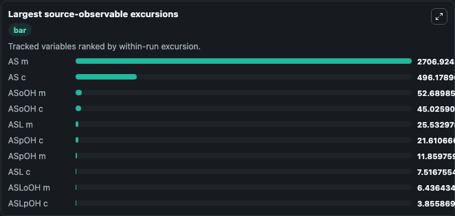
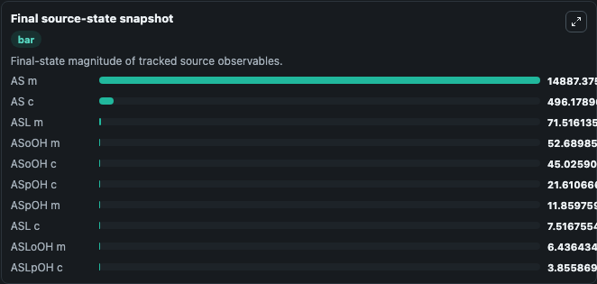

# Bucher2011_Atorvastatin_Metabolism

This Biosimulant lab wraps `Bucher2011_Atorvastatin_Metabolism` as a runnable pharmacology model with a companion visualization module.
This is the model of atorvastatin metabolism in hepaitc cells described in the article: A systems biology approach to dynamic modeling and inter-subject variability of statin pharmacokinetics in human. It can be used to explore drug-exposure and pathway-response dynamics and compare scenario outcomes across configurations.

## What You'll See

The lab asks: Does CYP3A4/UGT/PON balance favor parent atorvastatin, lactone, or hydroxy metabolites? It runs for 24.0 time units with a communication step of 1.0. The run uses the model defaults declared by the curated SBML wrapper. The generated visualizations focus on Mitochondrial Atorvastatin Acid, Mitochondrial Atorvastatin Lactone, Mitochondrial Para Hydroxy Atorvastatin, Mitochondrial Ortho Hydroxy Atorvastatin, Cytosolic Atorvastatin Acid, and Cytosolic Atorvastatin Lactone, combining trajectory, endpoint-comparison, and summary-table views from one completed dark-mode run.

In this captured run, **AS m** peaked at **1.76e+04** and **AS m** moved by **2707.0** native units across 24.0 simulation windows.

<!-- BIOSIMULANT_VISUALS_START -->
### Output Visualizations



*Summary table for Bucher2011_Atorvastatin_Metabolism, reporting the scientific question, observed answer (largest change: **AS m** at **2707.0** native units), evidence (peak observable: **AS m**), dominant module, and caveat.*



*Trajectories of AS m, AS c, ASoOH m, ASoOH c, ASL m, and ASpOH c across the 24.0 simulation. In this run **AS c** climbed from 0 to 496.2 and **AS m** fell from 1.76e+04 to 1.49e+04 — the largest movements among the focused observables.*



*Largest-excursion ranking of the focused observables — the absolute movement magnitude during the run. Top 3: **AS m** = 2706.9, **AS c** = 496.2, **ASoOH m** = 52.690, with 7 more observables below.*



*Endpoint snapshot of the focused observables — final values from the captured run. Top 3 by value: **AS m** = 1.49e+04, **AS c** = 496.2, **ASL m** = 71.516, with 7 more observables below.*

<!-- BIOSIMULANT_VISUALS_END -->

## Model Context

- Core model: `models/core`
- Visualization model: `models/visualisation`
- Standard: `sbml`
- Upstream source: `biomodels_ebi:BIOMD0000000328`
- License: `CC0`

## Inputs

| Input | Maps To | Default | Notes |
|---|---|---|---|
| CYP3A4 Para Hydroxylation Capacity | `pharmacology_sbml_bucher2011_atorvastatin_metabolism_biomd0000000328_model.cyp3a4_para_hydroxylation_capacity` |  | Uses the model default unless overridden at run time. |
| CYP3A4 Ortho Hydroxylation Capacity | `pharmacology_sbml_bucher2011_atorvastatin_metabolism_biomd0000000328_model.cyp3a4_ortho_hydroxylation_capacity` |  | Uses the model default unless overridden at run time. |
| UGT1A3 Lactonization Capacity | `pharmacology_sbml_bucher2011_atorvastatin_metabolism_biomd0000000328_model.ugt1a3_lactonization_capacity` |  | Uses the model default unless overridden at run time. |
| Pon Lactone Hydrolysis Rate | `pharmacology_sbml_bucher2011_atorvastatin_metabolism_biomd0000000328_model.pon_lactone_hydrolysis_rate` |  | Uses the model default unless overridden at run time. |

## Outputs

| Output | Maps To | Role |
|---|---|---|
| `state` | `pharmacology_sbml_bucher2011_atorvastatin_metabolism_biomd0000000328_model.state` | Available to the visualization model and downstream workflows. |
| `summary` | `pharmacology_sbml_bucher2011_atorvastatin_metabolism_biomd0000000328_model.summary` | Available to the visualization model and downstream workflows. |
| `species_labels` | `pharmacology_sbml_bucher2011_atorvastatin_metabolism_biomd0000000328_model.species_labels` | Available to the visualization model and downstream workflows. |
| `mitochondrial_atorvastatin_acid` | `pharmacology_sbml_bucher2011_atorvastatin_metabolism_biomd0000000328_model.mitochondrial_atorvastatin_acid` | Available to the visualization model and downstream workflows. |
| `mitochondrial_atorvastatin_lactone` | `pharmacology_sbml_bucher2011_atorvastatin_metabolism_biomd0000000328_model.mitochondrial_atorvastatin_lactone` | Available to the visualization model and downstream workflows. |
| `mitochondrial_para_hydroxy_atorvastatin` | `pharmacology_sbml_bucher2011_atorvastatin_metabolism_biomd0000000328_model.mitochondrial_para_hydroxy_atorvastatin` | Available to the visualization model and downstream workflows. |
| `mitochondrial_ortho_hydroxy_atorvastatin` | `pharmacology_sbml_bucher2011_atorvastatin_metabolism_biomd0000000328_model.mitochondrial_ortho_hydroxy_atorvastatin` | Available to the visualization model and downstream workflows. |
| `cytosolic_atorvastatin_acid` | `pharmacology_sbml_bucher2011_atorvastatin_metabolism_biomd0000000328_model.cytosolic_atorvastatin_acid` | Available to the visualization model and downstream workflows. |
| `cytosolic_atorvastatin_lactone` | `pharmacology_sbml_bucher2011_atorvastatin_metabolism_biomd0000000328_model.cytosolic_atorvastatin_lactone` | Available to the visualization model and downstream workflows. |

## Runtime

- Duration: `24.0`
- Communication step: `1.0`

## Running Locally

```bash
biosimulant labs serve .
```
