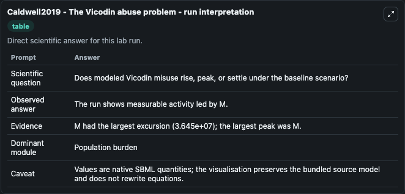
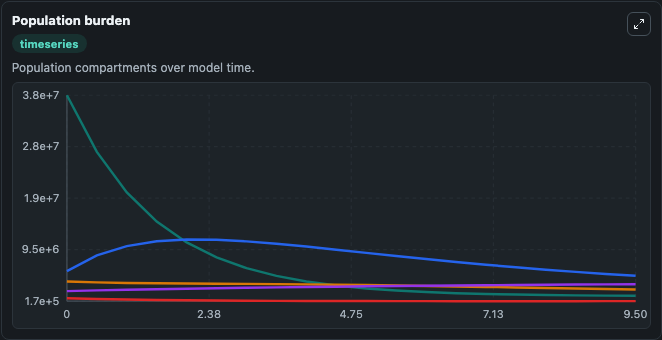
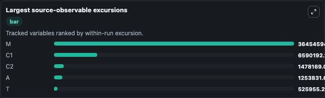
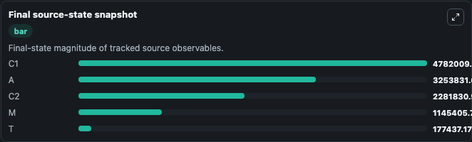

# Caldwell2019 - The Vicodin abuse problem

This Biosimulant lab wraps `Caldwell2019 - The Vicodin abuse problem` as a runnable pharmacology model with a companion visualization module.
This is a mathematical model of Vicodin use and abuse used to investigate methods of combating Vicodin abuse in a population of patients who have obtained the drug through prescription. It can be used to explore drug-exposure and pathway-response dynamics and compare scenario outcomes across configurations.

## What You'll See

The lab asks: Does the modeled population shift from medical use toward chronic use, abuse, or treatment? It runs for 10.0 time units with a communication step of 0.5. The run uses the model defaults declared by the curated SBML wrapper. The generated visualizations focus on Medical Vicodin Population, Early Chronic Vicodin Population, Late Chronic Vicodin Population, Vicodin Abuse Population, and Vicodin Treatment Population, combining trajectory, endpoint-comparison, and summary-table views from one completed dark-mode run.

In this captured run, **M** peaked at **3.76e+07** and **M** moved by **3.64e+07** native units across 10.0 simulation windows.

<!-- BIOSIMULANT_VISUALS_START -->
### Output Visualizations



*Summary table for Caldwell2019 - The Vicodin abuse problem, reporting the scientific question, observed answer (largest change: **M** at **3.64e+07** native units), evidence (peak observable: **M**), dominant module, and caveat.*



*Trajectories of M, C1, C2, A, and T across the 10.0 simulation. In this run **A** climbed from 2e+06 to 3.25e+06 and **M** fell from 3.76e+07 to 1.15e+06 — the largest movements among the focused observables.*



*Largest-excursion ranking of the focused observables — the absolute movement magnitude during the run. Top 3: **M** = 3.65e+07, **C1** = 6.59e+06, **C2** = 1.48e+06, with 2 more observables below.*



*Endpoint snapshot of the focused observables — final values from the captured run. Top 3 by value: **C1** = 4.78e+06, **A** = 3.25e+06, **C2** = 2.28e+06, with 2 more observables below.*

<!-- BIOSIMULANT_VISUALS_END -->

## Model Context

- Core model: `models/core`
- Visualization model: `models/visualisation`
- Standard: `sbml`
- Upstream source: `biomodels_ebi:BIOMD0000000840`
- License: `CC0`

## Inputs

| Input | Maps To | Default | Notes |
|---|---|---|---|
| Initial Medical Vicodin Population | `pharmacology_sbml_caldwell2019_the_vicodin_abuse_problem_biomd0000000840_model.initial_medical_vicodin_population` |  | Uses the model default unless overridden at run time. |
| Initial Early Chronic Vicodin Population | `pharmacology_sbml_caldwell2019_the_vicodin_abuse_problem_biomd0000000840_model.initial_early_chronic_vicodin_population` |  | Uses the model default unless overridden at run time. |
| Initial Late Chronic Vicodin Population | `pharmacology_sbml_caldwell2019_the_vicodin_abuse_problem_biomd0000000840_model.initial_late_chronic_vicodin_population` |  | Uses the model default unless overridden at run time. |
| Initial Vicodin Abuse Population | `pharmacology_sbml_caldwell2019_the_vicodin_abuse_problem_biomd0000000840_model.initial_vicodin_abuse_population` |  | Uses the model default unless overridden at run time. |
| Initial Vicodin Treatment Population | `pharmacology_sbml_caldwell2019_the_vicodin_abuse_problem_biomd0000000840_model.initial_vicodin_treatment_population` |  | Uses the model default unless overridden at run time. |

## Outputs

| Output | Maps To | Role |
|---|---|---|
| `state` | `pharmacology_sbml_caldwell2019_the_vicodin_abuse_problem_biomd0000000840_model.state` | Available to the visualization model and downstream workflows. |
| `summary` | `pharmacology_sbml_caldwell2019_the_vicodin_abuse_problem_biomd0000000840_model.summary` | Available to the visualization model and downstream workflows. |
| `species_labels` | `pharmacology_sbml_caldwell2019_the_vicodin_abuse_problem_biomd0000000840_model.species_labels` | Available to the visualization model and downstream workflows. |
| `medical_vicodin_population` | `pharmacology_sbml_caldwell2019_the_vicodin_abuse_problem_biomd0000000840_model.medical_vicodin_population` | Available to the visualization model and downstream workflows. |
| `early_chronic_vicodin_population` | `pharmacology_sbml_caldwell2019_the_vicodin_abuse_problem_biomd0000000840_model.early_chronic_vicodin_population` | Available to the visualization model and downstream workflows. |
| `late_chronic_vicodin_population` | `pharmacology_sbml_caldwell2019_the_vicodin_abuse_problem_biomd0000000840_model.late_chronic_vicodin_population` | Available to the visualization model and downstream workflows. |
| `vicodin_abuse_population` | `pharmacology_sbml_caldwell2019_the_vicodin_abuse_problem_biomd0000000840_model.vicodin_abuse_population` | Available to the visualization model and downstream workflows. |
| `vicodin_treatment_population` | `pharmacology_sbml_caldwell2019_the_vicodin_abuse_problem_biomd0000000840_model.vicodin_treatment_population` | Available to the visualization model and downstream workflows. |

## Runtime

- Duration: `10.0`
- Communication step: `0.5`

## Running Locally

```bash
biosimulant labs serve .
```
