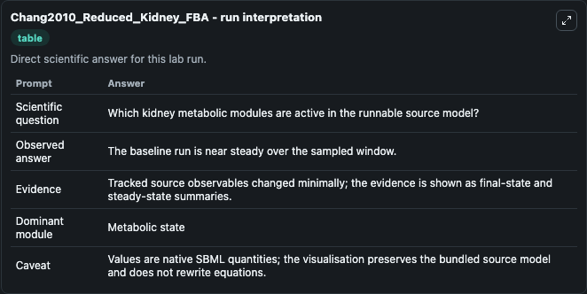
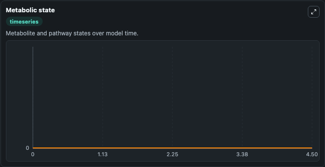

# Chang2010_Reduced_Kidney_FBA

This Biosimulant lab wraps `Chang2010_Reduced_Kidney_FBA` as a runnable pharmacology model with a companion visualization module.
This is the reduced kidney metabolic network described in the article Drug off-target effects predicted using structural analysis in the context of a metabolic network model. It can be used to explore drug-exposure and pathway-response dynamics and compare scenario outcomes across configurations.

## What You'll See

The lab asks: Which kidney metabolic pools move most under the selected initial metabolic state? It runs for 5.0 time units with a communication step of 0.5. The run uses the model defaults declared by the curated SBML wrapper. The generated visualizations focus on Cytosolic ATP, Mitochondrial ATP, Cytosolic Glucose, Extracellular Glucose, Cytosolic Lactate, and Extracellular Lactate, and related outputs, combining trajectory, endpoint-comparison, and summary-table views from one completed dark-mode run.

In this captured run, **ATP** moved from 0 to 0 across 5.0 simulation windows.

<!-- BIOSIMULANT_VISUALS_START -->
### Output Visualizations



*Summary table for Chang2010_Reduced_Kidney_FBA, reporting the scientific question, observed answer, dominant module, and caveat.*



*Trajectories of ATP, ATP, D Glucose, D Glucose, D Glucose, and L Lactate across the 5.0 simulation. In this run ATP, ATP, D Glucose, D Glucose stayed near their initial values — no observable moved appreciably.*

<!-- BIOSIMULANT_VISUALS_END -->

## Model Context

- Core model: `models/core`
- Visualization model: `models/visualisation`
- Standard: `sbml`
- Upstream source: `biomodels_ebi:MODEL1011080004`
- License: `CC0`

## Inputs

| Input | Maps To | Default | Notes |
|---|---|---|---|
| Initial Cytosolic ATP | `pharmacology_sbml_chang2010_reduced_kidney_fba_model1011080004_model.initial_cytosolic_atp` |  | Uses the model default unless overridden at run time. |
| Initial Mitochondrial ATP | `pharmacology_sbml_chang2010_reduced_kidney_fba_model1011080004_model.initial_mitochondrial_atp` |  | Uses the model default unless overridden at run time. |
| Initial Extracellular Glucose | `pharmacology_sbml_chang2010_reduced_kidney_fba_model1011080004_model.initial_extracellular_glucose` |  | Uses the model default unless overridden at run time. |
| Initial Cytosolic Lactate | `pharmacology_sbml_chang2010_reduced_kidney_fba_model1011080004_model.initial_cytosolic_lactate` |  | Uses the model default unless overridden at run time. |

## Outputs

| Output | Maps To | Role |
|---|---|---|
| `state` | `pharmacology_sbml_chang2010_reduced_kidney_fba_model1011080004_model.state` | Available to the visualization model and downstream workflows. |
| `summary` | `pharmacology_sbml_chang2010_reduced_kidney_fba_model1011080004_model.summary` | Available to the visualization model and downstream workflows. |
| `species_labels` | `pharmacology_sbml_chang2010_reduced_kidney_fba_model1011080004_model.species_labels` | Available to the visualization model and downstream workflows. |
| `cytosolic_atp` | `pharmacology_sbml_chang2010_reduced_kidney_fba_model1011080004_model.cytosolic_atp` | Available to the visualization model and downstream workflows. |
| `mitochondrial_atp` | `pharmacology_sbml_chang2010_reduced_kidney_fba_model1011080004_model.mitochondrial_atp` | Available to the visualization model and downstream workflows. |
| `cytosolic_glucose` | `pharmacology_sbml_chang2010_reduced_kidney_fba_model1011080004_model.cytosolic_glucose` | Available to the visualization model and downstream workflows. |
| `extracellular_glucose` | `pharmacology_sbml_chang2010_reduced_kidney_fba_model1011080004_model.extracellular_glucose` | Available to the visualization model and downstream workflows. |
| `cytosolic_lactate` | `pharmacology_sbml_chang2010_reduced_kidney_fba_model1011080004_model.cytosolic_lactate` | Available to the visualization model and downstream workflows. |
| `extracellular_lactate` | `pharmacology_sbml_chang2010_reduced_kidney_fba_model1011080004_model.extracellular_lactate` | Available to the visualization model and downstream workflows. |
| `cytosolic_urea` | `pharmacology_sbml_chang2010_reduced_kidney_fba_model1011080004_model.cytosolic_urea` | Available to the visualization model and downstream workflows. |

## Runtime

- Duration: `5.0`
- Communication step: `0.5`

## Running Locally

```bash
biosimulant labs serve .
```
