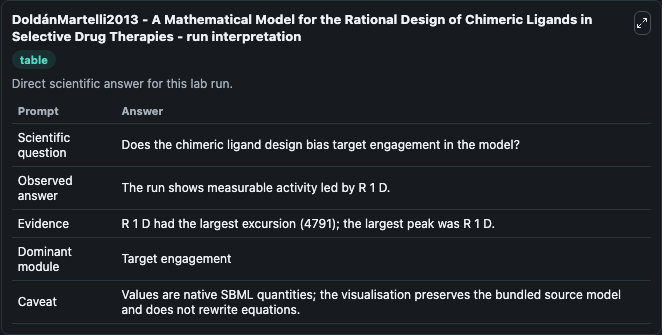
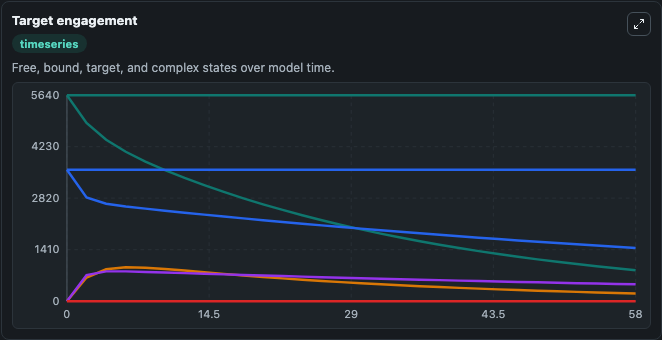
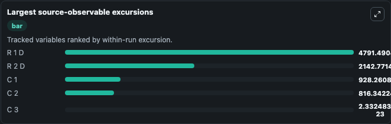
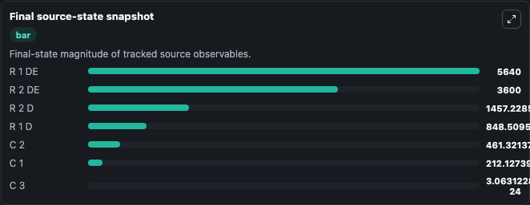

# DoldánMartelli2013 - A Mathematical Model for the Rational Design of Chimeric Ligands in Selective Drug Therapies

This Biosimulant lab wraps `DoldánMartelli2013 - A Mathematical Model for the Rational Design of Chimeric Ligands in Selective Drug Therapies` as a runnable pharmacology model with a companion visualization module.
This model attempts to provide a mathematical framework for describing the dynamics of receptor-drug complex formation of chimeric drugs. It can be used to explore drug-exposure and pathway-response dynamics and compare scenario outcomes across configurations.

## What You'll See

The lab asks: Does the chimeric ligand preferentially engage target 1 or target 2? It runs for 60.0 time units with a communication step of 2.0. The run uses the model defaults declared by the curated SBML wrapper. The generated visualizations focus on Target 1 Drug Complex, Target 2 Drug Complex, Target 1 Drug Effector Complex, Target 2 Drug Effector Complex, Selectivity Complex 1, and Selectivity Complex 2, and related outputs, combining trajectory, endpoint-comparison, and summary-table views from one completed dark-mode run.

In this captured run, **R 1 D** peaked at **5640.0** and **R 1 D** moved by **4791.0** native units across 60.0 simulation windows.

<!-- BIOSIMULANT_VISUALS_START -->
### Output Visualizations



*Summary table for DoldánMartelli2013 - A Mathematical Model for the Rational Design of Chimeric Ligands in Selective Drug Therapies, reporting the scientific question, observed answer (largest change: **R 1 D** at **4791.0** native units), evidence (peak observable: **R 1 D**), dominant module, and caveat.*



*Trajectories of R 1 D, R 2 D, C 1, C 2, C 3, and R 1 DE across the 60.0 simulation. In this run **C 2** climbed from 0 to 461.3 and **R 1 D** fell from 5640.0 to 848.5 — the largest movements among the focused observables.*



*Largest-excursion ranking of the focused observables — the absolute movement magnitude during the run. Top 3: **R 1 D** = 4791.5, **R 2 D** = 2142.8, **C 1** = 928.3, with 2 more observables below.*



*Endpoint snapshot of the focused observables — final values from the captured run. Top 3 by value: **R 1 DE** = 5640.0, **R 2 DE** = 3600.0, **R 2 D** = 1457.2, with 4 more observables below.*

<!-- BIOSIMULANT_VISUALS_END -->

## Model Context

- Core model: `models/core`
- Visualization model: `models/visualisation`
- Standard: `sbml`
- Upstream source: `biomodels_ebi:MODEL1907310001`
- License: `CC0`

## Inputs

| Input | Maps To | Default | Notes |
|---|---|---|---|
| Ligand Concentration | `pharmacology_sbml_dold_nmartelli2013_a_mathematical_model_for_the_model1907310001_model.ligand_concentration` |  | Uses the model default unless overridden at run time. |
| Target 1 Association Rate | `pharmacology_sbml_dold_nmartelli2013_a_mathematical_model_for_the_model1907310001_model.target_1_association_rate` |  | Uses the model default unless overridden at run time. |
| Target 1 Dissociation Rate | `pharmacology_sbml_dold_nmartelli2013_a_mathematical_model_for_the_model1907310001_model.target_1_dissociation_rate` |  | Uses the model default unless overridden at run time. |
| Target 2 Association Rate | `pharmacology_sbml_dold_nmartelli2013_a_mathematical_model_for_the_model1907310001_model.target_2_association_rate` |  | Uses the model default unless overridden at run time. |
| Target 2 Dissociation Rate | `pharmacology_sbml_dold_nmartelli2013_a_mathematical_model_for_the_model1907310001_model.target_2_dissociation_rate` |  | Uses the model default unless overridden at run time. |

## Outputs

| Output | Maps To | Role |
|---|---|---|
| `state` | `pharmacology_sbml_dold_nmartelli2013_a_mathematical_model_for_the_model1907310001_model.state` | Available to the visualization model and downstream workflows. |
| `summary` | `pharmacology_sbml_dold_nmartelli2013_a_mathematical_model_for_the_model1907310001_model.summary` | Available to the visualization model and downstream workflows. |
| `species_labels` | `pharmacology_sbml_dold_nmartelli2013_a_mathematical_model_for_the_model1907310001_model.species_labels` | Available to the visualization model and downstream workflows. |
| `target_1_drug_complex` | `pharmacology_sbml_dold_nmartelli2013_a_mathematical_model_for_the_model1907310001_model.target_1_drug_complex` | Available to the visualization model and downstream workflows. |
| `target_2_drug_complex` | `pharmacology_sbml_dold_nmartelli2013_a_mathematical_model_for_the_model1907310001_model.target_2_drug_complex` | Available to the visualization model and downstream workflows. |
| `target_1_drug_effector_complex` | `pharmacology_sbml_dold_nmartelli2013_a_mathematical_model_for_the_model1907310001_model.target_1_drug_effector_complex` | Available to the visualization model and downstream workflows. |
| `target_2_drug_effector_complex` | `pharmacology_sbml_dold_nmartelli2013_a_mathematical_model_for_the_model1907310001_model.target_2_drug_effector_complex` | Available to the visualization model and downstream workflows. |
| `selectivity_complex_1` | `pharmacology_sbml_dold_nmartelli2013_a_mathematical_model_for_the_model1907310001_model.selectivity_complex_1` | Available to the visualization model and downstream workflows. |
| `selectivity_complex_2` | `pharmacology_sbml_dold_nmartelli2013_a_mathematical_model_for_the_model1907310001_model.selectivity_complex_2` | Available to the visualization model and downstream workflows. |
| `selectivity_complex_3` | `pharmacology_sbml_dold_nmartelli2013_a_mathematical_model_for_the_model1907310001_model.selectivity_complex_3` | Available to the visualization model and downstream workflows. |

## Runtime

- Duration: `60.0`
- Communication step: `2.0`

## Running Locally

```bash
biosimulant labs serve .
```
