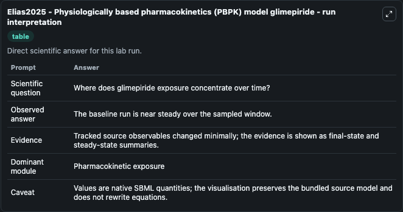
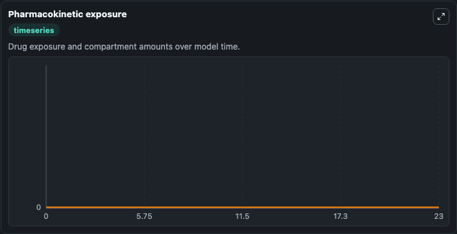

# Elias2025 - Physiologically based pharmacokinetics (PBPK) model glimepiride

This Biosimulant lab wraps `Elias2025 - Physiologically based pharmacokinetics (PBPK) model glimepiride` as a runnable pharmacology model with a companion visualization module.
Pharmacology Elias2025Physiologically Based Pharmacokinetics Model2510140001Model models core biological dynamics as a OTHER simulation curated from biomodels_ebi (biomodels_ebi:MODEL2510140001), focused on pha. It can be used to explore drug-exposure and pathway-response dynamics and compare scenario outcomes across configurations.

## What You'll See

The lab asks: How do dose, absorption, and CYP2C9 activity shape glimepiride/metabolite exposure? It runs for 24.0 time units with a communication step of 1.0. The run uses the model defaults declared by the curated SBML wrapper. The generated visualizations focus on Glimepiride Liver Plasma, Glimepiride Arterial Plasma, Glimepiride Venous Plasma, Glimepiride Kidney Plasma, Glimepiride Gut Plasma, and M1 Liver Plasma, and related outputs, combining trajectory, endpoint-comparison, and summary-table views from one completed dark-mode run.

In this captured run, **glimepiride (liver plasma)** moved from 0 to 0 across 24.0 simulation windows.

<!-- BIOSIMULANT_VISUALS_START -->
### Output Visualizations



*Summary table for Elias2025 - Physiologically based pharmacokinetics (PBPK) model glimepiride, reporting the scientific question, observed answer, dominant module, and caveat.*



*Trajectories of glimepiride (liver plasma), glimepiride (arterial blood plasma), glimepiride (venous blood plasma), glimepiride (kidney plasma), glimepiride (gut plasma), and M1 (liver plasma) across the 24.0 simulation. In this run glimepiride (liver plasma), glimepiride (arterial blood plasma), glimepiride (venous blood plasma), glimepiride (kidney plasma) stayed near their initial values — no observable moved appreciably.*

<!-- BIOSIMULANT_VISUALS_END -->

## Model Context

- Core model: `models/core`
- Visualization model: `models/visualisation`
- Standard: `sbml`
- Upstream source: `biomodels_ebi:MODEL2510140001`
- License: `CC0`

## Inputs

| Input | Maps To | Default | Notes |
|---|---|---|---|
| Oral Glimepiride Dose Mg | `pharmacology_sbml_elias2025_physiologically_based_pharmacokinetics_model2510140001_model.oral_glimepiride_dose_mg` |  | Uses the model default unless overridden at run time. |
| IV Glimepiride Bolus Mg | `pharmacology_sbml_elias2025_physiologically_based_pharmacokinetics_model2510140001_model.iv_glimepiride_bolus_mg` |  | Uses the model default unless overridden at run time. |
| Glimepiride Infusion Rate Mg Per Min | `pharmacology_sbml_elias2025_physiologically_based_pharmacokinetics_model2510140001_model.glimepiride_infusion_rate_mg_per_min` |  | Uses the model default unless overridden at run time. |
| CYP2C9 Activity Scale | `pharmacology_sbml_elias2025_physiologically_based_pharmacokinetics_model2510140001_model.cyp2c9_activity_scale` |  | Uses the model default unless overridden at run time. |
| Intestinal Absorption Scale | `pharmacology_sbml_elias2025_physiologically_based_pharmacokinetics_model2510140001_model.intestinal_absorption_scale` |  | Uses the model default unless overridden at run time. |

## Outputs

| Output | Maps To | Role |
|---|---|---|
| `state` | `pharmacology_sbml_elias2025_physiologically_based_pharmacokinetics_model2510140001_model.state` | Available to the visualization model and downstream workflows. |
| `summary` | `pharmacology_sbml_elias2025_physiologically_based_pharmacokinetics_model2510140001_model.summary` | Available to the visualization model and downstream workflows. |
| `species_labels` | `pharmacology_sbml_elias2025_physiologically_based_pharmacokinetics_model2510140001_model.species_labels` | Available to the visualization model and downstream workflows. |
| `glimepiride_liver_plasma` | `pharmacology_sbml_elias2025_physiologically_based_pharmacokinetics_model2510140001_model.glimepiride_liver_plasma` | Available to the visualization model and downstream workflows. |
| `glimepiride_arterial_plasma` | `pharmacology_sbml_elias2025_physiologically_based_pharmacokinetics_model2510140001_model.glimepiride_arterial_plasma` | Available to the visualization model and downstream workflows. |
| `glimepiride_venous_plasma` | `pharmacology_sbml_elias2025_physiologically_based_pharmacokinetics_model2510140001_model.glimepiride_venous_plasma` | Available to the visualization model and downstream workflows. |
| `glimepiride_kidney_plasma` | `pharmacology_sbml_elias2025_physiologically_based_pharmacokinetics_model2510140001_model.glimepiride_kidney_plasma` | Available to the visualization model and downstream workflows. |
| `glimepiride_gut_plasma` | `pharmacology_sbml_elias2025_physiologically_based_pharmacokinetics_model2510140001_model.glimepiride_gut_plasma` | Available to the visualization model and downstream workflows. |
| `m1_liver_plasma` | `pharmacology_sbml_elias2025_physiologically_based_pharmacokinetics_model2510140001_model.m1_liver_plasma` | Available to the visualization model and downstream workflows. |
| `m1_arterial_plasma` | `pharmacology_sbml_elias2025_physiologically_based_pharmacokinetics_model2510140001_model.m1_arterial_plasma` | Available to the visualization model and downstream workflows. |
| `m1_venous_plasma` | `pharmacology_sbml_elias2025_physiologically_based_pharmacokinetics_model2510140001_model.m1_venous_plasma` | Available to the visualization model and downstream workflows. |

## Runtime

- Duration: `24.0`
- Communication step: `1.0`

## Running Locally

```bash
biosimulant labs serve .
```
