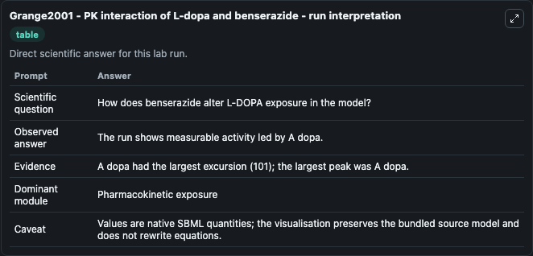
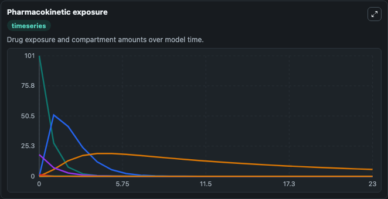
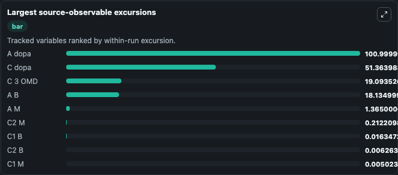
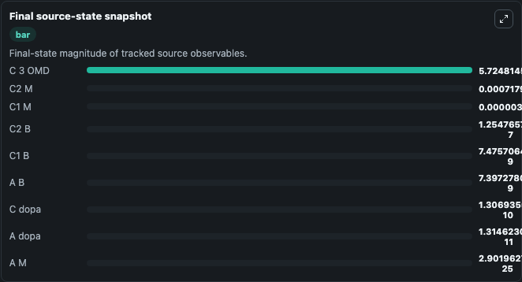

# Grange2001 - PK interaction of L-dopa and benserazide

This Biosimulant lab wraps `Grange2001 - PK interaction of L-dopa and benserazide` as a runnable pharmacology model with a companion visualization module.
Grange2001 - PK interaction of L-dopa and benserazide A pharmacokinetics of L-dopa in rats after administration of L-dopa alone (BIOMD0000000321) or L-dopa combined with a peripheral AADC (amino-acid-. It can be used to explore drug-exposure and pathway-response dynamics and compare scenario outcomes across configurations.

## What You'll See

The lab asks: How does benserazide coadministration alter L-DOPA exposure and metabolite formation? It runs for 24.0 time units with a communication step of 1.0. The run uses the model defaults declared by the curated SBML wrapper. The generated visualizations focus on L Dopa Amount, L Dopa Concentration, Benserazide Amount, Metabolite Amount, Three Omd Concentration, and Metabolite Compartment 1 Concentration, and related outputs, combining trajectory, endpoint-comparison, and summary-table views from one completed dark-mode run.

In this captured run, **A dopa** peaked at **101.0** and **A dopa** moved by **101.0** native units across 24.0 simulation windows.

<!-- BIOSIMULANT_VISUALS_START -->
### Output Visualizations



*Summary table for Grange2001 - PK interaction of L-dopa and benserazide, reporting the scientific question, observed answer (largest change: **A dopa** at **101.0** native units), evidence (peak observable: **A dopa**), dominant module, and caveat.*



*Trajectories of A dopa, C dopa, C 3 OMD, A B, A M, and C2 M across the 24.0 simulation. In this run **C 3 OMD** climbed from 0 to 5.725 and **A dopa** fell from 101.0 to 1.31e-11 — the largest movements among the focused observables.*



*Largest-excursion ranking of the focused observables — the absolute movement magnitude during the run. Top 3: **A dopa** = 101.0, **C dopa** = 51.364, **C 3 OMD** = 19.094, with 6 more observables below.*



*Endpoint snapshot of the focused observables — final values from the captured run. Top 3 by value: **C 3 OMD** = 5.725, **C2 M** = 0.000718, **C1 M** = 3.08e-06, with 6 more observables below.*

<!-- BIOSIMULANT_VISUALS_END -->

## Model Context

- Core model: `models/core`
- Visualization model: `models/visualisation`
- Standard: `sbml`
- Upstream source: `biomodels_ebi:BIOMD0000000320`
- License: `CC0`

## Inputs

| Input | Maps To | Default | Notes |
|---|---|---|---|
| L Dopa Dose Per Kg Rat | `pharmacology_sbml_grange2001_pk_interaction_of_l_dopa_and_benseraz_biomd0000000320_model.l_dopa_dose_per_kg_rat` |  | Uses the model default unless overridden at run time. |
| Benserazide Dose Per Kg Rat | `pharmacology_sbml_grange2001_pk_interaction_of_l_dopa_and_benseraz_biomd0000000320_model.benserazide_dose_per_kg_rat` |  | Uses the model default unless overridden at run time. |
| L Dopa Clearance Rate | `pharmacology_sbml_grange2001_pk_interaction_of_l_dopa_and_benseraz_biomd0000000320_model.l_dopa_clearance_rate` |  | Uses the model default unless overridden at run time. |
| Benserazide Clearance Rate | `pharmacology_sbml_grange2001_pk_interaction_of_l_dopa_and_benseraz_biomd0000000320_model.benserazide_clearance_rate` |  | Uses the model default unless overridden at run time. |

## Outputs

| Output | Maps To | Role |
|---|---|---|
| `state` | `pharmacology_sbml_grange2001_pk_interaction_of_l_dopa_and_benseraz_biomd0000000320_model.state` | Available to the visualization model and downstream workflows. |
| `summary` | `pharmacology_sbml_grange2001_pk_interaction_of_l_dopa_and_benseraz_biomd0000000320_model.summary` | Available to the visualization model and downstream workflows. |
| `species_labels` | `pharmacology_sbml_grange2001_pk_interaction_of_l_dopa_and_benseraz_biomd0000000320_model.species_labels` | Available to the visualization model and downstream workflows. |
| `l_dopa_amount` | `pharmacology_sbml_grange2001_pk_interaction_of_l_dopa_and_benseraz_biomd0000000320_model.l_dopa_amount` | Available to the visualization model and downstream workflows. |
| `l_dopa_concentration` | `pharmacology_sbml_grange2001_pk_interaction_of_l_dopa_and_benseraz_biomd0000000320_model.l_dopa_concentration` | Available to the visualization model and downstream workflows. |
| `benserazide_amount` | `pharmacology_sbml_grange2001_pk_interaction_of_l_dopa_and_benseraz_biomd0000000320_model.benserazide_amount` | Available to the visualization model and downstream workflows. |
| `metabolite_amount` | `pharmacology_sbml_grange2001_pk_interaction_of_l_dopa_and_benseraz_biomd0000000320_model.metabolite_amount` | Available to the visualization model and downstream workflows. |
| `three_omd_concentration` | `pharmacology_sbml_grange2001_pk_interaction_of_l_dopa_and_benseraz_biomd0000000320_model.three_omd_concentration` | Available to the visualization model and downstream workflows. |
| `metabolite_compartment_1_concentration` | `pharmacology_sbml_grange2001_pk_interaction_of_l_dopa_and_benseraz_biomd0000000320_model.metabolite_compartment_1_concentration` | Available to the visualization model and downstream workflows. |
| `benserazide_compartment_1_concentration` | `pharmacology_sbml_grange2001_pk_interaction_of_l_dopa_and_benseraz_biomd0000000320_model.benserazide_compartment_1_concentration` | Available to the visualization model and downstream workflows. |

## Runtime

- Duration: `24.0`
- Communication step: `1.0`

## Running Locally

```bash
biosimulant labs serve .
```
