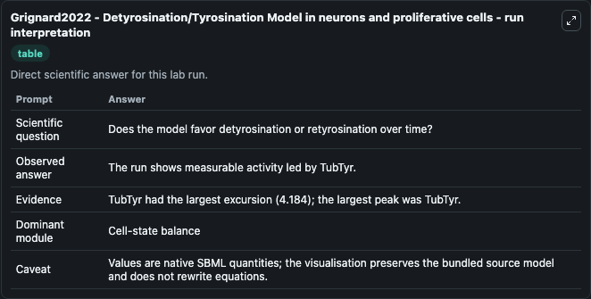
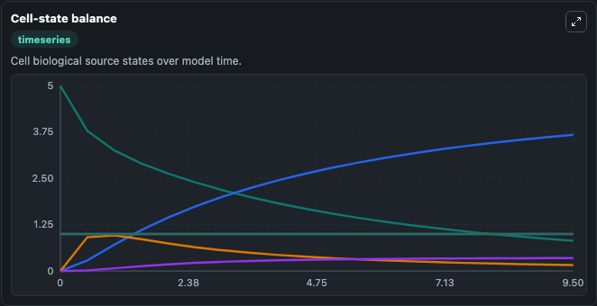
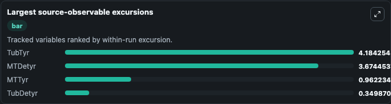
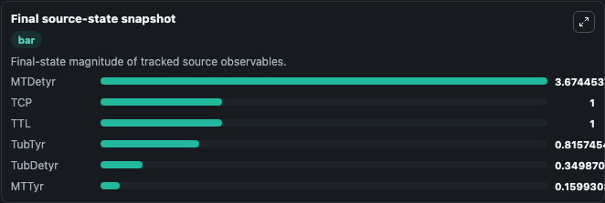

# Grignard2022 - Detyrosination/Tyrosination Model in neurons and proliferative cells

This Biosimulant lab wraps `Grignard2022 - Detyrosination/Tyrosination Model in neurons and proliferative cells` as a runnable pharmacology model with a companion visualization module.
SBML files for the mathematical model from the publication 'Mathematical modeling of the microtubule detyrosination/tyrosination cycle for cell-based drug screening design'. It can be used to explore drug-exposure and pathway-response dynamics and compare scenario outcomes across configurations.

## What You'll See

The lab asks: Does the model favor detyrosinated or tyrosinated tubulin under the selected enzyme state? It runs for 10.0 time units with a communication step of 0.5. The run uses the model defaults declared by the curated SBML wrapper. The generated visualizations focus on Detyrosinated Tubulin, Detyrosinated Microtubules, Tyrosinated Tubulin, Tyrosinated Microtubules, Tcp Enzyme Pool, and Ttl Enzyme Pool, combining trajectory, endpoint-comparison, and summary-table views from one completed dark-mode run.

In this captured run, **TubTyr** peaked at **5.000** and **TubTyr** moved by **4.184** native units across 10.0 simulation windows.

<!-- BIOSIMULANT_VISUALS_START -->
### Output Visualizations



*Summary table for Grignard2022 - Detyrosination/Tyrosination Model in neurons and proliferative cells, reporting the scientific question, observed answer (largest change: **TubTyr** at **4.184** native units), evidence (peak observable: **TubTyr**), dominant module, and caveat.*



*Trajectories of TubTyr, MTDetyr, MTTyr, TubDetyr, TCP, and TTL across the 10.0 simulation. In this run **MTDetyr** climbed from 0 to 3.674 and **TubTyr** fell from 5.000 to 0.8157 — the largest movements among the focused observables.*



*Largest-excursion ranking of the focused observables — the absolute movement magnitude during the run. Top 3: **TubTyr** = 4.184, **MTDetyr** = 3.674, **MTTyr** = 0.9622, with 1 more observable below.*



*Endpoint snapshot of the focused observables — final values from the captured run. Top 3 by value: **MTDetyr** = 3.674, **TCP** = 1.000, **TTL** = 1.000, with 3 more observables below.*

<!-- BIOSIMULANT_VISUALS_END -->

## Model Context

- Core model: `models/core`
- Visualization model: `models/visualisation`
- Standard: `sbml`
- Upstream source: `biomodels_ebi:MODEL2209260001`
- License: `CC0`

## Inputs

| Input | Maps To | Default | Notes |
|---|---|---|---|
| Initial Detyrosinated Tubulin | `pharmacology_sbml_grignard2022_detyrosination_tyrosination_model_i_model2209260001_model.initial_detyrosinated_tubulin` |  | Uses the model default unless overridden at run time. |
| Initial Tyrosinated Tubulin | `pharmacology_sbml_grignard2022_detyrosination_tyrosination_model_i_model2209260001_model.initial_tyrosinated_tubulin` |  | Uses the model default unless overridden at run time. |
| Initial Tcp Enzyme Pool | `pharmacology_sbml_grignard2022_detyrosination_tyrosination_model_i_model2209260001_model.initial_tcp_enzyme_pool` |  | Uses the model default unless overridden at run time. |
| Initial Ttl Enzyme Pool | `pharmacology_sbml_grignard2022_detyrosination_tyrosination_model_i_model2209260001_model.initial_ttl_enzyme_pool` |  | Uses the model default unless overridden at run time. |
| Detyrosination Affinity KM | `pharmacology_sbml_grignard2022_detyrosination_tyrosination_model_i_model2209260001_model.detyrosination_affinity_km` |  | Uses the model default unless overridden at run time. |

## Outputs

| Output | Maps To | Role |
|---|---|---|
| `state` | `pharmacology_sbml_grignard2022_detyrosination_tyrosination_model_i_model2209260001_model.state` | Available to the visualization model and downstream workflows. |
| `summary` | `pharmacology_sbml_grignard2022_detyrosination_tyrosination_model_i_model2209260001_model.summary` | Available to the visualization model and downstream workflows. |
| `species_labels` | `pharmacology_sbml_grignard2022_detyrosination_tyrosination_model_i_model2209260001_model.species_labels` | Available to the visualization model and downstream workflows. |
| `detyrosinated_tubulin` | `pharmacology_sbml_grignard2022_detyrosination_tyrosination_model_i_model2209260001_model.detyrosinated_tubulin` | Available to the visualization model and downstream workflows. |
| `detyrosinated_microtubules` | `pharmacology_sbml_grignard2022_detyrosination_tyrosination_model_i_model2209260001_model.detyrosinated_microtubules` | Available to the visualization model and downstream workflows. |
| `tyrosinated_tubulin` | `pharmacology_sbml_grignard2022_detyrosination_tyrosination_model_i_model2209260001_model.tyrosinated_tubulin` | Available to the visualization model and downstream workflows. |
| `tyrosinated_microtubules` | `pharmacology_sbml_grignard2022_detyrosination_tyrosination_model_i_model2209260001_model.tyrosinated_microtubules` | Available to the visualization model and downstream workflows. |
| `tcp_enzyme_pool` | `pharmacology_sbml_grignard2022_detyrosination_tyrosination_model_i_model2209260001_model.tcp_enzyme_pool` | Available to the visualization model and downstream workflows. |
| `ttl_enzyme_pool` | `pharmacology_sbml_grignard2022_detyrosination_tyrosination_model_i_model2209260001_model.ttl_enzyme_pool` | Available to the visualization model and downstream workflows. |

## Runtime

- Duration: `10.0`
- Communication step: `0.5`

## Running Locally

```bash
biosimulant labs serve .
```
