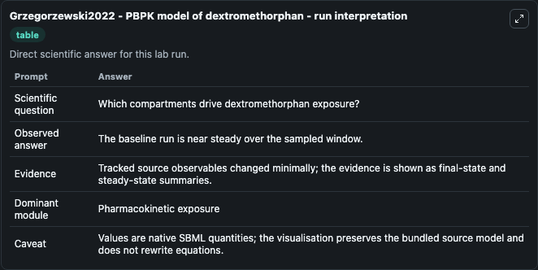

# Grzegorzewski2022 - PBPK model of dextromethorphan

This Biosimulant lab wraps `Grzegorzewski2022 - PBPK model of dextromethorphan` as a runnable pharmacology model with a companion visualization module.
Physiologically based pharmacokinetic (PBPK) modeling of the role of CYP2D6 polymorphism for metabolic phenotyping with dextromethorphan. It can be used to explore drug-exposure and pathway-response dynamics and compare scenario outcomes across configurations.

## What You'll See

The lab asks: How do route and CYP2D6 activity shape dextromethorphan and metabolite exposure? It runs for 24.0 time units with a communication step of 1.0. The run uses the model defaults declared by the curated SBML wrapper. The generated visualizations focus on Dextromethorphan Liver Plasma, Dextromethorphan Gut Plasma, Dextromethorphan Kidney Plasma, Dextromethorphan Lung Plasma, Dextorphan Liver Plasma, and Dextorphan Glucuronide Liver Plasma, combining trajectory, endpoint-comparison, and summary-table views from one completed dark-mode run.

In this captured run, **dextromethorphan (liver)** moved from 0 to 0 across 24.0 simulation windows.

<!-- BIOSIMULANT_VISUALS_START -->
### Output Visualizations



*Summary table for Grzegorzewski2022 - PBPK model of dextromethorphan, reporting the scientific question, observed answer, dominant module, and caveat.*


*Trajectories of dextromethorphan (liver), dextromethorphan (gut), dextorphan (liver), dextorphan glucuronide (liver), dextromethorphan (kidney), and dextromethorphan (lung) across the 24.0 simulation. In this run dextromethorphan (liver), dextromethorphan (gut), dextorphan (liver), dextorphan glucuronide (liver) stayed near their initial values — no observable moved appreciably.*

<!-- BIOSIMULANT_VISUALS_END -->

## Model Context

- Core model: `models/core`
- Visualization model: `models/visualisation`
- Standard: `sbml`
- Upstream source: `biomodels_ebi:MODEL2301090002`
- License: `CC0`

## Inputs

| Input | Maps To | Default | Notes |
|---|---|---|---|
| Oral Dextromethorphan Dose Mg | `pharmacology_sbml_grzegorzewski2022_pbpk_model_of_dextromethorphan_model2301090002_model.oral_dextromethorphan_dose_mg` |  | Uses the model default unless overridden at run time. |
| IV Dextromethorphan Bolus Mg | `pharmacology_sbml_grzegorzewski2022_pbpk_model_of_dextromethorphan_model2301090002_model.iv_dextromethorphan_bolus_mg` |  | Uses the model default unless overridden at run time. |
| Dextromethorphan Infusion Rate Mg Per Min | `pharmacology_sbml_grzegorzewski2022_pbpk_model_of_dextromethorphan_model2301090002_model.dextromethorphan_infusion_rate_mg_per_min` |  | Uses the model default unless overridden at run time. |
| CYP2D6 Custom Activity | `pharmacology_sbml_grzegorzewski2022_pbpk_model_of_dextromethorphan_model2301090002_model.cyp2d6_custom_activity` |  | Uses the model default unless overridden at run time. |
| CYP2D6 VMAX | `pharmacology_sbml_grzegorzewski2022_pbpk_model_of_dextromethorphan_model2301090002_model.cyp2d6_vmax` |  | Uses the model default unless overridden at run time. |
| CYP3A4 VMAX | `pharmacology_sbml_grzegorzewski2022_pbpk_model_of_dextromethorphan_model2301090002_model.cyp3a4_vmax` |  | Uses the model default unless overridden at run time. |

## Outputs

| Output | Maps To | Role |
|---|---|---|
| `state` | `pharmacology_sbml_grzegorzewski2022_pbpk_model_of_dextromethorphan_model2301090002_model.state` | Available to the visualization model and downstream workflows. |
| `summary` | `pharmacology_sbml_grzegorzewski2022_pbpk_model_of_dextromethorphan_model2301090002_model.summary` | Available to the visualization model and downstream workflows. |
| `species_labels` | `pharmacology_sbml_grzegorzewski2022_pbpk_model_of_dextromethorphan_model2301090002_model.species_labels` | Available to the visualization model and downstream workflows. |
| `dextromethorphan_liver_plasma` | `pharmacology_sbml_grzegorzewski2022_pbpk_model_of_dextromethorphan_model2301090002_model.dextromethorphan_liver_plasma` | Available to the visualization model and downstream workflows. |
| `dextromethorphan_gut_plasma` | `pharmacology_sbml_grzegorzewski2022_pbpk_model_of_dextromethorphan_model2301090002_model.dextromethorphan_gut_plasma` | Available to the visualization model and downstream workflows. |
| `dextromethorphan_kidney_plasma` | `pharmacology_sbml_grzegorzewski2022_pbpk_model_of_dextromethorphan_model2301090002_model.dextromethorphan_kidney_plasma` | Available to the visualization model and downstream workflows. |
| `dextromethorphan_lung_plasma` | `pharmacology_sbml_grzegorzewski2022_pbpk_model_of_dextromethorphan_model2301090002_model.dextromethorphan_lung_plasma` | Available to the visualization model and downstream workflows. |
| `dextorphan_liver_plasma` | `pharmacology_sbml_grzegorzewski2022_pbpk_model_of_dextromethorphan_model2301090002_model.dextorphan_liver_plasma` | Available to the visualization model and downstream workflows. |
| `dextorphan_glucuronide_liver_plasma` | `pharmacology_sbml_grzegorzewski2022_pbpk_model_of_dextromethorphan_model2301090002_model.dextorphan_glucuronide_liver_plasma` | Available to the visualization model and downstream workflows. |

## Runtime

- Duration: `24.0`
- Communication step: `1.0`

## Running Locally

```bash
biosimulant labs serve .
```
