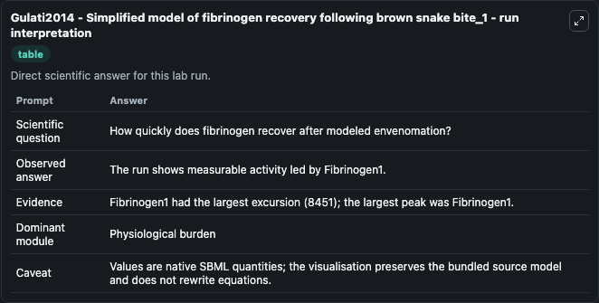
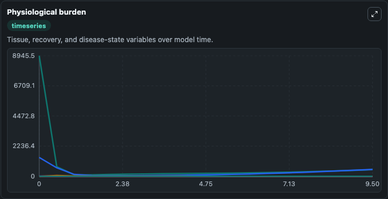
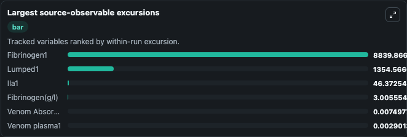
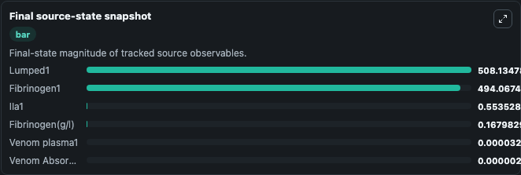

# Gulati2014 - Simplified model of fibrinogen recovery following brown snake bite_1

This Biosimulant lab wraps `Gulati2014 - Simplified model of fibrinogen recovery following brown snake bite_1` as a runnable pharmacology model with a companion visualization module.
Bridging systems biology and pharmacokinetics–pharmacodynamics has resulted in models that are highly complex and complicated. It can be used to explore drug-exposure and pathway-response dynamics and compare scenario outcomes across configurations.

## What You'll See

The lab asks: How quickly does fibrinogen recover after the selected venom burden? It runs for 10.0 time units with a communication step of 0.5. The run uses the model defaults declared by the curated SBML wrapper. The generated visualizations focus on Plasma Venom, Fibrinogen G Per L, Fibrinogen Pool, Venom Absorption, and Thrombin Activity, combining trajectory, endpoint-comparison, and summary-table views from one completed dark-mode run.

In this captured run, **Fibrinogen1** peaked at **8945.5** and **Fibrinogen1** moved by **8451.0** native units across 10.0 simulation windows.

<!-- BIOSIMULANT_VISUALS_START -->
### Output Visualizations



*Summary table for Gulati2014 - Simplified model of fibrinogen recovery following brown snake bite_1, reporting the scientific question, observed answer (largest change: **Fibrinogen1** at **8451.0** native units), evidence (peak observable: **Fibrinogen1**), dominant module, and caveat.*



*Trajectories of Fibrinogen1, Lumped1, IIa1, Fibrinogen(g/l), Venom Absorption1, and Venom plasma1 across the 10.0 simulation. In this run **IIa1** climbed from 0 to 0.5535 and **Fibrinogen1** fell from 8945.5 to 494.1 — the largest movements among the focused observables.*



*Largest-excursion ranking of the focused observables — the absolute movement magnitude during the run. Top 3: **Fibrinogen1** = 8839.9, **Lumped1** = 1354.6, **IIa1** = 46.373, with 3 more observables below.*



*Endpoint snapshot of the focused observables — final values from the captured run. Top 3 by value: **Lumped1** = 508.1, **Fibrinogen1** = 494.1, **IIa1** = 0.5535, with 3 more observables below.*

<!-- BIOSIMULANT_VISUALS_END -->

## Model Context

- Core model: `models/core`
- Visualization model: `models/visualisation`
- Standard: `sbml`
- Upstream source: `biomodels_ebi:MODEL1805090001`
- License: `CC0`

## Inputs

| Input | Maps To | Default | Notes |
|---|---|---|---|
| Brown Snake Venom Fraction | `pharmacology_sbml_gulati2014_simplified_model_of_fibrinogen_recove_model1805090001_model.brown_snake_venom_fraction` |  | Uses the model default unless overridden at run time. |
| Initial Plasma Venom | `pharmacology_sbml_gulati2014_simplified_model_of_fibrinogen_recove_model1805090001_model.initial_plasma_venom` |  | Uses the model default unless overridden at run time. |
| Initial Thrombin Activity | `pharmacology_sbml_gulati2014_simplified_model_of_fibrinogen_recove_model1805090001_model.initial_thrombin_activity` |  | Uses the model default unless overridden at run time. |

## Outputs

| Output | Maps To | Role |
|---|---|---|
| `state` | `pharmacology_sbml_gulati2014_simplified_model_of_fibrinogen_recove_model1805090001_model.state` | Available to the visualization model and downstream workflows. |
| `summary` | `pharmacology_sbml_gulati2014_simplified_model_of_fibrinogen_recove_model1805090001_model.summary` | Available to the visualization model and downstream workflows. |
| `species_labels` | `pharmacology_sbml_gulati2014_simplified_model_of_fibrinogen_recove_model1805090001_model.species_labels` | Available to the visualization model and downstream workflows. |
| `plasma_venom` | `pharmacology_sbml_gulati2014_simplified_model_of_fibrinogen_recove_model1805090001_model.plasma_venom` | Available to the visualization model and downstream workflows. |
| `fibrinogen_g_per_l` | `pharmacology_sbml_gulati2014_simplified_model_of_fibrinogen_recove_model1805090001_model.fibrinogen_g_per_l` | Available to the visualization model and downstream workflows. |
| `fibrinogen_pool` | `pharmacology_sbml_gulati2014_simplified_model_of_fibrinogen_recove_model1805090001_model.fibrinogen_pool` | Available to the visualization model and downstream workflows. |
| `venom_absorption` | `pharmacology_sbml_gulati2014_simplified_model_of_fibrinogen_recove_model1805090001_model.venom_absorption` | Available to the visualization model and downstream workflows. |
| `thrombin_activity` | `pharmacology_sbml_gulati2014_simplified_model_of_fibrinogen_recove_model1805090001_model.thrombin_activity` | Available to the visualization model and downstream workflows. |

## Runtime

- Duration: `10.0`
- Communication step: `0.5`

## Running Locally

```bash
biosimulant labs serve .
```
