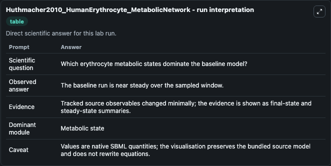

# Huthmacher2010_HumanErythrocyte_MetabolicNetwork

This Biosimulant lab wraps `Huthmacher2010_HumanErythrocyte_MetabolicNetwork` as a runnable pharmacology model with a companion visualization module.
This model is from the article: Antimalarial drug targets in Plasmodium falciparum predicted by stage-specific metabolic network analysis. It can be used to explore drug-exposure and pathway-response dynamics and compare scenario outcomes across configurations.

## What You'll See

The lab asks: Which erythrocyte metabolic pools are most perturbed from the selected initial state? It runs for 5.0 time units with a communication step of 0.5. The run uses the model defaults declared by the curated SBML wrapper. The generated visualizations focus on Erythrocyte ATP, Erythrocyte NAD, Erythrocyte NADH, Pyruvate, Glucose 1 Phosphate, and Datp, combining trajectory, endpoint-comparison, and summary-table views from one completed dark-mode run.

In this captured run, **ATP** moved from 0 to 0 across 5.0 simulation windows.

<!-- BIOSIMULANT_VISUALS_START -->
### Output Visualizations



*Summary table for Huthmacher2010_HumanErythrocyte_MetabolicNetwork, reporting the scientific question, observed answer, dominant module, and caveat.*


*Trajectories of ATP, dATP, dTDP glucose, D Glucose 1 phosphate, Pyruvate, and NADH across the 5.0 simulation. In this run ATP, dATP, dTDP glucose, D Glucose 1 phosphate stayed near their initial values — no observable moved appreciably.*

<!-- BIOSIMULANT_VISUALS_END -->

## Model Context

- Core model: `models/core`
- Visualization model: `models/visualisation`
- Standard: `sbml`
- Upstream source: `biomodels_ebi:MODEL1111240001`
- License: `CC0`

## Inputs

| Input | Maps To | Default | Notes |
|---|---|---|---|
| Initial Erythrocyte ATP | `pharmacology_sbml_huthmacher2010_humanerythrocyte_metabolicnetwork_model1111240001_model.initial_erythrocyte_atp` |  | Uses the model default unless overridden at run time. |
| Initial Erythrocyte NAD | `pharmacology_sbml_huthmacher2010_humanerythrocyte_metabolicnetwork_model1111240001_model.initial_erythrocyte_nad` |  | Uses the model default unless overridden at run time. |
| Initial Erythrocyte NADH | `pharmacology_sbml_huthmacher2010_humanerythrocyte_metabolicnetwork_model1111240001_model.initial_erythrocyte_nadh` |  | Uses the model default unless overridden at run time. |
| Initial Pyruvate | `pharmacology_sbml_huthmacher2010_humanerythrocyte_metabolicnetwork_model1111240001_model.initial_pyruvate` |  | Uses the model default unless overridden at run time. |
| Initial Glucose 1 Phosphate | `pharmacology_sbml_huthmacher2010_humanerythrocyte_metabolicnetwork_model1111240001_model.initial_glucose_1_phosphate` |  | Uses the model default unless overridden at run time. |

## Outputs

| Output | Maps To | Role |
|---|---|---|
| `state` | `pharmacology_sbml_huthmacher2010_humanerythrocyte_metabolicnetwork_model1111240001_model.state` | Available to the visualization model and downstream workflows. |
| `summary` | `pharmacology_sbml_huthmacher2010_humanerythrocyte_metabolicnetwork_model1111240001_model.summary` | Available to the visualization model and downstream workflows. |
| `species_labels` | `pharmacology_sbml_huthmacher2010_humanerythrocyte_metabolicnetwork_model1111240001_model.species_labels` | Available to the visualization model and downstream workflows. |
| `erythrocyte_atp` | `pharmacology_sbml_huthmacher2010_humanerythrocyte_metabolicnetwork_model1111240001_model.erythrocyte_atp` | Available to the visualization model and downstream workflows. |
| `erythrocyte_nad` | `pharmacology_sbml_huthmacher2010_humanerythrocyte_metabolicnetwork_model1111240001_model.erythrocyte_nad` | Available to the visualization model and downstream workflows. |
| `erythrocyte_nadh` | `pharmacology_sbml_huthmacher2010_humanerythrocyte_metabolicnetwork_model1111240001_model.erythrocyte_nadh` | Available to the visualization model and downstream workflows. |
| `pyruvate` | `pharmacology_sbml_huthmacher2010_humanerythrocyte_metabolicnetwork_model1111240001_model.pyruvate` | Available to the visualization model and downstream workflows. |
| `glucose_1_phosphate` | `pharmacology_sbml_huthmacher2010_humanerythrocyte_metabolicnetwork_model1111240001_model.glucose_1_phosphate` | Available to the visualization model and downstream workflows. |
| `datp` | `pharmacology_sbml_huthmacher2010_humanerythrocyte_metabolicnetwork_model1111240001_model.datp` | Available to the visualization model and downstream workflows. |

## Runtime

- Duration: `5.0`
- Communication step: `0.5`

## Running Locally

```bash
biosimulant labs serve .
```
