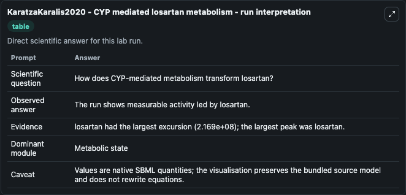
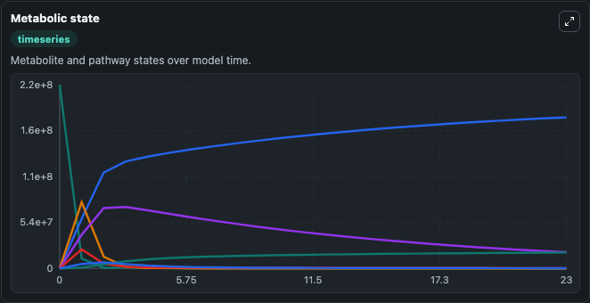
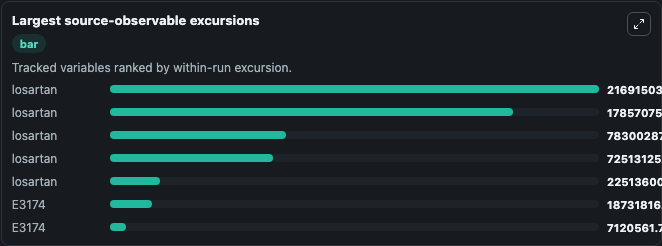
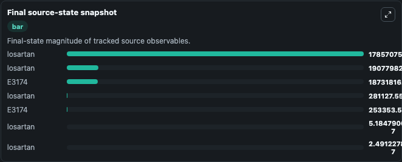

# KaratzaKaralis2020 - CYP mediated losartan metabolism

This Biosimulant lab wraps `KaratzaKaralis2020 - CYP mediated losartan metabolism` as a runnable pharmacology model with a companion visualization module.
A four-compartment pharmacokinetic model that describes the disposition of losartan and E-3174 (Karatza and Karalis, 2020). It can be used to explore drug-exposure and pathway-response dynamics and compare scenario outcomes across configurations.

## What You'll See

The lab asks: How does CYP2C9-mediated metabolism transform losartan into E3174? It runs for 24.0 time units with a communication step of 1.0. The run uses the model defaults declared by the curated SBML wrapper. The generated visualizations focus on Losartan Cellular Compartment, Losartan Intracellular, Losartan Outflow, Losartan Portal Compartment, Losartan Stomach, and E3174 Outflow, and related outputs, combining trajectory, endpoint-comparison, and summary-table views from one completed dark-mode run.

In this captured run, **losartan** peaked at **2.17e+08** and **losartan** moved by **2.17e+08** native units across 24.0 simulation windows.

<!-- BIOSIMULANT_VISUALS_START -->
### Output Visualizations



*Summary table for KaratzaKaralis2020 - CYP mediated losartan metabolism, reporting the scientific question, observed answer (largest change: **losartan** at **2.17e+08** native units), evidence (peak observable: **losartan**), dominant module, and caveat.*



*Trajectories of losartan, losartan, losartan, losartan, losartan, and E3174 across the 24.0 simulation. In this run **losartan** climbed from 0 to 1.79e+08 and **losartan** fell from 2.17e+08 to 2.49e-07 — the largest movements among the focused observables.*



*Largest-excursion ranking of the focused observables — the absolute movement magnitude during the run. Top 3: **losartan** = 2.17e+08, **losartan** = 1.79e+08, **losartan** = 7.83e+07, with 4 more observables below.*



*Endpoint snapshot of the focused observables — final values from the captured run. Top 3 by value: **losartan** = 1.79e+08, **losartan** = 1.91e+07, **E3174** = 1.87e+07, with 4 more observables below.*

<!-- BIOSIMULANT_VISUALS_END -->

## Model Context

- Core model: `models/core`
- Visualization model: `models/visualisation`
- Standard: `sbml`
- Upstream source: `biomodels_ebi:MODEL2412180001`
- License: `CC0`

## Inputs

| Input | Maps To | Default | Notes |
|---|---|---|---|
| Losartan Oral Dose | `pharmacology_sbml_karatzakaralis2020_cyp_mediated_losartan_metabol_model2412180001_model.losartan_oral_dose` |  | Uses the model default unless overridden at run time. |
| CYP2C9 Metabolism Start Time | `pharmacology_sbml_karatzakaralis2020_cyp_mediated_losartan_metabol_model2412180001_model.cyp2c9_metabolism_start_time` |  | Uses the model default unless overridden at run time. |
| Initial Losartan Stomach | `pharmacology_sbml_karatzakaralis2020_cyp_mediated_losartan_metabol_model2412180001_model.initial_losartan_stomach` |  | Uses the model default unless overridden at run time. |

## Outputs

| Output | Maps To | Role |
|---|---|---|
| `state` | `pharmacology_sbml_karatzakaralis2020_cyp_mediated_losartan_metabol_model2412180001_model.state` | Available to the visualization model and downstream workflows. |
| `summary` | `pharmacology_sbml_karatzakaralis2020_cyp_mediated_losartan_metabol_model2412180001_model.summary` | Available to the visualization model and downstream workflows. |
| `species_labels` | `pharmacology_sbml_karatzakaralis2020_cyp_mediated_losartan_metabol_model2412180001_model.species_labels` | Available to the visualization model and downstream workflows. |
| `losartan_cellular_compartment` | `pharmacology_sbml_karatzakaralis2020_cyp_mediated_losartan_metabol_model2412180001_model.losartan_cellular_compartment` | Available to the visualization model and downstream workflows. |
| `losartan_intracellular` | `pharmacology_sbml_karatzakaralis2020_cyp_mediated_losartan_metabol_model2412180001_model.losartan_intracellular` | Available to the visualization model and downstream workflows. |
| `losartan_outflow` | `pharmacology_sbml_karatzakaralis2020_cyp_mediated_losartan_metabol_model2412180001_model.losartan_outflow` | Available to the visualization model and downstream workflows. |
| `losartan_portal_compartment` | `pharmacology_sbml_karatzakaralis2020_cyp_mediated_losartan_metabol_model2412180001_model.losartan_portal_compartment` | Available to the visualization model and downstream workflows. |
| `losartan_stomach` | `pharmacology_sbml_karatzakaralis2020_cyp_mediated_losartan_metabol_model2412180001_model.losartan_stomach` | Available to the visualization model and downstream workflows. |
| `e3174_outflow` | `pharmacology_sbml_karatzakaralis2020_cyp_mediated_losartan_metabol_model2412180001_model.e3174_outflow` | Available to the visualization model and downstream workflows. |
| `e3174_cellular_compartment` | `pharmacology_sbml_karatzakaralis2020_cyp_mediated_losartan_metabol_model2412180001_model.e3174_cellular_compartment` | Available to the visualization model and downstream workflows. |

## Runtime

- Duration: `24.0`
- Communication step: `1.0`

## Running Locally

```bash
biosimulant labs serve .
```
