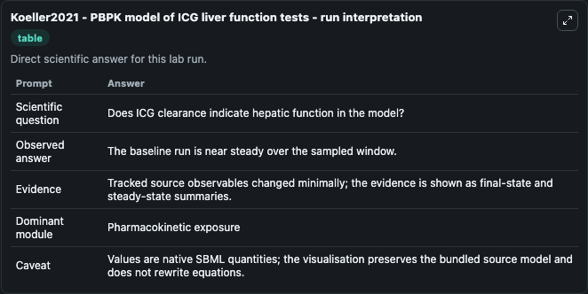
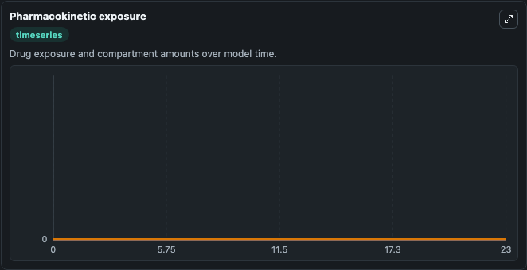

# Koeller2021 - PBPK model of ICG liver function tests

This Biosimulant lab wraps `Koeller2021 - PBPK model of ICG liver function tests` as a runnable pharmacology model with a companion visualization module.
Physiollogically based pharmacokinetic (PBPK) model of indocyanine-green (ICG) liver function tests. It can be used to explore drug-exposure and pathway-response dynamics and compare scenario outcomes across configurations.

## What You'll See

The lab asks: Does the selected liver impairment pattern slow ICG clearance? It runs for 24.0 time units with a communication step of 1.0. The run uses the model defaults declared by the curated SBML wrapper. The generated visualizations focus on ICG Liver Plasma, ICG Venous Plasma, ICG Arterial Plasma, ICG Gastrointestinal Plasma, ICG Lung Plasma, and ICG Portal Vein, and related outputs, combining trajectory, endpoint-comparison, and summary-table views from one completed dark-mode run.

In this captured run, **icg (liver)** moved from 0 to 0 across 24.0 simulation windows.

<!-- BIOSIMULANT_VISUALS_START -->
### Output Visualizations



*Summary table for Koeller2021 - PBPK model of ICG liver function tests, reporting the scientific question, observed answer, dominant module, and caveat.*



*Trajectories of icg (liver), icg (venous plasma), icg (arterial plasma), icg (rest), icg (gastrointestinal tract), and icg (lung) across the 24.0 simulation. In this run icg (liver), icg (venous plasma), icg (arterial plasma), icg (rest) stayed near their initial values — no observable moved appreciably.*

<!-- BIOSIMULANT_VISUALS_END -->

## Model Context

- Core model: `models/core`
- Visualization model: `models/visualisation`
- Standard: `sbml`
- Upstream source: `biomodels_ebi:MODEL2301090001`
- License: `CC0`

## Inputs

| Input | Maps To | Default | Notes |
|---|---|---|---|
| ICG Infusion Rate Mg Per Min | `pharmacology_sbml_koeller2021_pbpk_model_of_icg_liver_function_tes_model2301090001_model.icg_infusion_rate_mg_per_min` |  | Uses the model default unless overridden at run time. |
| ICG Injection Time Seconds | `pharmacology_sbml_koeller2021_pbpk_model_of_icg_liver_function_tes_model2301090001_model.icg_injection_time_seconds` |  | Uses the model default unless overridden at run time. |
| Liver Shunt Fraction | `pharmacology_sbml_koeller2021_pbpk_model_of_icg_liver_function_tes_model2301090001_model.liver_shunt_fraction` |  | Uses the model default unless overridden at run time. |
| Liver Tissue Loss Fraction | `pharmacology_sbml_koeller2021_pbpk_model_of_icg_liver_function_tes_model2301090001_model.liver_tissue_loss_fraction` |  | Uses the model default unless overridden at run time. |
| Hepatic Blood Flow Scale | `pharmacology_sbml_koeller2021_pbpk_model_of_icg_liver_function_tes_model2301090001_model.hepatic_blood_flow_scale` |  | Uses the model default unless overridden at run time. |
| Oatp1b3 Activity Scale | `pharmacology_sbml_koeller2021_pbpk_model_of_icg_liver_function_tes_model2301090001_model.oatp1b3_activity_scale` |  | Uses the model default unless overridden at run time. |

## Outputs

| Output | Maps To | Role |
|---|---|---|
| `state` | `pharmacology_sbml_koeller2021_pbpk_model_of_icg_liver_function_tes_model2301090001_model.state` | Available to the visualization model and downstream workflows. |
| `summary` | `pharmacology_sbml_koeller2021_pbpk_model_of_icg_liver_function_tes_model2301090001_model.summary` | Available to the visualization model and downstream workflows. |
| `species_labels` | `pharmacology_sbml_koeller2021_pbpk_model_of_icg_liver_function_tes_model2301090001_model.species_labels` | Available to the visualization model and downstream workflows. |
| `icg_liver_plasma` | `pharmacology_sbml_koeller2021_pbpk_model_of_icg_liver_function_tes_model2301090001_model.icg_liver_plasma` | Available to the visualization model and downstream workflows. |
| `icg_venous_plasma` | `pharmacology_sbml_koeller2021_pbpk_model_of_icg_liver_function_tes_model2301090001_model.icg_venous_plasma` | Available to the visualization model and downstream workflows. |
| `icg_arterial_plasma` | `pharmacology_sbml_koeller2021_pbpk_model_of_icg_liver_function_tes_model2301090001_model.icg_arterial_plasma` | Available to the visualization model and downstream workflows. |
| `icg_gastrointestinal_plasma` | `pharmacology_sbml_koeller2021_pbpk_model_of_icg_liver_function_tes_model2301090001_model.icg_gastrointestinal_plasma` | Available to the visualization model and downstream workflows. |
| `icg_lung_plasma` | `pharmacology_sbml_koeller2021_pbpk_model_of_icg_liver_function_tes_model2301090001_model.icg_lung_plasma` | Available to the visualization model and downstream workflows. |
| `icg_portal_vein` | `pharmacology_sbml_koeller2021_pbpk_model_of_icg_liver_function_tes_model2301090001_model.icg_portal_vein` | Available to the visualization model and downstream workflows. |
| `icg_liver_amount` | `pharmacology_sbml_koeller2021_pbpk_model_of_icg_liver_function_tes_model2301090001_model.icg_liver_amount` | Available to the visualization model and downstream workflows. |

## Runtime

- Duration: `24.0`
- Communication step: `1.0`

## Running Locally

```bash
biosimulant labs serve .
```
