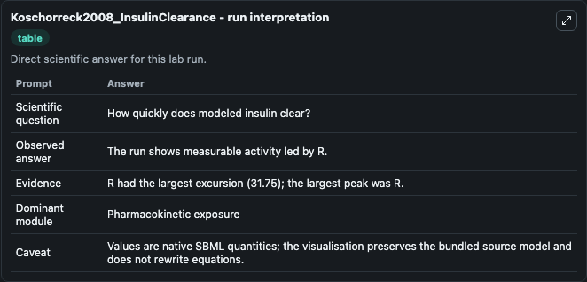
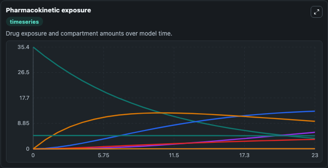
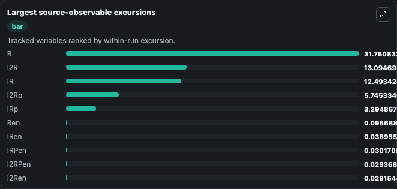
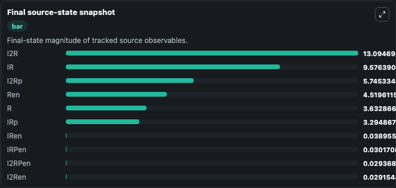

# Koschorreck2008_InsulinClearance

This Biosimulant lab wraps `Koschorreck2008_InsulinClearance` as a runnable pharmacology model with a companion visualization module.
This model is from the article: Mathematical modeling and analysis of insulin clearance in vivo. It can be used to explore drug-exposure and pathway-response dynamics and compare scenario outcomes across configurations.

## What You'll See

The lab asks: Does liver clearance shift insulin receptor states toward internalized/cleared pools? It runs for 24.0 time units with a communication step of 1.0. The run uses the model defaults declared by the curated SBML wrapper. The generated visualizations focus on Free Receptor, Insulin Receptor Complex, Two Insulin Receptor Complex, Phosphorylated Receptor, Phosphorylated Insulin Receptor Complex, and Endosomal Receptor, and related outputs, combining trajectory, endpoint-comparison, and summary-table views from one completed dark-mode run.

In this captured run, **R** peaked at **35.384** and **R** moved by **31.750** native units across 24.0 simulation windows.

<!-- BIOSIMULANT_VISUALS_START -->
### Output Visualizations



*Summary table for Koschorreck2008_InsulinClearance, reporting the scientific question, observed answer (largest change: **R** at **31.750** native units), evidence (peak observable: **R**), dominant module, and caveat.*



*Trajectories of R, I2R, IR, I2Rp, IRp, and Ren across the 24.0 simulation. In this run **I2R** climbed from 0 to 13.095 and **R** fell from 35.384 to 3.633 — the largest movements among the focused observables.*



*Largest-excursion ranking of the focused observables — the absolute movement magnitude during the run. Top 3: **R** = 31.751, **I2R** = 13.095, **IR** = 12.493, with 7 more observables below.*



*Endpoint snapshot of the focused observables — final values from the captured run. Top 3 by value: **I2R** = 13.095, **IR** = 9.576, **I2Rp** = 5.745, with 7 more observables below.*

<!-- BIOSIMULANT_VISUALS_END -->

## Model Context

- Core model: `models/core`
- Visualization model: `models/visualisation`
- Standard: `sbml`
- Upstream source: `biomodels_ebi:BIOMD0000000345`
- License: `CC0`

## Inputs

| Input | Maps To | Default | Notes |
|---|---|---|---|
| Liver Insulin Clearance Density | `pharmacology_sbml_koschorreck2008_insulinclearance_biomd0000000345_model.liver_insulin_clearance_density` |  | Uses the model default unless overridden at run time. |
| Initial Free Receptor | `pharmacology_sbml_koschorreck2008_insulinclearance_biomd0000000345_model.initial_free_receptor` |  | Uses the model default unless overridden at run time. |
| Initial Insulin Receptor Complex | `pharmacology_sbml_koschorreck2008_insulinclearance_biomd0000000345_model.initial_insulin_receptor_complex` |  | Uses the model default unless overridden at run time. |
| Initial Internalized Receptor | `pharmacology_sbml_koschorreck2008_insulinclearance_biomd0000000345_model.initial_internalized_receptor` |  | Uses the model default unless overridden at run time. |

## Outputs

| Output | Maps To | Role |
|---|---|---|
| `state` | `pharmacology_sbml_koschorreck2008_insulinclearance_biomd0000000345_model.state` | Available to the visualization model and downstream workflows. |
| `summary` | `pharmacology_sbml_koschorreck2008_insulinclearance_biomd0000000345_model.summary` | Available to the visualization model and downstream workflows. |
| `species_labels` | `pharmacology_sbml_koschorreck2008_insulinclearance_biomd0000000345_model.species_labels` | Available to the visualization model and downstream workflows. |
| `free_receptor` | `pharmacology_sbml_koschorreck2008_insulinclearance_biomd0000000345_model.free_receptor` | Available to the visualization model and downstream workflows. |
| `insulin_receptor_complex` | `pharmacology_sbml_koschorreck2008_insulinclearance_biomd0000000345_model.insulin_receptor_complex` | Available to the visualization model and downstream workflows. |
| `two_insulin_receptor_complex` | `pharmacology_sbml_koschorreck2008_insulinclearance_biomd0000000345_model.two_insulin_receptor_complex` | Available to the visualization model and downstream workflows. |
| `phosphorylated_receptor` | `pharmacology_sbml_koschorreck2008_insulinclearance_biomd0000000345_model.phosphorylated_receptor` | Available to the visualization model and downstream workflows. |
| `phosphorylated_insulin_receptor_complex` | `pharmacology_sbml_koschorreck2008_insulinclearance_biomd0000000345_model.phosphorylated_insulin_receptor_complex` | Available to the visualization model and downstream workflows. |
| `endosomal_receptor` | `pharmacology_sbml_koschorreck2008_insulinclearance_biomd0000000345_model.endosomal_receptor` | Available to the visualization model and downstream workflows. |
| `endosomal_insulin_receptor_complex` | `pharmacology_sbml_koschorreck2008_insulinclearance_biomd0000000345_model.endosomal_insulin_receptor_complex` | Available to the visualization model and downstream workflows. |

## Runtime

- Duration: `24.0`
- Communication step: `1.0`

## Running Locally

```bash
biosimulant labs serve .
```
