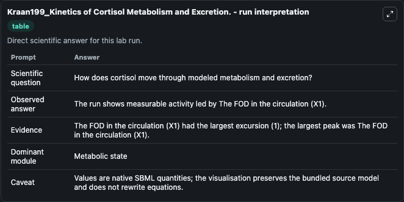
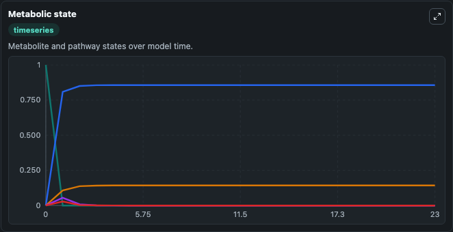
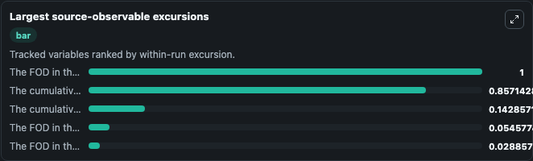
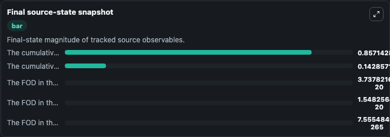

# Kraan199_Kinetics of Cortisol Metabolism and Excretion.

This Biosimulant lab wraps `Kraan199_Kinetics of Cortisol Metabolism and Excretion.` as a runnable pharmacology model with a companion visualization module.
A new model is proposed to study the kinetics of [3H]cortisol metabolism by using urinary data only. It can be used to explore drug-exposure and pathway-response dynamics and compare scenario outcomes across configurations.

## What You'll See

The lab asks: How is cortisol redistributed between circulation, tissues, gut, and excretion pools? It runs for 24.0 time units with a communication step of 1.0. The run uses the model defaults declared by the curated SBML wrapper. The generated visualizations focus on Circulating Cortisol, Metabolizing Tissue Cortisol, Urinary Excreted Cortisol, Non Urinary Excreted Cortisol, and Gallbladder Intestinal Cortisol, combining trajectory, endpoint-comparison, and summary-table views from one completed dark-mode run.

In this captured run, **The FOD in the circulation (X1)** peaked at **1.000** and **The FOD in the circulation (X1)** moved by **1.000** native units across 24.0 simulation windows.

<!-- BIOSIMULANT_VISUALS_START -->
### Output Visualizations



*Summary table for Kraan199_Kinetics of Cortisol Metabolism and Excretion., reporting the scientific question, observed answer (largest change: **The FOD in the circulation (X1)** at **1.000** native units), evidence (peak observable: **The FOD in the circulation (X1)**), dominant module, and caveat.*



*Trajectories of The FOD in the circulation (X1), The cumulative FOD excreted in the urine (X2), The cumulative FOD excreted in the non urinary pool (X3), The FOD in the gallbladder + intestinal lumen (X5), and The FOD in the metabolizing tissues (X4) across the 24.0 simulation. In this run **The cumulative FOD excreted in the urine (X2)** climbed from 0 to 0.8571 and **The FOD in the circulation (X1)** fell from 1.000 to 7.56e-265 — the largest movements among the focused observables.*



*Largest-excursion ranking of the focused observables — the absolute movement magnitude during the run. Top 3: **The FOD in the circulation (X1)** = 1.000, **The cumulative FOD excreted in the urine (X2)** = 0.8571, **The cumulative FOD excreted in the non urinary pool (X3)** = 0.1429, with 2 more observables below.*



*Endpoint snapshot of the focused observables — final values from the captured run. Top 3 by value: **The cumulative FOD excreted in the urine (X2)** = 0.8571, **The cumulative FOD excreted in the non urinary pool (X3)** = 0.1429, **The FOD in the gallbladder + intestinal lumen (X5)** = 3.74e-20, with 2 more observables below.*

<!-- BIOSIMULANT_VISUALS_END -->

## Model Context

- Core model: `models/core`
- Visualization model: `models/visualisation`
- Standard: `sbml`
- Upstream source: `biomodels_ebi:BIOMD0000000916`
- License: `CC0`

## Inputs

| Input | Maps To | Default | Notes |
|---|---|---|---|
| Initial Circulating Cortisol | `pharmacology_sbml_kraan199_kinetics_of_cortisol_metabolism_and_exc_biomd0000000916_model.initial_circulating_cortisol` |  | Uses the model default unless overridden at run time. |
| Initial Urinary Excreted Cortisol | `pharmacology_sbml_kraan199_kinetics_of_cortisol_metabolism_and_exc_biomd0000000916_model.initial_urinary_excreted_cortisol` |  | Uses the model default unless overridden at run time. |
| Initial Non Urinary Excreted Cortisol | `pharmacology_sbml_kraan199_kinetics_of_cortisol_metabolism_and_exc_biomd0000000916_model.initial_non_urinary_excreted_cortisol` |  | Uses the model default unless overridden at run time. |
| Initial Metabolizing Tissue Cortisol | `pharmacology_sbml_kraan199_kinetics_of_cortisol_metabolism_and_exc_biomd0000000916_model.initial_metabolizing_tissue_cortisol` |  | Uses the model default unless overridden at run time. |

## Outputs

| Output | Maps To | Role |
|---|---|---|
| `state` | `pharmacology_sbml_kraan199_kinetics_of_cortisol_metabolism_and_exc_biomd0000000916_model.state` | Available to the visualization model and downstream workflows. |
| `summary` | `pharmacology_sbml_kraan199_kinetics_of_cortisol_metabolism_and_exc_biomd0000000916_model.summary` | Available to the visualization model and downstream workflows. |
| `species_labels` | `pharmacology_sbml_kraan199_kinetics_of_cortisol_metabolism_and_exc_biomd0000000916_model.species_labels` | Available to the visualization model and downstream workflows. |
| `circulating_cortisol` | `pharmacology_sbml_kraan199_kinetics_of_cortisol_metabolism_and_exc_biomd0000000916_model.circulating_cortisol` | Available to the visualization model and downstream workflows. |
| `metabolizing_tissue_cortisol` | `pharmacology_sbml_kraan199_kinetics_of_cortisol_metabolism_and_exc_biomd0000000916_model.metabolizing_tissue_cortisol` | Available to the visualization model and downstream workflows. |
| `urinary_excreted_cortisol` | `pharmacology_sbml_kraan199_kinetics_of_cortisol_metabolism_and_exc_biomd0000000916_model.urinary_excreted_cortisol` | Available to the visualization model and downstream workflows. |
| `non_urinary_excreted_cortisol` | `pharmacology_sbml_kraan199_kinetics_of_cortisol_metabolism_and_exc_biomd0000000916_model.non_urinary_excreted_cortisol` | Available to the visualization model and downstream workflows. |
| `gallbladder_intestinal_cortisol` | `pharmacology_sbml_kraan199_kinetics_of_cortisol_metabolism_and_exc_biomd0000000916_model.gallbladder_intestinal_cortisol` | Available to the visualization model and downstream workflows. |

## Runtime

- Duration: `24.0`
- Communication step: `1.0`

## Running Locally

```bash
biosimulant labs serve .
```
