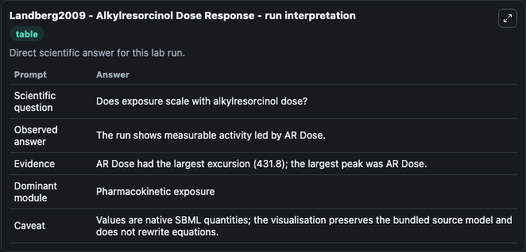
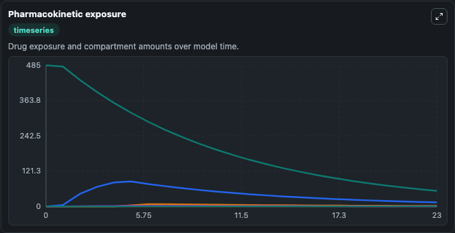
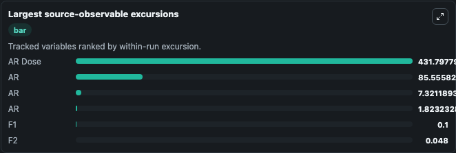
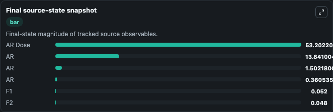

# Landberg2009 - Alkylresorcinol Dose Response

This Biosimulant lab wraps `Landberg2009 - Alkylresorcinol Dose Response` as a runnable pharmacology model with a companion visualization module.
Pharmacokinetic model of alkylresorcinols. It can be used to explore drug-exposure and pathway-response dynamics and compare scenario outcomes across configurations.

## What You'll See

The lab asks: Does alkylresorcinol exposure scale with the selected dose and absorption profile? It runs for 24.0 time units with a communication step of 1.0. The run uses the model defaults declared by the curated SBML wrapper. The generated visualizations focus on Alkylresorcinol Dose Pool, Alkylresorcinol Absorption Pool 1, Alkylresorcinol Absorption Pool 2, Alkylresorcinol Central Concentration, Bioavailability Fraction 1, and Bioavailability Fraction 2, combining trajectory, endpoint-comparison, and summary-table views from one completed dark-mode run.

In this captured run, **AR Dose** peaked at **485.0** and **AR Dose** moved by **431.8** native units across 24.0 simulation windows.

<!-- BIOSIMULANT_VISUALS_START -->
### Output Visualizations



*Summary table for Landberg2009 - Alkylresorcinol Dose Response, reporting the scientific question, observed answer (largest change: **AR Dose** at **431.8** native units), evidence (peak observable: **AR Dose**), dominant module, and caveat.*



*Trajectories of AR Dose, AR, AR, AR, F1, and F2 across the 24.0 simulation. In this run **AR** climbed from 0 to 13.841 and **AR Dose** fell from 485.0 to 53.202 — the largest movements among the focused observables.*



*Largest-excursion ranking of the focused observables — the absolute movement magnitude during the run. Top 3: **AR Dose** = 431.8, **AR** = 85.556, **AR** = 7.321, with 3 more observables below.*



*Endpoint snapshot of the focused observables — final values from the captured run. Top 3 by value: **AR Dose** = 53.202, **AR** = 13.841, **AR** = 1.502, with 3 more observables below.*

<!-- BIOSIMULANT_VISUALS_END -->

## Model Context

- Core model: `models/core`
- Visualization model: `models/visualisation`
- Standard: `sbml`
- Upstream source: `biomodels_ebi:BIOMD0000000948`
- License: `CC0`

## Inputs

| Input | Maps To | Default | Notes |
|---|---|---|---|
| Alkylresorcinol Dose | `pharmacology_sbml_landberg2009_alkylresorcinol_dose_response_biomd0000000948_model.alkylresorcinol_dose` |  | Uses the model default unless overridden at run time. |
| Fast Absorption Rate | `pharmacology_sbml_landberg2009_alkylresorcinol_dose_response_biomd0000000948_model.fast_absorption_rate` |  | Uses the model default unless overridden at run time. |
| Slow Absorption Rate | `pharmacology_sbml_landberg2009_alkylresorcinol_dose_response_biomd0000000948_model.slow_absorption_rate` |  | Uses the model default unless overridden at run time. |
| Clearance Over Volume | `pharmacology_sbml_landberg2009_alkylresorcinol_dose_response_biomd0000000948_model.clearance_over_volume` |  | Uses the model default unless overridden at run time. |
| Baseline Concentration | `pharmacology_sbml_landberg2009_alkylresorcinol_dose_response_biomd0000000948_model.baseline_concentration` |  | Uses the model default unless overridden at run time. |

## Outputs

| Output | Maps To | Role |
|---|---|---|
| `state` | `pharmacology_sbml_landberg2009_alkylresorcinol_dose_response_biomd0000000948_model.state` | Available to the visualization model and downstream workflows. |
| `summary` | `pharmacology_sbml_landberg2009_alkylresorcinol_dose_response_biomd0000000948_model.summary` | Available to the visualization model and downstream workflows. |
| `species_labels` | `pharmacology_sbml_landberg2009_alkylresorcinol_dose_response_biomd0000000948_model.species_labels` | Available to the visualization model and downstream workflows. |
| `alkylresorcinol_dose_pool` | `pharmacology_sbml_landberg2009_alkylresorcinol_dose_response_biomd0000000948_model.alkylresorcinol_dose_pool` | Available to the visualization model and downstream workflows. |
| `alkylresorcinol_absorption_pool_1` | `pharmacology_sbml_landberg2009_alkylresorcinol_dose_response_biomd0000000948_model.alkylresorcinol_absorption_pool_1` | Available to the visualization model and downstream workflows. |
| `alkylresorcinol_absorption_pool_2` | `pharmacology_sbml_landberg2009_alkylresorcinol_dose_response_biomd0000000948_model.alkylresorcinol_absorption_pool_2` | Available to the visualization model and downstream workflows. |
| `alkylresorcinol_central_concentration` | `pharmacology_sbml_landberg2009_alkylresorcinol_dose_response_biomd0000000948_model.alkylresorcinol_central_concentration` | Available to the visualization model and downstream workflows. |
| `bioavailability_fraction_1` | `pharmacology_sbml_landberg2009_alkylresorcinol_dose_response_biomd0000000948_model.bioavailability_fraction_1` | Available to the visualization model and downstream workflows. |
| `bioavailability_fraction_2` | `pharmacology_sbml_landberg2009_alkylresorcinol_dose_response_biomd0000000948_model.bioavailability_fraction_2` | Available to the visualization model and downstream workflows. |

## Runtime

- Duration: `24.0`
- Communication step: `1.0`

## Running Locally

```bash
biosimulant labs serve .
```
