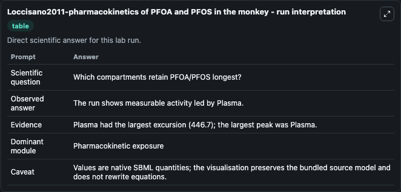
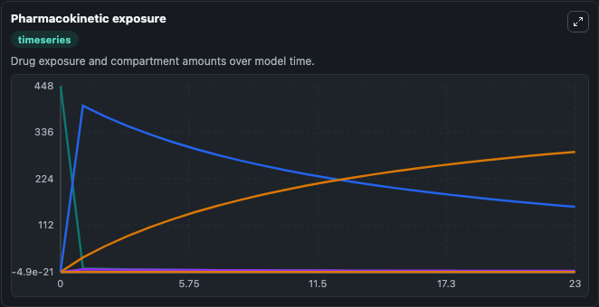
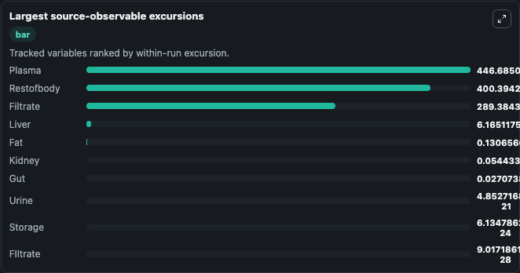
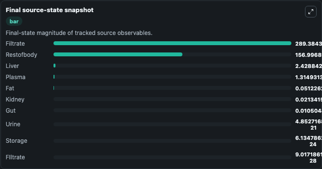

# Loccisano2011-pharmacokinetics of PFOA and PFOS in the monkey

This Biosimulant lab wraps `Loccisano2011-pharmacokinetics of PFOA and PFOS in the monkey` as a runnable pharmacology model with a companion visualization module.
Perfluoroalkyl acid carboxylates and sulfonates (PFAAs) have many consumer and industrial applications. It can be used to explore drug-exposure and pathway-response dynamics and compare scenario outcomes across configurations.

## What You'll See

The lab asks: Which compartments retain the modeled PFOA/PFOS burden longest? It runs for 24.0 time units with a communication step of 1.0. The run uses the model defaults declared by the curated SBML wrapper. The generated visualizations focus on Plasma Toxicant Burden, Liver Toxicant Burden, Kidney Toxicant Burden, Gut Toxicant Burden, Fat Toxicant Burden, and Skin Toxicant Burden, and related outputs, combining trajectory, endpoint-comparison, and summary-table views from one completed dark-mode run.

In this captured run, **Plasma** peaked at **448.0** and **Plasma** moved by **446.7** native units across 24.0 simulation windows.

<!-- BIOSIMULANT_VISUALS_START -->
### Output Visualizations



*Summary table for Loccisano2011-pharmacokinetics of PFOA and PFOS in the monkey, reporting the scientific question, observed answer (largest change: **Plasma** at **446.7** native units), evidence (peak observable: **Plasma**), dominant module, and caveat.*



*Trajectories of Plasma, Restofbody, Filtrate, Liver, Fat, and Kidney across the 24.0 simulation. In this run **Filtrate** climbed from 0 to 289.4 and **Plasma** fell from 448.0 to 1.315 — the largest movements among the focused observables.*



*Largest-excursion ranking of the focused observables — the absolute movement magnitude during the run. Top 3: **Plasma** = 446.7, **Restofbody** = 400.4, **Filtrate** = 289.4, with 7 more observables below.*



*Endpoint snapshot of the focused observables — final values from the captured run. Top 3 by value: **Filtrate** = 289.4, **Restofbody** = 157.0, **Liver** = 2.429, with 7 more observables below.*

<!-- BIOSIMULANT_VISUALS_END -->

## Model Context

- Core model: `models/core`
- Visualization model: `models/visualisation`
- Standard: `sbml`
- Upstream source: `biomodels_ebi:MODEL2003190002`
- License: `CC0`

## Inputs

| Input | Maps To | Default | Notes |
|---|---|---|---|
| Oral Toxicant Input | `pharmacology_sbml_loccisano2011_pharmacokinetics_of_pfoa_and_pfos_model2003190002_model.oral_toxicant_input` |  | Uses the model default unless overridden at run time. |
| IV Toxicant Input | `pharmacology_sbml_loccisano2011_pharmacokinetics_of_pfoa_and_pfos_model2003190002_model.iv_toxicant_input` |  | Uses the model default unless overridden at run time. |
| Initial Plasma Toxicant Burden | `pharmacology_sbml_loccisano2011_pharmacokinetics_of_pfoa_and_pfos_model2003190002_model.initial_plasma_toxicant_burden` |  | Uses the model default unless overridden at run time. |
| Urinary Elimination Rate | `pharmacology_sbml_loccisano2011_pharmacokinetics_of_pfoa_and_pfos_model2003190002_model.urinary_elimination_rate` |  | Uses the model default unless overridden at run time. |
| Free Fraction | `pharmacology_sbml_loccisano2011_pharmacokinetics_of_pfoa_and_pfos_model2003190002_model.free_fraction` |  | Uses the model default unless overridden at run time. |

## Outputs

| Output | Maps To | Role |
|---|---|---|
| `state` | `pharmacology_sbml_loccisano2011_pharmacokinetics_of_pfoa_and_pfos_model2003190002_model.state` | Available to the visualization model and downstream workflows. |
| `summary` | `pharmacology_sbml_loccisano2011_pharmacokinetics_of_pfoa_and_pfos_model2003190002_model.summary` | Available to the visualization model and downstream workflows. |
| `species_labels` | `pharmacology_sbml_loccisano2011_pharmacokinetics_of_pfoa_and_pfos_model2003190002_model.species_labels` | Available to the visualization model and downstream workflows. |
| `plasma_toxicant_burden` | `pharmacology_sbml_loccisano2011_pharmacokinetics_of_pfoa_and_pfos_model2003190002_model.plasma_toxicant_burden` | Available to the visualization model and downstream workflows. |
| `liver_toxicant_burden` | `pharmacology_sbml_loccisano2011_pharmacokinetics_of_pfoa_and_pfos_model2003190002_model.liver_toxicant_burden` | Available to the visualization model and downstream workflows. |
| `kidney_toxicant_burden` | `pharmacology_sbml_loccisano2011_pharmacokinetics_of_pfoa_and_pfos_model2003190002_model.kidney_toxicant_burden` | Available to the visualization model and downstream workflows. |
| `gut_toxicant_burden` | `pharmacology_sbml_loccisano2011_pharmacokinetics_of_pfoa_and_pfos_model2003190002_model.gut_toxicant_burden` | Available to the visualization model and downstream workflows. |
| `fat_toxicant_burden` | `pharmacology_sbml_loccisano2011_pharmacokinetics_of_pfoa_and_pfos_model2003190002_model.fat_toxicant_burden` | Available to the visualization model and downstream workflows. |
| `skin_toxicant_burden` | `pharmacology_sbml_loccisano2011_pharmacokinetics_of_pfoa_and_pfos_model2003190002_model.skin_toxicant_burden` | Available to the visualization model and downstream workflows. |
| `urine_toxicant_burden` | `pharmacology_sbml_loccisano2011_pharmacokinetics_of_pfoa_and_pfos_model2003190002_model.urine_toxicant_burden` | Available to the visualization model and downstream workflows. |
| `filtrate_toxicant_burden` | `pharmacology_sbml_loccisano2011_pharmacokinetics_of_pfoa_and_pfos_model2003190002_model.filtrate_toxicant_burden` | Available to the visualization model and downstream workflows. |

## Runtime

- Duration: `24.0`
- Communication step: `1.0`

## Running Locally

```bash
biosimulant labs serve .
```
