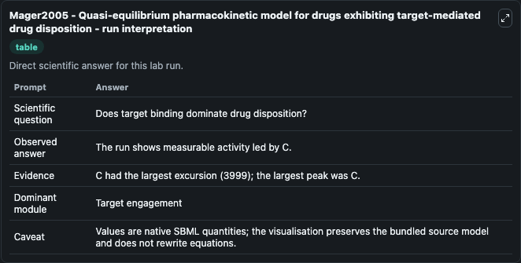
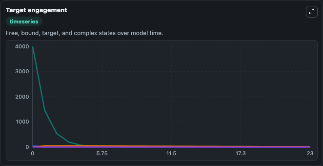
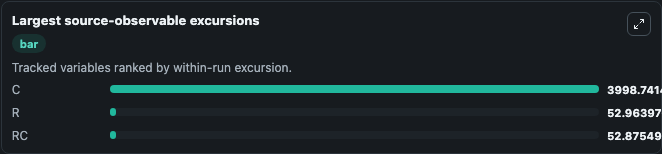
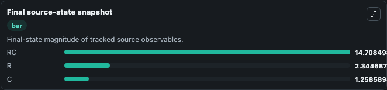

# Mager2005 - Quasi-equilibrium pharmacokinetic model for drugs exhibiting target-mediated drug disposition

This Biosimulant lab wraps `Mager2005 - Quasi-equilibrium pharmacokinetic model for drugs exhibiting target-mediated drug disposition` as a runnable pharmacology model with a companion visualization module.
This model was developed with the aim of constructing an equilibrium model of the pharmacokinetic behaviour of a drug exhibiting target-mediated drug disposition (TMDD). It can be used to explore drug-exposure and pathway-response dynamics and compare scenario outcomes across configurations.

## What You'll See

The lab asks: Does target binding dominate drug disposition under the selected affinity and target abundance? It runs for 24.0 time units with a communication step of 1.0. The run uses the model defaults declared by the curated SBML wrapper. The generated visualizations focus on Free Drug Concentration, Total Target Amount, Free Target Concentration, and Drug Target Complex, combining trajectory, endpoint-comparison, and summary-table views from one completed dark-mode run.

In this captured run, **C** peaked at **4000.0** and **C** moved by **3999.0** native units across 24.0 simulation windows.

<!-- BIOSIMULANT_VISUALS_START -->
### Output Visualizations



*Summary table for Mager2005 - Quasi-equilibrium pharmacokinetic model for drugs exhibiting target-mediated drug disposition, reporting the scientific question, observed answer (largest change: **C** at **3999.0** native units), evidence (peak observable: **C**), dominant module, and caveat.*



*Trajectories of C, R, RC, and A T across the 24.0 simulation. In this run **RC** climbed from 0 to 14.708 and **C** fell from 4000.0 to 1.259 — the largest movements among the focused observables.*



*Largest-excursion ranking of the focused observables — the absolute movement magnitude during the run. Top 3: **C** = 3998.7, **R** = 52.964, **RC** = 52.875.*



*Endpoint snapshot of the focused observables — final values from the captured run. Top 3 by value: **RC** = 14.708, **R** = 2.345, **C** = 1.259.*

<!-- BIOSIMULANT_VISUALS_END -->

## Model Context

- Core model: `models/core`
- Visualization model: `models/visualisation`
- Standard: `sbml`
- Upstream source: `biomodels_ebi:BIOMD0000000765`
- License: `CC0`

## Inputs

| Input | Maps To | Default | Notes |
|---|---|---|---|
| Initial Free Drug Concentration | `pharmacology_sbml_mager2005_quasi_equilibrium_pharmacokinetic_mode_biomd0000000765_model.initial_free_drug_concentration` |  | Uses the model default unless overridden at run time. |
| Initial Free Target Concentration | `pharmacology_sbml_mager2005_quasi_equilibrium_pharmacokinetic_mode_biomd0000000765_model.initial_free_target_concentration` |  | Uses the model default unless overridden at run time. |
| Target Binding Affinity Kd | `pharmacology_sbml_mager2005_quasi_equilibrium_pharmacokinetic_mode_biomd0000000765_model.target_binding_affinity_kd` |  | Uses the model default unless overridden at run time. |
| Drug Elimination Rate | `pharmacology_sbml_mager2005_quasi_equilibrium_pharmacokinetic_mode_biomd0000000765_model.drug_elimination_rate` |  | Uses the model default unless overridden at run time. |
| Complex Internalization Rate | `pharmacology_sbml_mager2005_quasi_equilibrium_pharmacokinetic_mode_biomd0000000765_model.complex_internalization_rate` |  | Uses the model default unless overridden at run time. |

## Outputs

| Output | Maps To | Role |
|---|---|---|
| `state` | `pharmacology_sbml_mager2005_quasi_equilibrium_pharmacokinetic_mode_biomd0000000765_model.state` | Available to the visualization model and downstream workflows. |
| `summary` | `pharmacology_sbml_mager2005_quasi_equilibrium_pharmacokinetic_mode_biomd0000000765_model.summary` | Available to the visualization model and downstream workflows. |
| `species_labels` | `pharmacology_sbml_mager2005_quasi_equilibrium_pharmacokinetic_mode_biomd0000000765_model.species_labels` | Available to the visualization model and downstream workflows. |
| `free_drug_concentration` | `pharmacology_sbml_mager2005_quasi_equilibrium_pharmacokinetic_mode_biomd0000000765_model.free_drug_concentration` | Available to the visualization model and downstream workflows. |
| `total_target_amount` | `pharmacology_sbml_mager2005_quasi_equilibrium_pharmacokinetic_mode_biomd0000000765_model.total_target_amount` | Available to the visualization model and downstream workflows. |
| `free_target_concentration` | `pharmacology_sbml_mager2005_quasi_equilibrium_pharmacokinetic_mode_biomd0000000765_model.free_target_concentration` | Available to the visualization model and downstream workflows. |
| `drug_target_complex` | `pharmacology_sbml_mager2005_quasi_equilibrium_pharmacokinetic_mode_biomd0000000765_model.drug_target_complex` | Available to the visualization model and downstream workflows. |

## Runtime

- Duration: `24.0`
- Communication step: `1.0`

## Running Locally

```bash
biosimulant labs serve .
```
