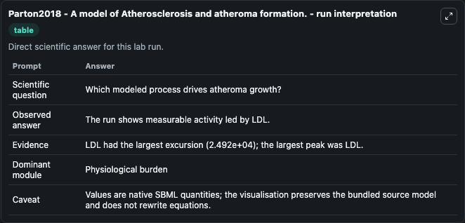
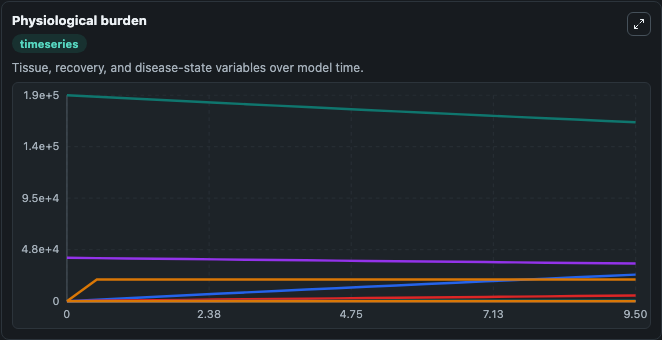
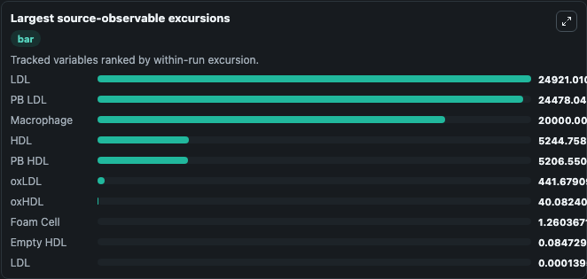
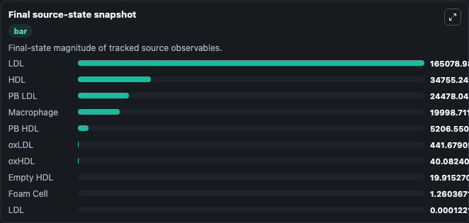

# Parton2018 - A model of Atherosclerosis and atheroma formation.

This Biosimulant lab wraps `Parton2018 - A model of Atherosclerosis and atheroma formation.` as a runnable pharmacology model with a companion visualization module.
SBML and SBGN-ML models of atherosclerosis and atheroma formation. It can be used to explore drug-exposure and pathway-response dynamics and compare scenario outcomes across configurations.

## What You'll See

The lab asks: Which lipid/inflammatory process dominates modeled atheroma progression? It runs for 10.0 time units with a communication step of 0.5. The run uses the model defaults declared by the curated SBML wrapper. The generated visualizations focus on HDL, LDL, Blood LDL, Blood HDL, Oxidized LDL, and Oxidized HDL, and related outputs, combining trajectory, endpoint-comparison, and summary-table views from one completed dark-mode run.

In this captured run, **LDL** peaked at **1.9e+05** and **LDL** moved by **2.49e+04** native units across 10.0 simulation windows.

<!-- BIOSIMULANT_VISUALS_START -->
### Output Visualizations



*Summary table for Parton2018 - A model of Atherosclerosis and atheroma formation., reporting the scientific question, observed answer (largest change: **LDL** at **2.49e+04** native units), evidence (peak observable: **LDL**), dominant module, and caveat.*



*Trajectories of LDL, PB LDL, Macrophage, HDL, PB HDL, and oxLDL across the 10.0 simulation. In this run **PB LDL** climbed from 0 to 2.45e+04 and **LDL** fell from 1.9e+05 to 1.65e+05 — the largest movements among the focused observables.*



*Largest-excursion ranking of the focused observables — the absolute movement magnitude during the run. Top 3: **LDL** = 2.49e+04, **PB LDL** = 2.45e+04, **Macrophage** = 2e+04, with 7 more observables below.*



*Endpoint snapshot of the focused observables — final values from the captured run. Top 3 by value: **LDL** = 1.65e+05, **HDL** = 3.48e+04, **PB LDL** = 2.45e+04, with 7 more observables below.*

<!-- BIOSIMULANT_VISUALS_END -->

## Model Context

- Core model: `models/core`
- Visualization model: `models/visualisation`
- Standard: `sbml`
- Upstream source: `biomodels_ebi:MODEL1812100001`
- License: `CC0`

## Inputs

| Input | Maps To | Default | Notes |
|---|---|---|---|
| Initial LDL | `pharmacology_sbml_parton2018_a_model_of_atherosclerosis_and_athero_model1812100001_model.initial_ldl` |  | Uses the model default unless overridden at run time. |
| Initial HDL | `pharmacology_sbml_parton2018_a_model_of_atherosclerosis_and_athero_model1812100001_model.initial_hdl` |  | Uses the model default unless overridden at run time. |
| Initial Free Oxygen Radicals | `pharmacology_sbml_parton2018_a_model_of_atherosclerosis_and_athero_model1812100001_model.initial_free_oxygen_radicals` |  | Uses the model default unless overridden at run time. |
| Initial Monocytes | `pharmacology_sbml_parton2018_a_model_of_atherosclerosis_and_athero_model1812100001_model.initial_monocytes` |  | Uses the model default unless overridden at run time. |
| Initial T Cells | `pharmacology_sbml_parton2018_a_model_of_atherosclerosis_and_athero_model1812100001_model.initial_t_cells` |  | Uses the model default unless overridden at run time. |

## Outputs

| Output | Maps To | Role |
|---|---|---|
| `state` | `pharmacology_sbml_parton2018_a_model_of_atherosclerosis_and_athero_model1812100001_model.state` | Available to the visualization model and downstream workflows. |
| `summary` | `pharmacology_sbml_parton2018_a_model_of_atherosclerosis_and_athero_model1812100001_model.summary` | Available to the visualization model and downstream workflows. |
| `species_labels` | `pharmacology_sbml_parton2018_a_model_of_atherosclerosis_and_athero_model1812100001_model.species_labels` | Available to the visualization model and downstream workflows. |
| `hdl` | `pharmacology_sbml_parton2018_a_model_of_atherosclerosis_and_athero_model1812100001_model.hdl` | Available to the visualization model and downstream workflows. |
| `ldl` | `pharmacology_sbml_parton2018_a_model_of_atherosclerosis_and_athero_model1812100001_model.ldl` | Available to the visualization model and downstream workflows. |
| `blood_ldl` | `pharmacology_sbml_parton2018_a_model_of_atherosclerosis_and_athero_model1812100001_model.blood_ldl` | Available to the visualization model and downstream workflows. |
| `blood_hdl` | `pharmacology_sbml_parton2018_a_model_of_atherosclerosis_and_athero_model1812100001_model.blood_hdl` | Available to the visualization model and downstream workflows. |
| `oxidized_ldl` | `pharmacology_sbml_parton2018_a_model_of_atherosclerosis_and_athero_model1812100001_model.oxidized_ldl` | Available to the visualization model and downstream workflows. |
| `oxidized_hdl` | `pharmacology_sbml_parton2018_a_model_of_atherosclerosis_and_athero_model1812100001_model.oxidized_hdl` | Available to the visualization model and downstream workflows. |
| `monocytes` | `pharmacology_sbml_parton2018_a_model_of_atherosclerosis_and_athero_model1812100001_model.monocytes` | Available to the visualization model and downstream workflows. |
| `macrophages` | `pharmacology_sbml_parton2018_a_model_of_atherosclerosis_and_athero_model1812100001_model.macrophages` | Available to the visualization model and downstream workflows. |
| `foam_cells` | `pharmacology_sbml_parton2018_a_model_of_atherosclerosis_and_athero_model1812100001_model.foam_cells` | Available to the visualization model and downstream workflows. |

## Runtime

- Duration: `10.0`
- Communication step: `0.5`

## Running Locally

```bash
biosimulant labs serve .
```
