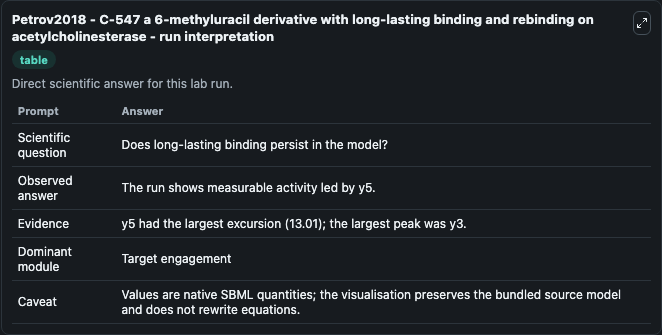
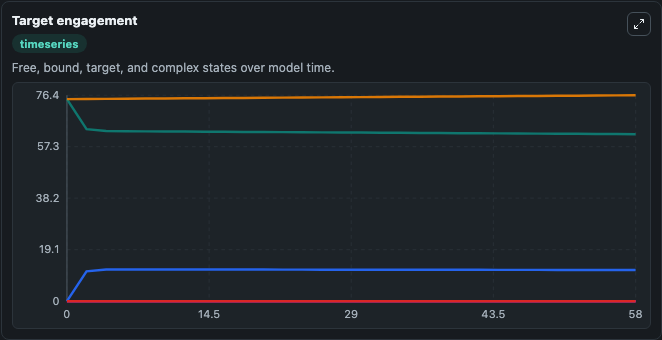
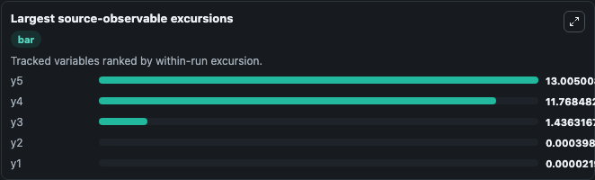
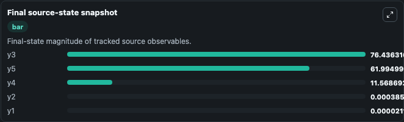

# Petrov2018 - C-547 a 6-methyluracil derivative with long-lasting binding and rebinding on acetylcholinesterase

This Biosimulant lab wraps `Petrov2018 - C-547 a 6-methyluracil derivative with long-lasting binding and rebinding on acetylcholinesterase` as a runnable pharmacology model with a companion visualization module.
C-547, a candidate drug, is a potent slow-binding inhibitor of acetyl-cholinesterase, and the focus of this PK/PD model, which investigates the metabolism and clinical effect of C-547 when it is no lo. It can be used to explore drug-exposure and pathway-response dynamics and compare scenario outcomes across configurations.

## What You'll See

The lab asks: Does long-lasting C-547 binding/rebinding persist in the simulated state trajectory? It runs for 60.0 time units with a communication step of 2.0. The run uses the model defaults declared by the curated SBML wrapper. The generated visualizations focus on C547 Binding State Y1, C547 Binding State Y2, C547 Binding State Y3, C547 Binding State Y4, and C547 Binding State Y5, combining trajectory, endpoint-comparison, and summary-table views from one completed dark-mode run.

In this captured run, **y3** peaked at **76.436** and **y5** moved by **13.010** native units across 60.0 simulation windows.

<!-- BIOSIMULANT_VISUALS_START -->
### Output Visualizations



*Summary table for Petrov2018 - C-547 a 6-methyluracil derivative with long-lasting binding and rebinding on acetylcholinesterase, reporting the scientific question, observed answer (largest change: **y5** at **13.010** native units), evidence (peak observable: **y3**), dominant module, and caveat.*



*Trajectories of y5, y4, y3, y2, and y1 across the 60.0 simulation. In this run **y4** climbed from 0 to 11.569 and **y5** fell from 75.000 to 61.995 — the largest movements among the focused observables.*



*Largest-excursion ranking of the focused observables — the absolute movement magnitude during the run. Top 3: **y5** = 13.005, **y4** = 11.768, **y3** = 1.436, with 2 more observables below.*



*Endpoint snapshot of the focused observables — final values from the captured run. Top 3 by value: **y3** = 76.436, **y5** = 61.995, **y4** = 11.569, with 2 more observables below.*

<!-- BIOSIMULANT_VISUALS_END -->

## Model Context

- Core model: `models/core`
- Visualization model: `models/visualisation`
- Standard: `sbml`
- Upstream source: `biomodels_ebi:MODEL1910240001`
- License: `CC0`

## Inputs

| Input | Maps To | Default | Notes |
|---|---|---|---|
| Initial C547 Binding State Y1 | `pharmacology_sbml_petrov2018_c_547_a_6_methyluracil_derivative_wit_model1910240001_model.initial_c547_binding_state_y1` |  | Uses the model default unless overridden at run time. |
| Initial C547 Binding State Y2 | `pharmacology_sbml_petrov2018_c_547_a_6_methyluracil_derivative_wit_model1910240001_model.initial_c547_binding_state_y2` |  | Uses the model default unless overridden at run time. |
| Initial C547 Binding State Y3 | `pharmacology_sbml_petrov2018_c_547_a_6_methyluracil_derivative_wit_model1910240001_model.initial_c547_binding_state_y3` |  | Uses the model default unless overridden at run time. |
| Initial C547 Binding State Y4 | `pharmacology_sbml_petrov2018_c_547_a_6_methyluracil_derivative_wit_model1910240001_model.initial_c547_binding_state_y4` |  | Uses the model default unless overridden at run time. |
| Initial C547 Binding State Y5 | `pharmacology_sbml_petrov2018_c_547_a_6_methyluracil_derivative_wit_model1910240001_model.initial_c547_binding_state_y5` |  | Uses the model default unless overridden at run time. |

## Outputs

| Output | Maps To | Role |
|---|---|---|
| `state` | `pharmacology_sbml_petrov2018_c_547_a_6_methyluracil_derivative_wit_model1910240001_model.state` | Available to the visualization model and downstream workflows. |
| `summary` | `pharmacology_sbml_petrov2018_c_547_a_6_methyluracil_derivative_wit_model1910240001_model.summary` | Available to the visualization model and downstream workflows. |
| `species_labels` | `pharmacology_sbml_petrov2018_c_547_a_6_methyluracil_derivative_wit_model1910240001_model.species_labels` | Available to the visualization model and downstream workflows. |
| `c547_binding_state_y1` | `pharmacology_sbml_petrov2018_c_547_a_6_methyluracil_derivative_wit_model1910240001_model.c547_binding_state_y1` | Available to the visualization model and downstream workflows. |
| `c547_binding_state_y2` | `pharmacology_sbml_petrov2018_c_547_a_6_methyluracil_derivative_wit_model1910240001_model.c547_binding_state_y2` | Available to the visualization model and downstream workflows. |
| `c547_binding_state_y3` | `pharmacology_sbml_petrov2018_c_547_a_6_methyluracil_derivative_wit_model1910240001_model.c547_binding_state_y3` | Available to the visualization model and downstream workflows. |
| `c547_binding_state_y4` | `pharmacology_sbml_petrov2018_c_547_a_6_methyluracil_derivative_wit_model1910240001_model.c547_binding_state_y4` | Available to the visualization model and downstream workflows. |
| `c547_binding_state_y5` | `pharmacology_sbml_petrov2018_c_547_a_6_methyluracil_derivative_wit_model1910240001_model.c547_binding_state_y5` | Available to the visualization model and downstream workflows. |

## Runtime

- Duration: `60.0`
- Communication step: `2.0`

## Running Locally

```bash
biosimulant labs serve .
```
