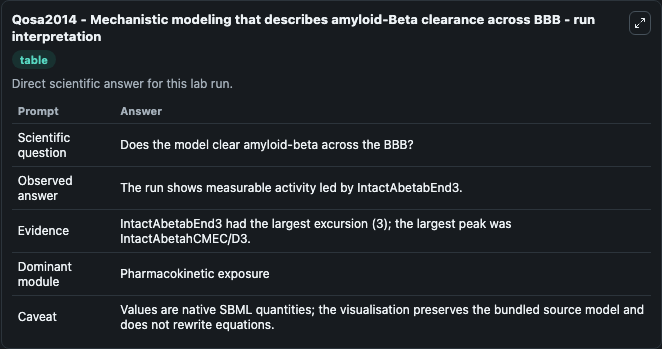
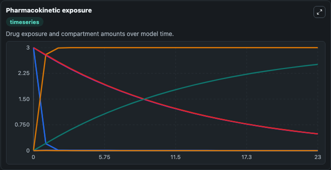
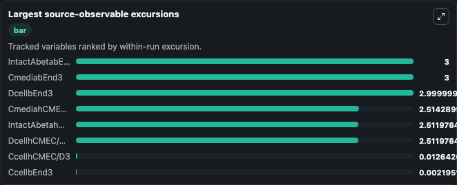
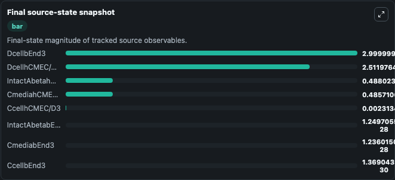

# Qosa2014 - Mechanistic modeling that describes amyloid-Beta clearance across BBB

This Biosimulant lab wraps `Qosa2014 - Mechanistic modeling that describes amyloid-Beta clearance across BBB` as a runnable pharmacology model with a companion visualization module.
Qosa2014 - Mechanistic modeling thatdescribes Aβ clearance across BBB Qosa2014 - Mechanistic modeling thatdescribes Aβ clearance across BBB. It can be used to explore drug-exposure and pathway-response dynamics and compare scenario outcomes across configurations.

## What You'll See

The lab asks: Does the model clear/degrade amyloid-beta across BBB cell systems? It runs for 24.0 time units with a communication step of 1.0. The run uses the model defaults declared by the curated SBML wrapper. The generated visualizations focus on Intact Amyloid Beta Hcmec D3, Intact Amyloid Beta Bend3, Cellular Amyloid Beta Hcmec D3, Degraded Amyloid Beta Hcmec D3, Cellular Amyloid Beta Bend3, and Degraded Amyloid Beta Bend3, and related outputs, combining trajectory, endpoint-comparison, and summary-table views from one completed dark-mode run.

In this captured run, **IntactAbetahCMEC/D3** peaked at **3.000** and **IntactAbetabEnd3** moved by **3.000** native units across 24.0 simulation windows.

<!-- BIOSIMULANT_VISUALS_START -->
### Output Visualizations



*Summary table for Qosa2014 - Mechanistic modeling that describes amyloid-Beta clearance across BBB, reporting the scientific question, observed answer (largest change: **IntactAbetabEnd3** at **3.000** native units), evidence (peak observable: **IntactAbetahCMEC/D3**), dominant module, and caveat.*



*Trajectories of IntactAbetabEnd3, CmediabEnd3, DcellbEnd3, CmediahCMEC/D3, IntactAbetahCMEC/D3, and DcellhCMEC/D3 across the 24.0 simulation. In this run **DcellbEnd3** climbed from 0 to 3.000 and **IntactAbetabEnd3** fell from 3.000 to 1.25e-28 — the largest movements among the focused observables.*



*Largest-excursion ranking of the focused observables — the absolute movement magnitude during the run. Top 3: **IntactAbetabEnd3** = 3.000, **CmediabEnd3** = 3.000, **DcellbEnd3** = 3.000, with 5 more observables below.*



*Endpoint snapshot of the focused observables — final values from the captured run. Top 3 by value: **DcellbEnd3** = 3.000, **DcellhCMEC/D3** = 2.512, **IntactAbetahCMEC/D3** = 0.4880, with 5 more observables below.*

<!-- BIOSIMULANT_VISUALS_END -->

## Model Context

- Core model: `models/core`
- Visualization model: `models/visualisation`
- Standard: `sbml`
- Upstream source: `biomodels_ebi:MODEL1409240002`
- License: `CC0`

## Inputs

| Input | Maps To | Default | Notes |
|---|---|---|---|
| Initial Cellular Amyloid Beta Hcmec D3 | `pharmacology_sbml_qosa2014_mechanistic_modeling_that_describes_amy_model1409240002_model.initial_cellular_amyloid_beta_hcmec_d3` |  | Uses the model default unless overridden at run time. |
| Initial Cellular Amyloid Beta Bend3 | `pharmacology_sbml_qosa2014_mechanistic_modeling_that_describes_amy_model1409240002_model.initial_cellular_amyloid_beta_bend3` |  | Uses the model default unless overridden at run time. |
| Initial Media Amyloid Beta Hcmec D3 | `pharmacology_sbml_qosa2014_mechanistic_modeling_that_describes_amy_model1409240002_model.initial_media_amyloid_beta_hcmec_d3` |  | Uses the model default unless overridden at run time. |
| Initial Media Amyloid Beta Bend3 | `pharmacology_sbml_qosa2014_mechanistic_modeling_that_describes_amy_model1409240002_model.initial_media_amyloid_beta_bend3` |  | Uses the model default unless overridden at run time. |

## Outputs

| Output | Maps To | Role |
|---|---|---|
| `state` | `pharmacology_sbml_qosa2014_mechanistic_modeling_that_describes_amy_model1409240002_model.state` | Available to the visualization model and downstream workflows. |
| `summary` | `pharmacology_sbml_qosa2014_mechanistic_modeling_that_describes_amy_model1409240002_model.summary` | Available to the visualization model and downstream workflows. |
| `species_labels` | `pharmacology_sbml_qosa2014_mechanistic_modeling_that_describes_amy_model1409240002_model.species_labels` | Available to the visualization model and downstream workflows. |
| `intact_amyloid_beta_hcmec_d3` | `pharmacology_sbml_qosa2014_mechanistic_modeling_that_describes_amy_model1409240002_model.intact_amyloid_beta_hcmec_d3` | Available to the visualization model and downstream workflows. |
| `intact_amyloid_beta_bend3` | `pharmacology_sbml_qosa2014_mechanistic_modeling_that_describes_amy_model1409240002_model.intact_amyloid_beta_bend3` | Available to the visualization model and downstream workflows. |
| `cellular_amyloid_beta_hcmec_d3` | `pharmacology_sbml_qosa2014_mechanistic_modeling_that_describes_amy_model1409240002_model.cellular_amyloid_beta_hcmec_d3` | Available to the visualization model and downstream workflows. |
| `degraded_amyloid_beta_hcmec_d3` | `pharmacology_sbml_qosa2014_mechanistic_modeling_that_describes_amy_model1409240002_model.degraded_amyloid_beta_hcmec_d3` | Available to the visualization model and downstream workflows. |
| `cellular_amyloid_beta_bend3` | `pharmacology_sbml_qosa2014_mechanistic_modeling_that_describes_amy_model1409240002_model.cellular_amyloid_beta_bend3` | Available to the visualization model and downstream workflows. |
| `degraded_amyloid_beta_bend3` | `pharmacology_sbml_qosa2014_mechanistic_modeling_that_describes_amy_model1409240002_model.degraded_amyloid_beta_bend3` | Available to the visualization model and downstream workflows. |
| `media_amyloid_beta_hcmec_d3` | `pharmacology_sbml_qosa2014_mechanistic_modeling_that_describes_amy_model1409240002_model.media_amyloid_beta_hcmec_d3` | Available to the visualization model and downstream workflows. |
| `media_amyloid_beta_bend3` | `pharmacology_sbml_qosa2014_mechanistic_modeling_that_describes_amy_model1409240002_model.media_amyloid_beta_bend3` | Available to the visualization model and downstream workflows. |

## Runtime

- Duration: `24.0`
- Communication step: `1.0`

## Running Locally

```bash
biosimulant labs serve .
```
