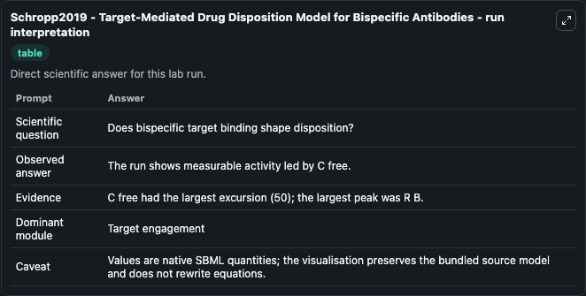
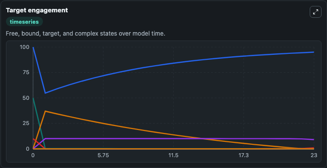
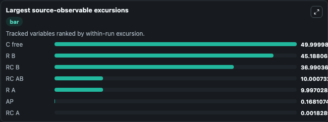
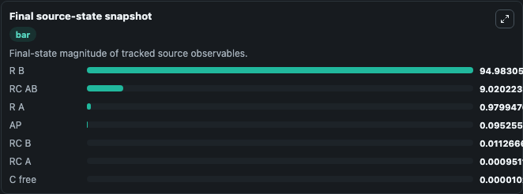

# Schropp2019 - Target-Mediated Drug Disposition Model for Bispecific Antibodies

This Biosimulant lab wraps `Schropp2019 - Target-Mediated Drug Disposition Model for Bispecific Antibodies` as a runnable pharmacology model with a companion visualization module.
This model presents a general target-mediated drug disposition (TMDD) model for bispecific antibodies (BsAbs), which bind to two different targets on different cell membranes. It can be used to explore drug-exposure and pathway-response dynamics and compare scenario outcomes across configurations.

## What You'll See

The lab asks: Does bispecific target engagement shape antibody disposition? It runs for 24.0 time units with a communication step of 1.0. The run uses the model defaults declared by the curated SBML wrapper. The generated visualizations focus on Free Bispecific Antibody, Free Target A, Free Target B, Antibody Target A Complex, Antibody Target B Complex, and Bispecific Bridge Complex, and related outputs, combining trajectory, endpoint-comparison, and summary-table views from one completed dark-mode run.

In this captured run, **Free Target B** peaked at **100.0** and **Free Bispecific Antibody** moved by **50.000** native units across 24.0 simulation windows.

<!-- BIOSIMULANT_VISUALS_START -->
### Output Visualizations



*Summary table for Schropp2019 - Target-Mediated Drug Disposition Model for Bispecific Antibodies, reporting the scientific question, observed answer (largest change: **Free Bispecific Antibody** at **50.000** native units), evidence (peak observable: **Free Target B**), dominant module, and caveat.*



*Trajectories of Free Bispecific Antibody, Free Target B, Antibody Target B Complex, Bispecific Bridge Complex, Free Target A, and Peripheral Antibody across the 24.0 simulation. In this run **Bispecific Bridge Complex** climbed from 0 to 9.020 and **Free Bispecific Antibody** fell from 50.000 to 1.03e-05 — the largest movements among the focused observables.*



*Largest-excursion ranking of the focused observables — the absolute movement magnitude during the run. Top 3: **Free Bispecific Antibody** = 50.000, **Free Target B** = 45.188, **Antibody Target B Complex** = 36.990, with 4 more observables below.*



*Endpoint snapshot of the focused observables — final values from the captured run. Top 3 by value: **Free Target B** = 94.983, **Bispecific Bridge Complex** = 9.020, **Free Target A** = 0.9799, with 4 more observables below.*

<!-- BIOSIMULANT_VISUALS_END -->

## Model Context

- Core model: `models/core`
- Visualization model: `models/visualisation`
- Standard: `sbml`
- Upstream source: `biomodels_ebi:BIOMD0000000788`
- License: `CC0`

## Inputs

| Input | Maps To | Default | Notes |
|---|---|---|---|
| Initial Free Bispecific Antibody | `pharmacology_sbml_schropp2019_target_mediated_drug_disposition_mod_biomd0000000788_model.initial_free_bispecific_antibody` |  | Uses the model default unless overridden at run time. |
| Initial Target A Concentration | `pharmacology_sbml_schropp2019_target_mediated_drug_disposition_mod_biomd0000000788_model.initial_target_a_concentration` |  | Uses the model default unless overridden at run time. |
| Initial Target B Concentration | `pharmacology_sbml_schropp2019_target_mediated_drug_disposition_mod_biomd0000000788_model.initial_target_b_concentration` |  | Uses the model default unless overridden at run time. |
| Target A Association Rate | `pharmacology_sbml_schropp2019_target_mediated_drug_disposition_mod_biomd0000000788_model.target_a_association_rate` |  | Uses the model default unless overridden at run time. |
| Target B Association Rate | `pharmacology_sbml_schropp2019_target_mediated_drug_disposition_mod_biomd0000000788_model.target_b_association_rate` |  | Uses the model default unless overridden at run time. |
| Central Elimination Rate | `pharmacology_sbml_schropp2019_target_mediated_drug_disposition_mod_biomd0000000788_model.central_elimination_rate` |  | Uses the model default unless overridden at run time. |

## Outputs

| Output | Maps To | Role |
|---|---|---|
| `state` | `pharmacology_sbml_schropp2019_target_mediated_drug_disposition_mod_biomd0000000788_model.state` | Available to the visualization model and downstream workflows. |
| `summary` | `pharmacology_sbml_schropp2019_target_mediated_drug_disposition_mod_biomd0000000788_model.summary` | Available to the visualization model and downstream workflows. |
| `species_labels` | `pharmacology_sbml_schropp2019_target_mediated_drug_disposition_mod_biomd0000000788_model.species_labels` | Available to the visualization model and downstream workflows. |
| `free_bispecific_antibody` | `pharmacology_sbml_schropp2019_target_mediated_drug_disposition_mod_biomd0000000788_model.free_bispecific_antibody` | Available to the visualization model and downstream workflows. |
| `free_target_a` | `pharmacology_sbml_schropp2019_target_mediated_drug_disposition_mod_biomd0000000788_model.free_target_a` | Available to the visualization model and downstream workflows. |
| `free_target_b` | `pharmacology_sbml_schropp2019_target_mediated_drug_disposition_mod_biomd0000000788_model.free_target_b` | Available to the visualization model and downstream workflows. |
| `antibody_target_a_complex` | `pharmacology_sbml_schropp2019_target_mediated_drug_disposition_mod_biomd0000000788_model.antibody_target_a_complex` | Available to the visualization model and downstream workflows. |
| `antibody_target_b_complex` | `pharmacology_sbml_schropp2019_target_mediated_drug_disposition_mod_biomd0000000788_model.antibody_target_b_complex` | Available to the visualization model and downstream workflows. |
| `bispecific_bridge_complex` | `pharmacology_sbml_schropp2019_target_mediated_drug_disposition_mod_biomd0000000788_model.bispecific_bridge_complex` | Available to the visualization model and downstream workflows. |
| `peripheral_antibody` | `pharmacology_sbml_schropp2019_target_mediated_drug_disposition_mod_biomd0000000788_model.peripheral_antibody` | Available to the visualization model and downstream workflows. |
| `depot_antibody` | `pharmacology_sbml_schropp2019_target_mediated_drug_disposition_mod_biomd0000000788_model.depot_antibody` | Available to the visualization model and downstream workflows. |

## Runtime

- Duration: `24.0`
- Communication step: `1.0`

## Running Locally

```bash
biosimulant labs serve .
```
