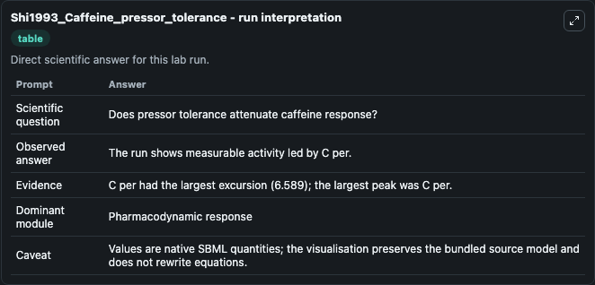
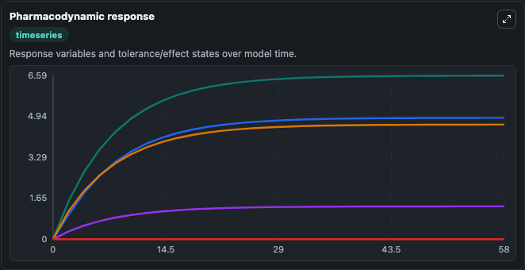
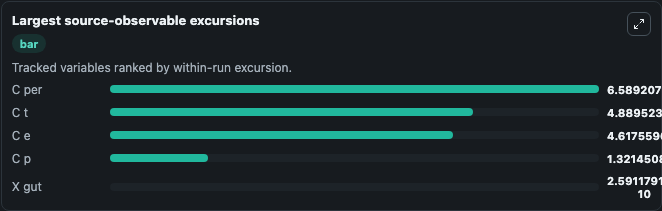
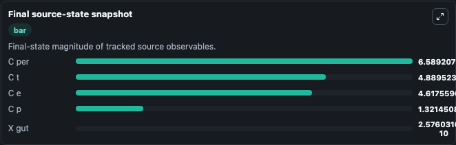

# Shi1993_Caffeine_pressor_tolerance

This Biosimulant lab wraps `Shi1993_Caffeine_pressor_tolerance` as a runnable pharmacology model with a companion visualization module.
described in: Pharmacokinetic-pharmacodynamic modeling of caffeine: Tolerance to pressor effects Shi J, Benowitz NL, Denaro CP and Sheiner LB. It can be used to explore drug-exposure and pathway-response dynamics and compare scenario outcomes across configurations.

## What You'll See

The lab asks: Does tolerance attenuate the modeled caffeine pressor response over time? It runs for 60.0 time units with a communication step of 2.0. The run uses the model defaults declared by the curated SBML wrapper. The generated visualizations focus on Gut Caffeine Amount, Plasma Caffeine Concentration, Peripheral Caffeine Concentration, Effect Site Caffeine Concentration, and Tolerance State, combining trajectory, endpoint-comparison, and summary-table views from one completed dark-mode run.

In this captured run, **C per** peaked at **6.589** and **C per** moved by **6.589** native units across 60.0 simulation windows.

<!-- BIOSIMULANT_VISUALS_START -->
### Output Visualizations



*Summary table for Shi1993_Caffeine_pressor_tolerance, reporting the scientific question, observed answer (largest change: **C per** at **6.589** native units), evidence (peak observable: **C per**), dominant module, and caveat.*



*Trajectories of C per, C t, C e, C p, and X gut across the 60.0 simulation. In this run **C per** climbed from 0 to 6.589 — the largest movements among the focused observables.*



*Largest-excursion ranking of the focused observables — the absolute movement magnitude during the run. Top 3: **C per** = 6.589, **C t** = 4.890, **C e** = 4.618, with 2 more observables below.*



*Endpoint snapshot of the focused observables — final values from the captured run. Top 3 by value: **C per** = 6.589, **C t** = 4.890, **C e** = 4.618, with 2 more observables below.*

<!-- BIOSIMULANT_VISUALS_END -->

## Model Context

- Core model: `models/core`
- Visualization model: `models/visualisation`
- Standard: `sbml`
- Upstream source: `biomodels_ebi:BIOMD0000000241`
- License: `CC0`

## Inputs

| Input | Maps To | Default | Notes |
|---|---|---|---|
| Initial Gut Caffeine Amount | `pharmacology_sbml_shi1993_caffeine_pressor_tolerance_biomd0000000241_model.initial_gut_caffeine_amount` |  | Uses the model default unless overridden at run time. |
| Initial Plasma Caffeine Concentration | `pharmacology_sbml_shi1993_caffeine_pressor_tolerance_biomd0000000241_model.initial_plasma_caffeine_concentration` |  | Uses the model default unless overridden at run time. |
| Initial Effect Site Caffeine | `pharmacology_sbml_shi1993_caffeine_pressor_tolerance_biomd0000000241_model.initial_effect_site_caffeine` |  | Uses the model default unless overridden at run time. |
| Initial Tolerance State | `pharmacology_sbml_shi1993_caffeine_pressor_tolerance_biomd0000000241_model.initial_tolerance_state` |  | Uses the model default unless overridden at run time. |

## Outputs

| Output | Maps To | Role |
|---|---|---|
| `state` | `pharmacology_sbml_shi1993_caffeine_pressor_tolerance_biomd0000000241_model.state` | Available to the visualization model and downstream workflows. |
| `summary` | `pharmacology_sbml_shi1993_caffeine_pressor_tolerance_biomd0000000241_model.summary` | Available to the visualization model and downstream workflows. |
| `species_labels` | `pharmacology_sbml_shi1993_caffeine_pressor_tolerance_biomd0000000241_model.species_labels` | Available to the visualization model and downstream workflows. |
| `gut_caffeine_amount` | `pharmacology_sbml_shi1993_caffeine_pressor_tolerance_biomd0000000241_model.gut_caffeine_amount` | Available to the visualization model and downstream workflows. |
| `plasma_caffeine_concentration` | `pharmacology_sbml_shi1993_caffeine_pressor_tolerance_biomd0000000241_model.plasma_caffeine_concentration` | Available to the visualization model and downstream workflows. |
| `peripheral_caffeine_concentration` | `pharmacology_sbml_shi1993_caffeine_pressor_tolerance_biomd0000000241_model.peripheral_caffeine_concentration` | Available to the visualization model and downstream workflows. |
| `effect_site_caffeine_concentration` | `pharmacology_sbml_shi1993_caffeine_pressor_tolerance_biomd0000000241_model.effect_site_caffeine_concentration` | Available to the visualization model and downstream workflows. |
| `tolerance_state` | `pharmacology_sbml_shi1993_caffeine_pressor_tolerance_biomd0000000241_model.tolerance_state` | Available to the visualization model and downstream workflows. |

## Runtime

- Duration: `60.0`
- Communication step: `2.0`

## Running Locally

```bash
biosimulant labs serve .
```
