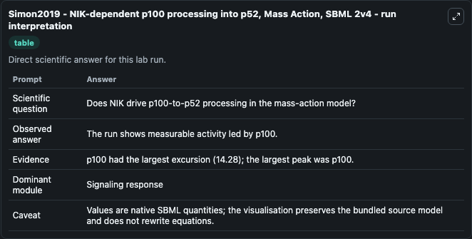
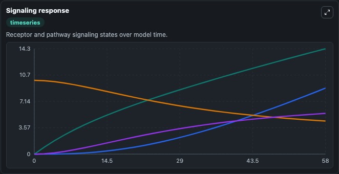
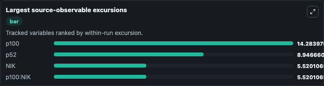
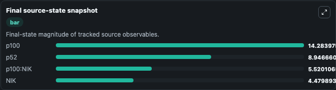

# Simon2019 - NIK-dependent p100 processing into p52, Mass Action, SBML 2v4

This Biosimulant lab wraps `Simon2019 - NIK-dependent p100 processing into p52, Mass Action, SBML 2v4` as a runnable pharmacology model with a companion visualization module.
This model represents NIK-dependent p100 processing into p52 with mass action kinetics. It can be used to explore drug-exposure and pathway-response dynamics and compare scenario outcomes across configurations.

## What You'll See

The lab asks: Does mass-action NIK binding drive p100-to-p52 processing? It runs for 60.0 time units with a communication step of 2.0. The run uses the model defaults declared by the curated SBML wrapper. The generated visualizations focus on P100 NIK Complex, P100 Pool, P52 Pool, and NIK Pool, combining trajectory, endpoint-comparison, and summary-table views from one completed dark-mode run.

In this captured run, **p100** peaked at **14.284** and **p100** moved by **14.280** native units across 60.0 simulation windows.

<!-- BIOSIMULANT_VISUALS_START -->
### Output Visualizations



*Summary table for Simon2019 - NIK-dependent p100 processing into p52, Mass Action, SBML 2v4, reporting the scientific question, observed answer (largest change: **p100** at **14.280** native units), evidence (peak observable: **p100**), dominant module, and caveat.*



*Trajectories of p100, p52, NIK, and p100:NIK across the 60.0 simulation. In this run **p100** climbed from 0 to 14.284 and **NIK** fell from 10.000 to 4.480 — the largest movements among the focused observables.*



*Largest-excursion ranking of the focused observables — the absolute movement magnitude during the run. Top 3: **p100** = 14.284, **p52** = 8.947, **NIK** = 5.520, with 1 more observable below.*



*Endpoint snapshot of the focused observables — final values from the captured run. Top 3 by value: **p100** = 14.284, **p52** = 8.947, **p100:NIK** = 5.520, with 1 more observable below.*

<!-- BIOSIMULANT_VISUALS_END -->

## Model Context

- Core model: `models/core`
- Visualization model: `models/visualisation`
- Standard: `sbml`
- Upstream source: `biomodels_ebi:BIOMD0000000868`
- License: `CC0`

## Inputs

| Input | Maps To | Default | Notes |
|---|---|---|---|
| Initial P100 Pool | `pharmacology_sbml_simon2019_nik_dependent_p100_processing_into_p52_biomd0000000868_model.initial_p100_pool` |  | Uses the model default unless overridden at run time. |
| Initial NIK Pool | `pharmacology_sbml_simon2019_nik_dependent_p100_processing_into_p52_biomd0000000868_model.initial_nik_pool` |  | Uses the model default unless overridden at run time. |
| Initial P100 NIK Complex | `pharmacology_sbml_simon2019_nik_dependent_p100_processing_into_p52_biomd0000000868_model.initial_p100_nik_complex` |  | Uses the model default unless overridden at run time. |
| Total P100 Boundary Pool | `pharmacology_sbml_simon2019_nik_dependent_p100_processing_into_p52_biomd0000000868_model.total_p100_boundary_pool` |  | Uses the model default unless overridden at run time. |

## Outputs

| Output | Maps To | Role |
|---|---|---|
| `state` | `pharmacology_sbml_simon2019_nik_dependent_p100_processing_into_p52_biomd0000000868_model.state` | Available to the visualization model and downstream workflows. |
| `summary` | `pharmacology_sbml_simon2019_nik_dependent_p100_processing_into_p52_biomd0000000868_model.summary` | Available to the visualization model and downstream workflows. |
| `species_labels` | `pharmacology_sbml_simon2019_nik_dependent_p100_processing_into_p52_biomd0000000868_model.species_labels` | Available to the visualization model and downstream workflows. |
| `p100_nik_complex` | `pharmacology_sbml_simon2019_nik_dependent_p100_processing_into_p52_biomd0000000868_model.p100_nik_complex` | Available to the visualization model and downstream workflows. |
| `p100_pool` | `pharmacology_sbml_simon2019_nik_dependent_p100_processing_into_p52_biomd0000000868_model.p100_pool` | Available to the visualization model and downstream workflows. |
| `p52_pool` | `pharmacology_sbml_simon2019_nik_dependent_p100_processing_into_p52_biomd0000000868_model.p52_pool` | Available to the visualization model and downstream workflows. |
| `nik_pool` | `pharmacology_sbml_simon2019_nik_dependent_p100_processing_into_p52_biomd0000000868_model.nik_pool` | Available to the visualization model and downstream workflows. |

## Runtime

- Duration: `60.0`
- Communication step: `2.0`

## Running Locally

```bash
biosimulant labs serve .
```
