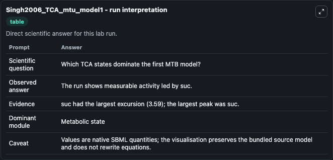
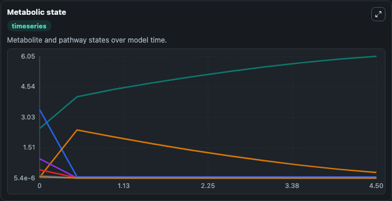
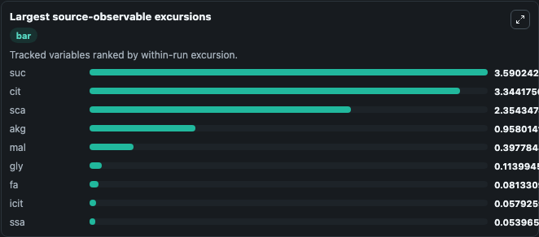
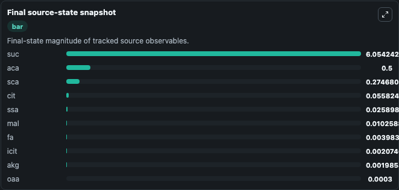

# Singh2006_TCA_mtu_model1

This Biosimulant lab wraps `Singh2006_TCA_mtu_model1` as a runnable pharmacology model with a companion visualization module.
This a model from the article: Kinetic modeling of tricarboxylic acid cycle and glyoxylate bypass in Mycobacterium tuberculosis, and its application to assessment of drug targets. It can be used to explore drug-exposure and pathway-response dynamics and compare scenario outcomes across configurations.

## What You'll See

The lab asks: Which TCA intermediates dominate MTB model variant 1? It runs for 5.0 time units with a communication step of 0.5. The run uses the model defaults declared by the curated SBML wrapper. The generated visualizations focus on Coa Pool, Acetate Or Acetyl Pool, Oxaloacetate Pool, Citrate Pool, Isocitrate Pool, and Alpha Ketoglutarate Pool, and related outputs, combining trajectory, endpoint-comparison, and summary-table views from one completed dark-mode run.

In this captured run, **suc** peaked at **6.054** and **suc** moved by **3.590** native units across 5.0 simulation windows.

<!-- BIOSIMULANT_VISUALS_START -->
### Output Visualizations



*Summary table for Singh2006_TCA_mtu_model1, reporting the scientific question, observed answer (largest change: **suc** at **3.590** native units), evidence (peak observable: **suc**), dominant module, and caveat.*



*Trajectories of suc, cit, sca, akg, mal, and gly across the 5.0 simulation. In this run **suc** climbed from 2.464 to 6.054 and **cit** fell from 3.400 to 0.0558 — the largest movements among the focused observables.*



*Largest-excursion ranking of the focused observables — the absolute movement magnitude during the run. Top 3: **suc** = 3.590, **cit** = 3.344, **sca** = 2.354, with 6 more observables below.*



*Endpoint snapshot of the focused observables — final values from the captured run. Top 3 by value: **suc** = 6.054, **aca** = 0.5000, **sca** = 0.2747, with 7 more observables below.*

<!-- BIOSIMULANT_VISUALS_END -->

## Model Context

- Core model: `models/core`
- Visualization model: `models/visualisation`
- Standard: `sbml`
- Upstream source: `biomodels_ebi:BIOMD0000000219`
- License: `CC0`

## Inputs

| Input | Maps To | Default | Notes |
|---|---|---|---|
| Initial Coa Pool | `pharmacology_sbml_singh2006_tca_mtu_model1_biomd0000000219_model.initial_coa_pool` |  | Uses the model default unless overridden at run time. |
| Initial Acetate Or Acetyl Pool | `pharmacology_sbml_singh2006_tca_mtu_model1_biomd0000000219_model.initial_acetate_or_acetyl_pool` |  | Uses the model default unless overridden at run time. |
| Initial Oxaloacetate Pool | `pharmacology_sbml_singh2006_tca_mtu_model1_biomd0000000219_model.initial_oxaloacetate_pool` |  | Uses the model default unless overridden at run time. |
| Initial Citrate Pool | `pharmacology_sbml_singh2006_tca_mtu_model1_biomd0000000219_model.initial_citrate_pool` |  | Uses the model default unless overridden at run time. |

## Outputs

| Output | Maps To | Role |
|---|---|---|
| `state` | `pharmacology_sbml_singh2006_tca_mtu_model1_biomd0000000219_model.state` | Available to the visualization model and downstream workflows. |
| `summary` | `pharmacology_sbml_singh2006_tca_mtu_model1_biomd0000000219_model.summary` | Available to the visualization model and downstream workflows. |
| `species_labels` | `pharmacology_sbml_singh2006_tca_mtu_model1_biomd0000000219_model.species_labels` | Available to the visualization model and downstream workflows. |
| `coa_pool` | `pharmacology_sbml_singh2006_tca_mtu_model1_biomd0000000219_model.coa_pool` | Available to the visualization model and downstream workflows. |
| `acetate_or_acetyl_pool` | `pharmacology_sbml_singh2006_tca_mtu_model1_biomd0000000219_model.acetate_or_acetyl_pool` | Available to the visualization model and downstream workflows. |
| `oxaloacetate_pool` | `pharmacology_sbml_singh2006_tca_mtu_model1_biomd0000000219_model.oxaloacetate_pool` | Available to the visualization model and downstream workflows. |
| `citrate_pool` | `pharmacology_sbml_singh2006_tca_mtu_model1_biomd0000000219_model.citrate_pool` | Available to the visualization model and downstream workflows. |
| `isocitrate_pool` | `pharmacology_sbml_singh2006_tca_mtu_model1_biomd0000000219_model.isocitrate_pool` | Available to the visualization model and downstream workflows. |
| `alpha_ketoglutarate_pool` | `pharmacology_sbml_singh2006_tca_mtu_model1_biomd0000000219_model.alpha_ketoglutarate_pool` | Available to the visualization model and downstream workflows. |
| `succinate_semialdehyde_pool` | `pharmacology_sbml_singh2006_tca_mtu_model1_biomd0000000219_model.succinate_semialdehyde_pool` | Available to the visualization model and downstream workflows. |
| `succinate_pool` | `pharmacology_sbml_singh2006_tca_mtu_model1_biomd0000000219_model.succinate_pool` | Available to the visualization model and downstream workflows. |

## Runtime

- Duration: `5.0`
- Communication step: `0.5`

## Running Locally

```bash
biosimulant labs serve .
```
