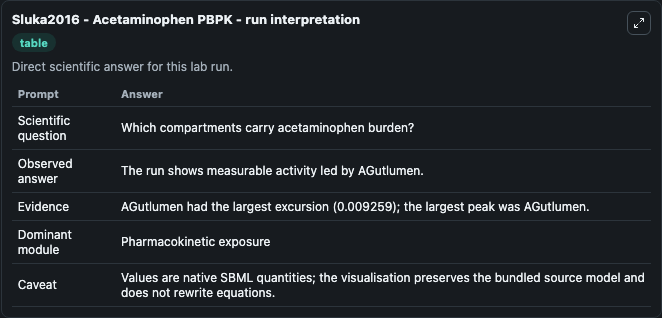
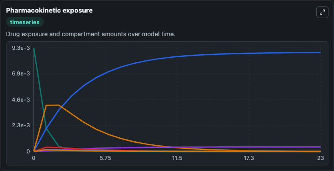
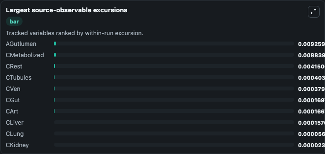
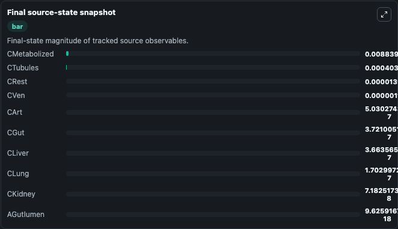

# Sluka2016 - Acetaminophen PBPK

This Biosimulant lab wraps `Sluka2016 - Acetaminophen PBPK` as a runnable pharmacology model with a companion visualization module.
Basic PBPK (Physiologically Based PharmacoKinetic) model of Acetaminophen. It can be used to explore drug-exposure and pathway-response dynamics and compare scenario outcomes across configurations.

## What You'll See

The lab asks: Which compartments carry acetaminophen burden after the selected dose? It runs for 24.0 time units with a communication step of 1.0. The run uses the model defaults declared by the curated SBML wrapper. The generated visualizations focus on Liver Acetaminophen Concentration, Arterial Acetaminophen Concentration, Gut Acetaminophen Concentration, Gut Lumen Acetaminophen Amount, Lung Acetaminophen Concentration, and Venous Acetaminophen Concentration, and related outputs, combining trajectory, endpoint-comparison, and summary-table views from one completed dark-mode run.

In this captured run, **AGutlumen** peaked at **0.00926** and **AGutlumen** moved by **0.00926** native units across 24.0 simulation windows.

<!-- BIOSIMULANT_VISUALS_START -->
### Output Visualizations



*Summary table for Sluka2016 - Acetaminophen PBPK, reporting the scientific question, observed answer (largest change: **AGutlumen** at **0.00926** native units), evidence (peak observable: **AGutlumen**), dominant module, and caveat.*



*Trajectories of AGutlumen, CMetabolized, CRest, CTubules, CVen, and CGut across the 24.0 simulation. In this run **CMetabolized** climbed from 0 to 0.00884 and **AGutlumen** fell from 0.00926 to 9.63e-18 — the largest movements among the focused observables.*



*Largest-excursion ranking of the focused observables — the absolute movement magnitude during the run. Top 3: **AGutlumen** = 0.00926, **CMetabolized** = 0.00884, **CRest** = 0.00415, with 7 more observables below.*



*Endpoint snapshot of the focused observables — final values from the captured run. Top 3 by value: **CMetabolized** = 0.00884, **CTubules** = 0.000403, **CRest** = 1.4e-05, with 7 more observables below.*

<!-- BIOSIMULANT_VISUALS_END -->

## Model Context

- Core model: `models/core`
- Visualization model: `models/visualisation`
- Standard: `sbml`
- Upstream source: `biomodels_ebi:BIOMD0000000619`
- License: `CC0`

## Inputs

| Input | Maps To | Default | Notes |
|---|---|---|---|
| Acetaminophen Dose Grams | `pharmacology_sbml_sluka2016_acetaminophen_pbpk_biomd0000000619_model.acetaminophen_dose_grams` |  | Uses the model default unless overridden at run time. |
| Initial Gut Lumen Acetaminophen | `pharmacology_sbml_sluka2016_acetaminophen_pbpk_biomd0000000619_model.initial_gut_lumen_acetaminophen` |  | Uses the model default unless overridden at run time. |
| Initial Liver Acetaminophen Concentration | `pharmacology_sbml_sluka2016_acetaminophen_pbpk_biomd0000000619_model.initial_liver_acetaminophen_concentration` |  | Uses the model default unless overridden at run time. |
| Initial Metabolized Acetaminophen | `pharmacology_sbml_sluka2016_acetaminophen_pbpk_biomd0000000619_model.initial_metabolized_acetaminophen` |  | Uses the model default unless overridden at run time. |

## Outputs

| Output | Maps To | Role |
|---|---|---|
| `state` | `pharmacology_sbml_sluka2016_acetaminophen_pbpk_biomd0000000619_model.state` | Available to the visualization model and downstream workflows. |
| `summary` | `pharmacology_sbml_sluka2016_acetaminophen_pbpk_biomd0000000619_model.summary` | Available to the visualization model and downstream workflows. |
| `species_labels` | `pharmacology_sbml_sluka2016_acetaminophen_pbpk_biomd0000000619_model.species_labels` | Available to the visualization model and downstream workflows. |
| `liver_acetaminophen_concentration` | `pharmacology_sbml_sluka2016_acetaminophen_pbpk_biomd0000000619_model.liver_acetaminophen_concentration` | Available to the visualization model and downstream workflows. |
| `arterial_acetaminophen_concentration` | `pharmacology_sbml_sluka2016_acetaminophen_pbpk_biomd0000000619_model.arterial_acetaminophen_concentration` | Available to the visualization model and downstream workflows. |
| `gut_acetaminophen_concentration` | `pharmacology_sbml_sluka2016_acetaminophen_pbpk_biomd0000000619_model.gut_acetaminophen_concentration` | Available to the visualization model and downstream workflows. |
| `gut_lumen_acetaminophen_amount` | `pharmacology_sbml_sluka2016_acetaminophen_pbpk_biomd0000000619_model.gut_lumen_acetaminophen_amount` | Available to the visualization model and downstream workflows. |
| `lung_acetaminophen_concentration` | `pharmacology_sbml_sluka2016_acetaminophen_pbpk_biomd0000000619_model.lung_acetaminophen_concentration` | Available to the visualization model and downstream workflows. |
| `venous_acetaminophen_concentration` | `pharmacology_sbml_sluka2016_acetaminophen_pbpk_biomd0000000619_model.venous_acetaminophen_concentration` | Available to the visualization model and downstream workflows. |
| `rest_body_acetaminophen_concentration` | `pharmacology_sbml_sluka2016_acetaminophen_pbpk_biomd0000000619_model.rest_body_acetaminophen_concentration` | Available to the visualization model and downstream workflows. |
| `metabolized_acetaminophen_concentration` | `pharmacology_sbml_sluka2016_acetaminophen_pbpk_biomd0000000619_model.metabolized_acetaminophen_concentration` | Available to the visualization model and downstream workflows. |

## Runtime

- Duration: `24.0`
- Communication step: `1.0`

## Running Locally

```bash
biosimulant labs serve .
```
