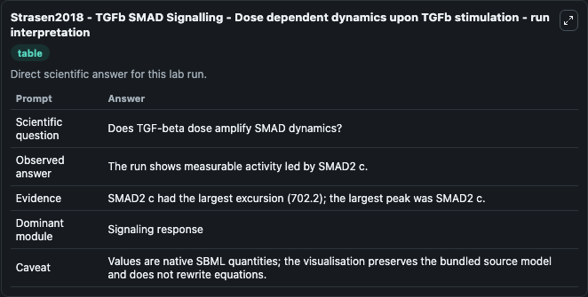
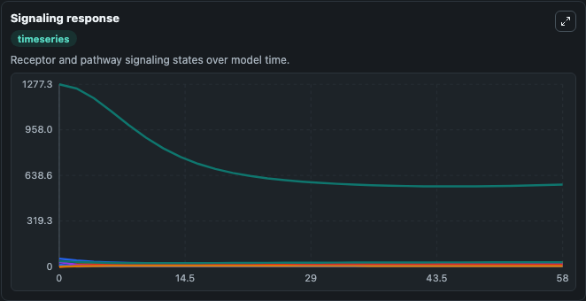
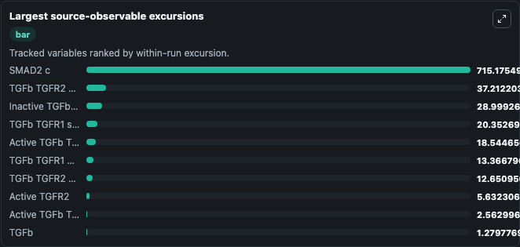
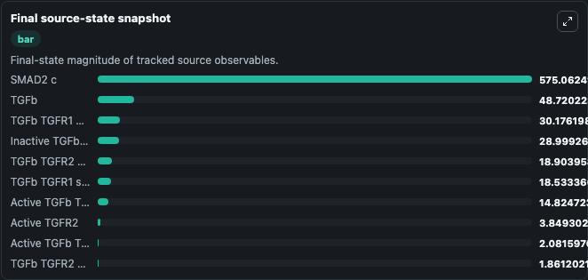

# Strasen2018 - TGFb SMAD Signalling - Dose dependent dynamics upon TGFb stimulation

This Biosimulant lab wraps `Strasen2018 - TGFb SMAD Signalling - Dose dependent dynamics upon TGFb stimulation` as a runnable pharmacology model with a companion visualization module.
This model simulates TGFb dose dependent kinetics of The SMADs. It can be used to explore drug-exposure and pathway-response dynamics and compare scenario outcomes across configurations.

## What You'll See

The lab asks: Does TGF-beta dose amplify receptor activation and internalization? It runs for 60.0 time units with a communication step of 2.0. The run uses the model defaults declared by the curated SBML wrapper. The generated visualizations focus on Surface TGF Beta Receptor 1, Surface TGF Beta Receptor 2, Endosomal TGF Beta Receptor 1, Endosomal TGF Beta Receptor 2, TGF Beta Ligand, and Internalized TGF Beta, and related outputs, combining trajectory, endpoint-comparison, and summary-table views from one completed dark-mode run.

In this captured run, **SMAD2 c** peaked at **1277.3** and **SMAD2 c** moved by **702.2** native units across 60.0 simulation windows.

<!-- BIOSIMULANT_VISUALS_START -->
### Output Visualizations



*Summary table for Strasen2018 - TGFb SMAD Signalling - Dose dependent dynamics upon TGFb stimulation, reporting the scientific question, observed answer (largest change: **SMAD2 c** at **702.2** native units), evidence (peak observable: **SMAD2 c**), dominant module, and caveat.*



*Trajectories of SMAD2 c, TGFb TGFR2 endo, Inactive TGFb TGFR1 TGFR2, TGFb TGFR1 surface, Active TGFb TGFR1 TGFR2, and TGFb TGFR1 endo across the 60.0 simulation. In this run **Inactive TGFb TGFR1 TGFR2** climbed from 0 to 28.999 and **SMAD2 c** fell from 1277.3 to 575.1 — the largest movements among the focused observables.*



*Largest-excursion ranking of the focused observables — the absolute movement magnitude during the run. Top 3: **SMAD2 c** = 715.2, **TGFb TGFR2 endo** = 37.212, **Inactive TGFb TGFR1 TGFR2** = 28.999, with 7 more observables below.*



*Endpoint snapshot of the focused observables — final values from the captured run. Top 3 by value: **SMAD2 c** = 575.1, **TGFb** = 48.720, **TGFb TGFR1 endo** = 30.176, with 7 more observables below.*

<!-- BIOSIMULANT_VISUALS_END -->

## Model Context

- Core model: `models/core`
- Visualization model: `models/visualisation`
- Standard: `sbml`
- Upstream source: `biomodels_ebi:BIOMD0000000989`
- License: `CC0`

## Inputs

| Input | Maps To | Default | Notes |
|---|---|---|---|
| TGFB Ligand Dose | `pharmacology_sbml_strasen2018_tgfb_smad_signalling_dose_dependent_biomd0000000989_model.tgfb_ligand_dose` |  | Uses the model default unless overridden at run time. |
| Initial Surface TGF Beta Receptor 1 | `pharmacology_sbml_strasen2018_tgfb_smad_signalling_dose_dependent_biomd0000000989_model.initial_surface_tgf_beta_receptor_1` |  | Uses the model default unless overridden at run time. |
| Initial Surface TGF Beta Receptor 2 | `pharmacology_sbml_strasen2018_tgfb_smad_signalling_dose_dependent_biomd0000000989_model.initial_surface_tgf_beta_receptor_2` |  | Uses the model default unless overridden at run time. |
| Receptor Phosphorylation Rate | `pharmacology_sbml_strasen2018_tgfb_smad_signalling_dose_dependent_biomd0000000989_model.receptor_phosphorylation_rate` |  | Uses the model default unless overridden at run time. |
| Ligand Degradation Rate | `pharmacology_sbml_strasen2018_tgfb_smad_signalling_dose_dependent_biomd0000000989_model.ligand_degradation_rate` |  | Uses the model default unless overridden at run time. |

## Outputs

| Output | Maps To | Role |
|---|---|---|
| `state` | `pharmacology_sbml_strasen2018_tgfb_smad_signalling_dose_dependent_biomd0000000989_model.state` | Available to the visualization model and downstream workflows. |
| `summary` | `pharmacology_sbml_strasen2018_tgfb_smad_signalling_dose_dependent_biomd0000000989_model.summary` | Available to the visualization model and downstream workflows. |
| `species_labels` | `pharmacology_sbml_strasen2018_tgfb_smad_signalling_dose_dependent_biomd0000000989_model.species_labels` | Available to the visualization model and downstream workflows. |
| `surface_tgf_beta_receptor_1` | `pharmacology_sbml_strasen2018_tgfb_smad_signalling_dose_dependent_biomd0000000989_model.surface_tgf_beta_receptor_1` | Available to the visualization model and downstream workflows. |
| `surface_tgf_beta_receptor_2` | `pharmacology_sbml_strasen2018_tgfb_smad_signalling_dose_dependent_biomd0000000989_model.surface_tgf_beta_receptor_2` | Available to the visualization model and downstream workflows. |
| `endosomal_tgf_beta_receptor_1` | `pharmacology_sbml_strasen2018_tgfb_smad_signalling_dose_dependent_biomd0000000989_model.endosomal_tgf_beta_receptor_1` | Available to the visualization model and downstream workflows. |
| `endosomal_tgf_beta_receptor_2` | `pharmacology_sbml_strasen2018_tgfb_smad_signalling_dose_dependent_biomd0000000989_model.endosomal_tgf_beta_receptor_2` | Available to the visualization model and downstream workflows. |
| `tgf_beta_ligand` | `pharmacology_sbml_strasen2018_tgfb_smad_signalling_dose_dependent_biomd0000000989_model.tgf_beta_ligand` | Available to the visualization model and downstream workflows. |
| `internalized_tgf_beta` | `pharmacology_sbml_strasen2018_tgfb_smad_signalling_dose_dependent_biomd0000000989_model.internalized_tgf_beta` | Available to the visualization model and downstream workflows. |
| `active_receptor_2` | `pharmacology_sbml_strasen2018_tgfb_smad_signalling_dose_dependent_biomd0000000989_model.active_receptor_2` | Available to the visualization model and downstream workflows. |
| `active_tgf_beta_receptor_complex` | `pharmacology_sbml_strasen2018_tgfb_smad_signalling_dose_dependent_biomd0000000989_model.active_tgf_beta_receptor_complex` | Available to the visualization model and downstream workflows. |

## Runtime

- Duration: `60.0`
- Communication step: `2.0`

## Running Locally

```bash
biosimulant labs serve .
```
