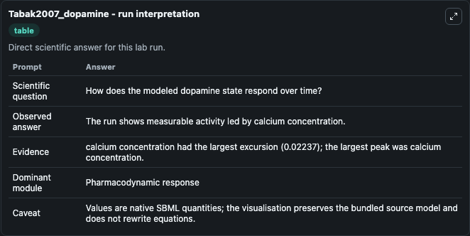
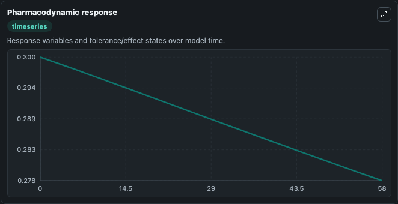
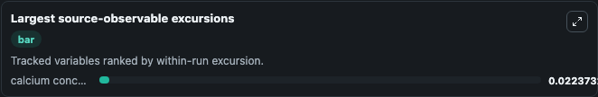
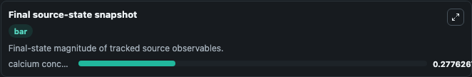

# Tabak2007_dopamine

This Biosimulant lab wraps `Tabak2007_dopamine` as a runnable pharmacology model with a companion visualization module.
The model is encoded according to the paper Low dose of dopamine may stimulate prolactin secretion by increasing fast potassium currents Figure5 has been reproduced by MathSBML. It can be used to explore drug-exposure and pathway-response dynamics and compare scenario outcomes across configurations.

## What You'll See

The lab asks: How does the selected conductance state affect calcium dynamics? It runs for 60.0 time units with a communication step of 2.0. The run uses the model defaults declared by the curated SBML wrapper. The generated visualizations focus on Calcium Concentration, combining trajectory, endpoint-comparison, and summary-table views from one completed dark-mode run.

In this captured run, **calcium concentration** peaked at **0.3000** and **calcium concentration** moved by **0.0224** native units across 60.0 simulation windows.

<!-- BIOSIMULANT_VISUALS_START -->
### Output Visualizations



*Summary table for Tabak2007_dopamine, reporting the scientific question, observed answer (largest change: **calcium concentration** at **0.0224** native units), evidence (peak observable: **calcium concentration**), dominant module, and caveat.*



*Trajectories of calcium concentration across the 60.0 simulation. In this run **calcium concentration** fell from 0.3000 to 0.2776 — the largest movements among the focused observables.*



*Largest-excursion ranking of the focused observables — the absolute movement magnitude during the run. Top 1: **calcium concentration** = 0.0224.*



*Endpoint snapshot of the focused observables — final values from the captured run. Top 1 by value: **calcium concentration** = 0.2776.*

<!-- BIOSIMULANT_VISUALS_END -->

## Model Context

- Core model: `models/core`
- Visualization model: `models/visualisation`
- Standard: `sbml`
- Upstream source: `biomodels_ebi:BIOMD0000000138`
- License: `CC0`

## Inputs

| Input | Maps To | Default | Notes |
|---|---|---|---|
| Initial Calcium Concentration | `pharmacology_sbml_tabak2007_dopamine_biomd0000000138_model.initial_calcium_concentration` |  | Uses the model default unless overridden at run time. |
| Calcium Conductance | `pharmacology_sbml_tabak2007_dopamine_biomd0000000138_model.calcium_conductance` |  | Uses the model default unless overridden at run time. |
| Potassium Conductance | `pharmacology_sbml_tabak2007_dopamine_biomd0000000138_model.potassium_conductance` |  | Uses the model default unless overridden at run time. |
| Sk Conductance | `pharmacology_sbml_tabak2007_dopamine_biomd0000000138_model.sk_conductance` |  | Uses the model default unless overridden at run time. |
| Membrane Capacitance | `pharmacology_sbml_tabak2007_dopamine_biomd0000000138_model.membrane_capacitance` |  | Uses the model default unless overridden at run time. |

## Outputs

| Output | Maps To | Role |
|---|---|---|
| `state` | `pharmacology_sbml_tabak2007_dopamine_biomd0000000138_model.state` | Available to the visualization model and downstream workflows. |
| `summary` | `pharmacology_sbml_tabak2007_dopamine_biomd0000000138_model.summary` | Available to the visualization model and downstream workflows. |
| `species_labels` | `pharmacology_sbml_tabak2007_dopamine_biomd0000000138_model.species_labels` | Available to the visualization model and downstream workflows. |
| `calcium_concentration` | `pharmacology_sbml_tabak2007_dopamine_biomd0000000138_model.calcium_concentration` | Available to the visualization model and downstream workflows. |

## Runtime

- Duration: `60.0`
- Communication step: `2.0`

## Running Locally

```bash
biosimulant labs serve .
```
