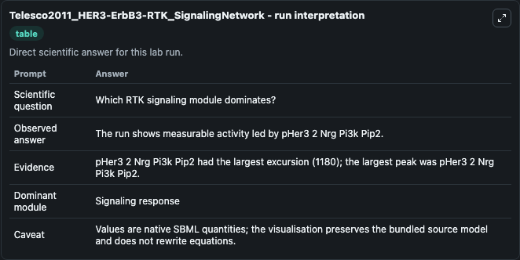
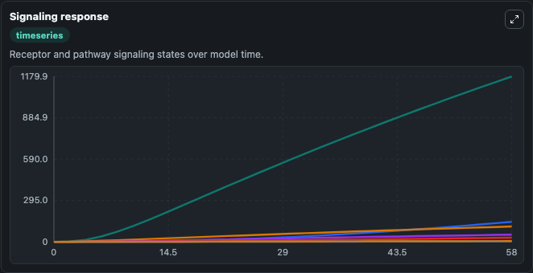
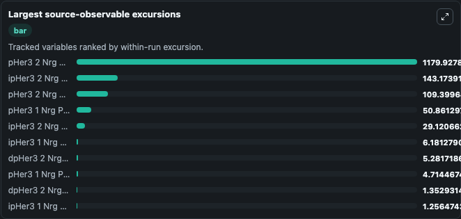
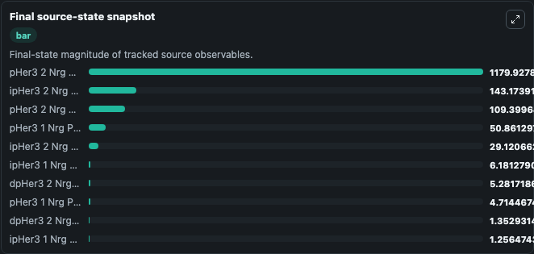

# Telesco2011_HER3-ErbB3-RTK_SignalingNetwork

This Biosimulant lab wraps `Telesco2011_HER3-ErbB3-RTK_SignalingNetwork` as a runnable pharmacology model with a companion visualization module.
This model is from the article: A multiscale modeling approach to investigate molecular mechanisms of pseudokinase activation and drug resistance in the HER3/ErbB3 receptor tyrosine kinase signaling n. It can be used to explore drug-exposure and pathway-response dynamics and compare scenario outcomes across configurations.

## What You'll See

The lab asks: Which HER3/PI3K signaling complexes dominate receptor activation/internalization? It runs for 60.0 time units with a communication step of 2.0. The run uses the model defaults declared by the curated SBML wrapper. The generated visualizations focus on Phosphorylated HER3 Neuregulin PI3K Complex, Phosphorylated HER3 1 Neuregulin PI3K Complex, Phosphorylated HER3 Neuregulin PI3K PIP2 Complex, Internalized Phosphorylated HER3 Neuregulin PI3K Complex, and Internalized Phosphorylated HER3 Neuregulin PI3K PIP2 Complex, combining trajectory, endpoint-comparison, and summary-table views from one completed dark-mode run.

In this captured run, **pHer3 2 Nrg Pi3k Pip2** peaked at **1179.9** and **pHer3 2 Nrg Pi3k Pip2** moved by **1180.0** native units across 60.0 simulation windows.

<!-- BIOSIMULANT_VISUALS_START -->
### Output Visualizations



*Summary table for Telesco2011_HER3-ErbB3-RTK_SignalingNetwork, reporting the scientific question, observed answer (largest change: **pHer3 2 Nrg Pi3k Pip2** at **1180.0** native units), evidence (peak observable: **pHer3 2 Nrg Pi3k Pip2**), dominant module, and caveat.*



*Trajectories of pHer3 2 Nrg Pi3k Pip2, ipHer3 2 Nrg Pi3k Pip2, pHer3 2 Nrg Pi3k, pHer3 1 Nrg Pi3k Pip2, ipHer3 2 Nrg Pi3k, and ipHer3 1 Nrg Pi3k Pip2 across the 60.0 simulation. In this run **pHer3 2 Nrg Pi3k Pip2** climbed from 0 to 1179.9 — the largest movements among the focused observables.*



*Largest-excursion ranking of the focused observables — the absolute movement magnitude during the run. Top 3: **pHer3 2 Nrg Pi3k Pip2** = 1179.9, **ipHer3 2 Nrg Pi3k Pip2** = 143.2, **pHer3 2 Nrg Pi3k** = 109.4, with 7 more observables below.*



*Endpoint snapshot of the focused observables — final values from the captured run. Top 3 by value: **pHer3 2 Nrg Pi3k Pip2** = 1179.9, **ipHer3 2 Nrg Pi3k Pip2** = 143.2, **pHer3 2 Nrg Pi3k** = 109.4, with 7 more observables below.*

<!-- BIOSIMULANT_VISUALS_END -->

## Model Context

- Core model: `models/core`
- Visualization model: `models/visualisation`
- Standard: `sbml`
- Upstream source: `biomodels_ebi:MODEL1102210001`
- License: `CC0`

## Inputs

| Input | Maps To | Default | Notes |
|---|---|---|---|
| Initial Total HER3 Receptor | `pharmacology_sbml_telesco2011_her3_erbb3_rtk_signalingnetwork_model1102210001_model.initial_total_her3_receptor` |  | Uses the model default unless overridden at run time. |
| Initial HER3 Neuregulin Complex | `pharmacology_sbml_telesco2011_her3_erbb3_rtk_signalingnetwork_model1102210001_model.initial_her3_neuregulin_complex` |  | Uses the model default unless overridden at run time. |
| Initial Phosphorylated HER3 Neuregulin PI3K Complex | `pharmacology_sbml_telesco2011_her3_erbb3_rtk_signalingnetwork_model1102210001_model.initial_phosphorylated_her3_neuregulin_pi3k_complex` |  | Uses the model default unless overridden at run time. |
| Initial Internalized Phosphorylated HER3 PI3K Complex | `pharmacology_sbml_telesco2011_her3_erbb3_rtk_signalingnetwork_model1102210001_model.initial_internalized_phosphorylated_her3_pi3k_complex` |  | Uses the model default unless overridden at run time. |

## Outputs

| Output | Maps To | Role |
|---|---|---|
| `state` | `pharmacology_sbml_telesco2011_her3_erbb3_rtk_signalingnetwork_model1102210001_model.state` | Available to the visualization model and downstream workflows. |
| `summary` | `pharmacology_sbml_telesco2011_her3_erbb3_rtk_signalingnetwork_model1102210001_model.summary` | Available to the visualization model and downstream workflows. |
| `species_labels` | `pharmacology_sbml_telesco2011_her3_erbb3_rtk_signalingnetwork_model1102210001_model.species_labels` | Available to the visualization model and downstream workflows. |
| `phosphorylated_her3_neuregulin_pi3k_complex` | `pharmacology_sbml_telesco2011_her3_erbb3_rtk_signalingnetwork_model1102210001_model.phosphorylated_her3_neuregulin_pi3k_complex` | Available to the visualization model and downstream workflows. |
| `phosphorylated_her3_1_neuregulin_pi3k_complex` | `pharmacology_sbml_telesco2011_her3_erbb3_rtk_signalingnetwork_model1102210001_model.phosphorylated_her3_1_neuregulin_pi3k_complex` | Available to the visualization model and downstream workflows. |
| `phosphorylated_her3_neuregulin_pi3k_pip2_complex` | `pharmacology_sbml_telesco2011_her3_erbb3_rtk_signalingnetwork_model1102210001_model.phosphorylated_her3_neuregulin_pi3k_pip2_complex` | Available to the visualization model and downstream workflows. |
| `internalized_phosphorylated_her3_neuregulin_pi3k_complex` | `pharmacology_sbml_telesco2011_her3_erbb3_rtk_signalingnetwork_model1102210001_model.internalized_phosphorylated_her3_neuregulin_pi3k_complex` | Available to the visualization model and downstream workflows. |
| `internalized_phosphorylated_her3_neuregulin_pi3k_pip2_complex` | `pharmacology_sbml_telesco2011_her3_erbb3_rtk_signalingnetwork_model1102210001_model.internalized_phosphorylated_her3_neuregulin_pi3k_pip2_complex` | Available to the visualization model and downstream workflows. |

## Runtime

- Duration: `60.0`
- Communication step: `2.0`

## Running Locally

```bash
biosimulant labs serve .
```
