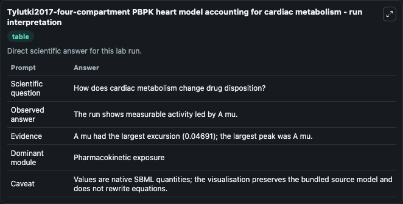
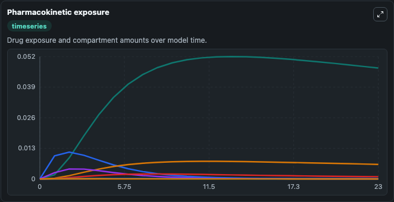
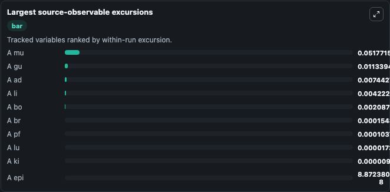
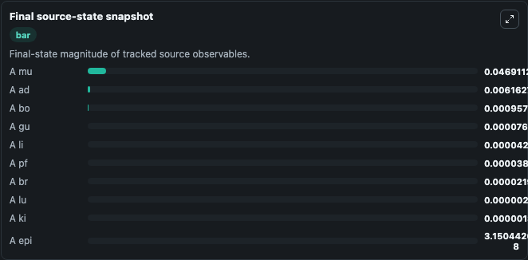

# Tylutki2017-four-compartment PBPK heart model accounting for cardiac metabolism

This Biosimulant lab wraps `Tylutki2017-four-compartment PBPK heart model accounting for cardiac metabolism` as a runnable pharmacology model with a companion visualization module.
In the field of cardiac drug efficacy and safety assessment, information on drug concentration in heart tissue is desirable. It can be used to explore drug-exposure and pathway-response dynamics and compare scenario outcomes across configurations.

## What You'll See

The lab asks: How does cardiac metabolism and clearance distribute drug across heart-related compartments? It runs for 24.0 time units with a communication step of 1.0. The run uses the model defaults declared by the curated SBML wrapper. The generated visualizations focus on Adipose Drug Amount, Bone Drug Amount, Brain Drug Amount, Gut Drug Amount, Epicardium Drug Amount, and Myocardium Drug Amount, and related outputs, combining trajectory, endpoint-comparison, and summary-table views from one completed dark-mode run.

In this captured run, **A mu** peaked at **0.0518** and **A mu** moved by **0.0469** native units across 24.0 simulation windows.

<!-- BIOSIMULANT_VISUALS_START -->
### Output Visualizations



*Summary table for Tylutki2017-four-compartment PBPK heart model accounting for cardiac metabolism, reporting the scientific question, observed answer (largest change: **A mu** at **0.0469** native units), evidence (peak observable: **A mu**), dominant module, and caveat.*



*Trajectories of A mu, A gu, A ad, A li, A bo, and A br across the 24.0 simulation. In this run **A mu** climbed from 0 to 0.0469 — the largest movements among the focused observables.*



*Largest-excursion ranking of the focused observables — the absolute movement magnitude during the run. Top 3: **A mu** = 0.0518, **A gu** = 0.0113, **A ad** = 0.00744, with 7 more observables below.*



*Endpoint snapshot of the focused observables — final values from the captured run. Top 3 by value: **A mu** = 0.0469, **A ad** = 0.00616, **A bo** = 0.000957, with 7 more observables below.*

<!-- BIOSIMULANT_VISUALS_END -->

## Model Context

- Core model: `models/core`
- Visualization model: `models/visualisation`
- Standard: `sbml`
- Upstream source: `biomodels_ebi:MODEL2003190003`
- License: `CC0`

## Inputs

| Input | Maps To | Default | Notes |
|---|---|---|---|
| Drug Dose | `pharmacology_sbml_tylutki2017_four_compartment_pbpk_heart_model_ac_model2003190003_model.drug_dose` |  | Uses the model default unless overridden at run time. |
| Fraction Absorbed | `pharmacology_sbml_tylutki2017_four_compartment_pbpk_heart_model_ac_model2003190003_model.fraction_absorbed` |  | Uses the model default unless overridden at run time. |
| Absorption Rate | `pharmacology_sbml_tylutki2017_four_compartment_pbpk_heart_model_ac_model2003190003_model.absorption_rate` |  | Uses the model default unless overridden at run time. |
| Renal Clearance | `pharmacology_sbml_tylutki2017_four_compartment_pbpk_heart_model_ac_model2003190003_model.renal_clearance` |  | Uses the model default unless overridden at run time. |
| CYP2C9 Expression | `pharmacology_sbml_tylutki2017_four_compartment_pbpk_heart_model_ac_model2003190003_model.cyp2c9_expression` |  | Uses the model default unless overridden at run time. |
| CYP2C8 Expression | `pharmacology_sbml_tylutki2017_four_compartment_pbpk_heart_model_ac_model2003190003_model.cyp2c8_expression` |  | Uses the model default unless overridden at run time. |

## Outputs

| Output | Maps To | Role |
|---|---|---|
| `state` | `pharmacology_sbml_tylutki2017_four_compartment_pbpk_heart_model_ac_model2003190003_model.state` | Available to the visualization model and downstream workflows. |
| `summary` | `pharmacology_sbml_tylutki2017_four_compartment_pbpk_heart_model_ac_model2003190003_model.summary` | Available to the visualization model and downstream workflows. |
| `species_labels` | `pharmacology_sbml_tylutki2017_four_compartment_pbpk_heart_model_ac_model2003190003_model.species_labels` | Available to the visualization model and downstream workflows. |
| `adipose_drug_amount` | `pharmacology_sbml_tylutki2017_four_compartment_pbpk_heart_model_ac_model2003190003_model.adipose_drug_amount` | Available to the visualization model and downstream workflows. |
| `bone_drug_amount` | `pharmacology_sbml_tylutki2017_four_compartment_pbpk_heart_model_ac_model2003190003_model.bone_drug_amount` | Available to the visualization model and downstream workflows. |
| `brain_drug_amount` | `pharmacology_sbml_tylutki2017_four_compartment_pbpk_heart_model_ac_model2003190003_model.brain_drug_amount` | Available to the visualization model and downstream workflows. |
| `gut_drug_amount` | `pharmacology_sbml_tylutki2017_four_compartment_pbpk_heart_model_ac_model2003190003_model.gut_drug_amount` | Available to the visualization model and downstream workflows. |
| `epicardium_drug_amount` | `pharmacology_sbml_tylutki2017_four_compartment_pbpk_heart_model_ac_model2003190003_model.epicardium_drug_amount` | Available to the visualization model and downstream workflows. |
| `myocardium_drug_amount` | `pharmacology_sbml_tylutki2017_four_compartment_pbpk_heart_model_ac_model2003190003_model.myocardium_drug_amount` | Available to the visualization model and downstream workflows. |
| `endocardium_drug_amount` | `pharmacology_sbml_tylutki2017_four_compartment_pbpk_heart_model_ac_model2003190003_model.endocardium_drug_amount` | Available to the visualization model and downstream workflows. |
| `perfusate_drug_amount` | `pharmacology_sbml_tylutki2017_four_compartment_pbpk_heart_model_ac_model2003190003_model.perfusate_drug_amount` | Available to the visualization model and downstream workflows. |

## Runtime

- Duration: `24.0`
- Communication step: `1.0`

## Running Locally

```bash
biosimulant labs serve .
```
