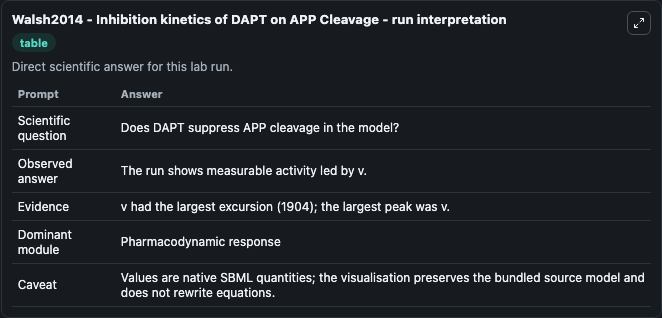
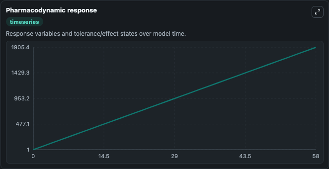
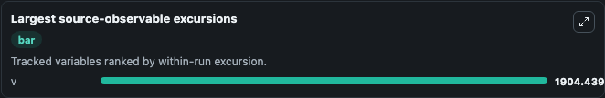
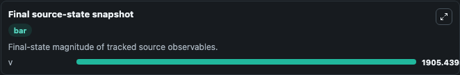

# Walsh2014 - Inhibition kinetics of DAPT on APP Cleavage

This Biosimulant lab wraps `Walsh2014 - Inhibition kinetics of DAPT on APP Cleavage` as a runnable pharmacology model with a companion visualization module.
Walsh2014 - Inhibition kinetics of DAPT onAPP Cleavage This model is described in the article: Are improper kinetic models hampering drug development? It can be used to explore dose-response dynamics and compare treatment scenarios across conditions. It can be used to explore drug-exposure and pathway-response dynamics and compare scenario outcomes across configurations.

## What You'll See

The lab asks: Does DAPT suppress the APP cleavage state under the selected inhibitor concentration? It runs for 60.0 time units with a communication step of 2.0. The run uses the model defaults declared by the curated SBML wrapper. The generated visualizations focus on APP Cleavage State, combining trajectory, endpoint-comparison, and summary-table views from one completed dark-mode run.

In this captured run, **v** peaked at **1905.4** and **v** moved by **1904.0** native units across 60.0 simulation windows.

<!-- BIOSIMULANT_VISUALS_START -->
### Output Visualizations



*Summary table for Walsh2014 - Inhibition kinetics of DAPT on APP Cleavage, reporting the scientific question, observed answer (largest change: **v** at **1904.0** native units), evidence (peak observable: **v**), dominant module, and caveat.*



*Trajectories of v across the 60.0 simulation. In this run **v** climbed from 1.000 to 1905.4 — the largest movements among the focused observables.*



*Largest-excursion ranking of the focused observables — the absolute movement magnitude during the run. Top 1: **v** = 1904.4.*



*Endpoint snapshot of the focused observables — final values from the captured run. Top 1 by value: **v** = 1905.4.*

<!-- BIOSIMULANT_VISUALS_END -->

## Model Context

- Core model: `models/core`
- Visualization model: `models/visualisation`
- Standard: `sbml`
- Upstream source: `biomodels_ebi:BIOMD0000000617`
- License: `CC0`

## Inputs

| Input | Maps To | Default | Notes |
|---|---|---|---|
| Dapt Inhibitor Concentration | `pharmacology_sbml_walsh2014_inhibition_kinetics_of_dapt_on_app_cle_biomd0000000617_model.dapt_inhibitor_concentration` |  | Uses the model default unless overridden at run time. |
| Substrate Concentration | `pharmacology_sbml_walsh2014_inhibition_kinetics_of_dapt_on_app_cle_biomd0000000617_model.substrate_concentration` |  | Uses the model default unless overridden at run time. |
| Cleavage State | `pharmacology_sbml_walsh2014_inhibition_kinetics_of_dapt_on_app_cle_biomd0000000617_model.cleavage_state` |  | Uses the model default unless overridden at run time. |
| Cleavage VMAX 1 | `pharmacology_sbml_walsh2014_inhibition_kinetics_of_dapt_on_app_cle_biomd0000000617_model.cleavage_vmax_1` |  | Uses the model default unless overridden at run time. |
| Cleavage VMAX 2 | `pharmacology_sbml_walsh2014_inhibition_kinetics_of_dapt_on_app_cle_biomd0000000617_model.cleavage_vmax_2` |  | Uses the model default unless overridden at run time. |

## Outputs

| Output | Maps To | Role |
|---|---|---|
| `state` | `pharmacology_sbml_walsh2014_inhibition_kinetics_of_dapt_on_app_cle_biomd0000000617_model.state` | Available to the visualization model and downstream workflows. |
| `summary` | `pharmacology_sbml_walsh2014_inhibition_kinetics_of_dapt_on_app_cle_biomd0000000617_model.summary` | Available to the visualization model and downstream workflows. |
| `species_labels` | `pharmacology_sbml_walsh2014_inhibition_kinetics_of_dapt_on_app_cle_biomd0000000617_model.species_labels` | Available to the visualization model and downstream workflows. |
| `app_cleavage_state` | `pharmacology_sbml_walsh2014_inhibition_kinetics_of_dapt_on_app_cle_biomd0000000617_model.app_cleavage_state` | Available to the visualization model and downstream workflows. |

## Runtime

- Duration: `60.0`
- Communication step: `2.0`

## Running Locally

```bash
biosimulant labs serve .
```
