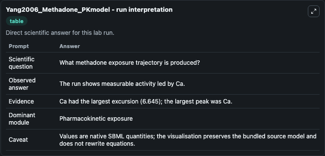
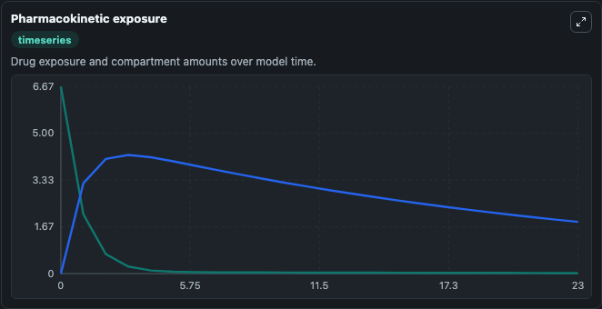
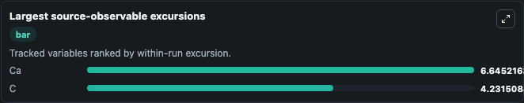
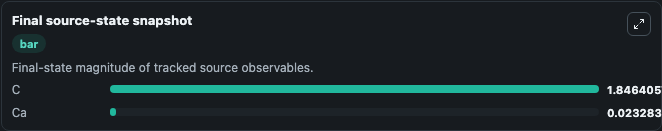

# Yang2006_Methadone_PKmodel

This Biosimulant lab wraps `Yang2006_Methadone_PKmodel` as a runnable pharmacology model with a companion visualization module.
This a model from the article: Population-based analysis of methadone distribution and metabolism using anage-dependent physiologically based pharmacokinetic model. It can be used to explore drug-exposure and pathway-response dynamics and compare scenario outcomes across configurations.

## What You'll See

The lab asks: What methadone exposure trajectory is produced by the selected initial state and metabolism parameters? It runs for 24.0 time units with a communication step of 1.0. The run uses the model defaults declared by the curated SBML wrapper. The generated visualizations focus on Methadone Absorption State, and Methadone Concentration, combining trajectory, endpoint-comparison, and summary-table views from one completed dark-mode run.

In this captured run, **Ca** peaked at **6.668** and **Ca** moved by **6.645** native units across 24.0 simulation windows.

<!-- BIOSIMULANT_VISUALS_START -->
### Output Visualizations



*Summary table for Yang2006_Methadone_PKmodel, reporting the scientific question, observed answer (largest change: **Ca** at **6.645** native units), evidence (peak observable: **Ca**), dominant module, and caveat.*



*Trajectories of Ca, and C across the 24.0 simulation. In this run **C** climbed from 0 to 1.846 and **Ca** fell from 6.668 to 0.0233 — the largest movements among the focused observables.*



*Largest-excursion ranking of the focused observables — the absolute movement magnitude during the run. Top 2: **Ca** = 6.645, **C** = 4.232.*



*Endpoint snapshot of the focused observables — final values from the captured run. Top 2 by value: **C** = 1.846, **Ca** = 0.0233.*

<!-- BIOSIMULANT_VISUALS_END -->

## Model Context

- Core model: `models/core`
- Visualization model: `models/visualisation`
- Standard: `sbml`
- Upstream source: `biomodels_ebi:MODEL1006230040`
- License: `CC0`

## Inputs

| Input | Maps To | Default | Notes |
|---|---|---|---|
| Initial Methadone Absorption State | `pharmacology_sbml_yang2006_methadone_pkmodel_model1006230040_model.initial_methadone_absorption_state` |  | Uses the model default unless overridden at run time. |
| Initial Methadone Concentration | `pharmacology_sbml_yang2006_methadone_pkmodel_model1006230040_model.initial_methadone_concentration` |  | Uses the model default unless overridden at run time. |
| Metabolism VMAX | `pharmacology_sbml_yang2006_methadone_pkmodel_model1006230040_model.metabolism_vmax` |  | Uses the model default unless overridden at run time. |
| Metabolism KM | `pharmacology_sbml_yang2006_methadone_pkmodel_model1006230040_model.metabolism_km` |  | Uses the model default unless overridden at run time. |

## Outputs

| Output | Maps To | Role |
|---|---|---|
| `state` | `pharmacology_sbml_yang2006_methadone_pkmodel_model1006230040_model.state` | Available to the visualization model and downstream workflows. |
| `summary` | `pharmacology_sbml_yang2006_methadone_pkmodel_model1006230040_model.summary` | Available to the visualization model and downstream workflows. |
| `species_labels` | `pharmacology_sbml_yang2006_methadone_pkmodel_model1006230040_model.species_labels` | Available to the visualization model and downstream workflows. |
| `methadone_absorption_state` | `pharmacology_sbml_yang2006_methadone_pkmodel_model1006230040_model.methadone_absorption_state` | Available to the visualization model and downstream workflows. |
| `methadone_concentration` | `pharmacology_sbml_yang2006_methadone_pkmodel_model1006230040_model.methadone_concentration` | Available to the visualization model and downstream workflows. |

## Runtime

- Duration: `24.0`
- Communication step: `1.0`

## Running Locally

```bash
biosimulant labs serve .
```
