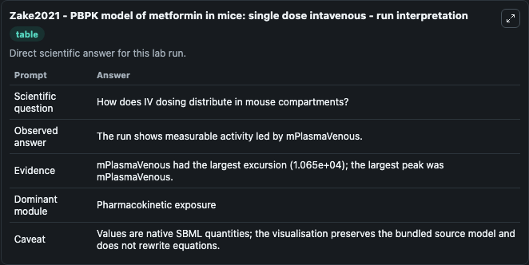
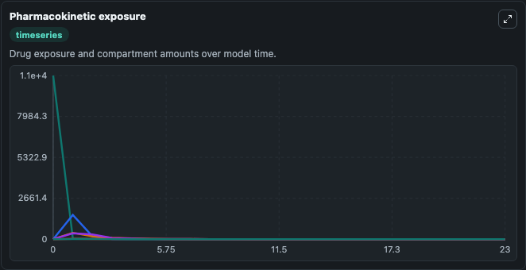
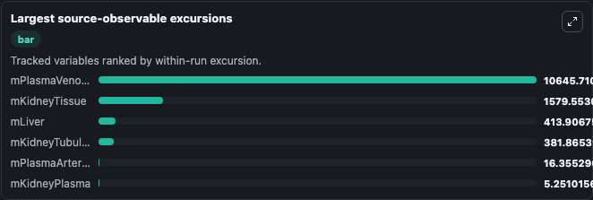
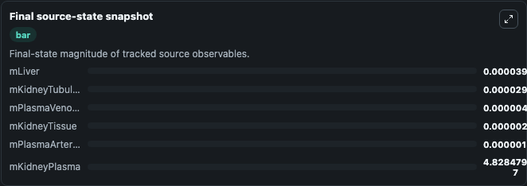

# Zake2021 - PBPK model of metformin in mice: single dose intavenous

This Biosimulant lab wraps `Zake2021 - PBPK model of metformin in mice: single dose intavenous` as a runnable pharmacology model with a companion visualization module.
This model is supplementary material of publication 'Physiologically based metformin pharmacokinetics model of mice and scale-up to humans for the estimation of concentrations in various tissues'by Da. It can be used to explore drug-exposure and pathway-response dynamics and compare scenario outcomes across configurations.

## What You'll See

The lab asks: How does IV metformin distribute across mouse plasma, liver, and kidney compartments? It runs for 24.0 time units with a communication step of 1.0. The run uses the model defaults declared by the curated SBML wrapper. The generated visualizations focus on Kidney Plasma Metformin, Liver Metformin, Venous Plasma Metformin, Arterial Plasma Metformin, Kidney Tissue Metformin, and Kidney Tubular Metformin, combining trajectory, endpoint-comparison, and summary-table views from one completed dark-mode run.

In this captured run, **mPlasmaVenous** peaked at **1.06e+04** and **mPlasmaVenous** moved by **1.06e+04** native units across 24.0 simulation windows.

<!-- BIOSIMULANT_VISUALS_START -->
### Output Visualizations



*Summary table for Zake2021 - PBPK model of metformin in mice: single dose intavenous, reporting the scientific question, observed answer (largest change: **mPlasmaVenous** at **1.06e+04** native units), evidence (peak observable: **mPlasmaVenous**), dominant module, and caveat.*



*Trajectories of mPlasmaVenous, mKidneyTissue, mLiver, mKidneyTubular, mPlasmaArterial, and mKidneyPlasma across the 24.0 simulation. In this run **mLiver** climbed from 0 to 3.97e-05 and **mPlasmaVenous** fell from 1.06e+04 to 4.6e-06 — the largest movements among the focused observables.*



*Largest-excursion ranking of the focused observables — the absolute movement magnitude during the run. Top 3: **mPlasmaVenous** = 1.06e+04, **mKidneyTissue** = 1579.6, **mLiver** = 413.9, with 3 more observables below.*



*Endpoint snapshot of the focused observables — final values from the captured run. Top 3 by value: **mLiver** = 3.97e-05, **mKidneyTubular** = 2.99e-05, **mPlasmaVenous** = 4.6e-06, with 3 more observables below.*

<!-- BIOSIMULANT_VISUALS_END -->

## Model Context

- Core model: `models/core`
- Visualization model: `models/visualisation`
- Standard: `sbml`
- Upstream source: `biomodels_ebi:BIOMD0000001039`
- License: `CC0`

## Inputs

| Input | Maps To | Default | Notes |
|---|---|---|---|
| Metformin Plasma Dose Mg | `pharmacology_sbml_zake2021_pbpk_model_of_metformin_in_mice_single_biomd0000001039_model.metformin_plasma_dose_mg` |  | Uses the model default unless overridden at run time. |
| Metformin Lumen Dose Mg | `pharmacology_sbml_zake2021_pbpk_model_of_metformin_in_mice_single_biomd0000001039_model.metformin_lumen_dose_mg` |  | Uses the model default unless overridden at run time. |
| Body Weight G | `pharmacology_sbml_zake2021_pbpk_model_of_metformin_in_mice_single_biomd0000001039_model.body_weight_g` |  | Uses the model default unless overridden at run time. |
| Cardiac Output Ml Per Min | `pharmacology_sbml_zake2021_pbpk_model_of_metformin_in_mice_single_biomd0000001039_model.cardiac_output_ml_per_min` |  | Uses the model default unless overridden at run time. |

## Outputs

| Output | Maps To | Role |
|---|---|---|
| `state` | `pharmacology_sbml_zake2021_pbpk_model_of_metformin_in_mice_single_biomd0000001039_model.state` | Available to the visualization model and downstream workflows. |
| `summary` | `pharmacology_sbml_zake2021_pbpk_model_of_metformin_in_mice_single_biomd0000001039_model.summary` | Available to the visualization model and downstream workflows. |
| `species_labels` | `pharmacology_sbml_zake2021_pbpk_model_of_metformin_in_mice_single_biomd0000001039_model.species_labels` | Available to the visualization model and downstream workflows. |
| `kidney_plasma_metformin` | `pharmacology_sbml_zake2021_pbpk_model_of_metformin_in_mice_single_biomd0000001039_model.kidney_plasma_metformin` | Available to the visualization model and downstream workflows. |
| `liver_metformin` | `pharmacology_sbml_zake2021_pbpk_model_of_metformin_in_mice_single_biomd0000001039_model.liver_metformin` | Available to the visualization model and downstream workflows. |
| `venous_plasma_metformin` | `pharmacology_sbml_zake2021_pbpk_model_of_metformin_in_mice_single_biomd0000001039_model.venous_plasma_metformin` | Available to the visualization model and downstream workflows. |
| `arterial_plasma_metformin` | `pharmacology_sbml_zake2021_pbpk_model_of_metformin_in_mice_single_biomd0000001039_model.arterial_plasma_metformin` | Available to the visualization model and downstream workflows. |
| `kidney_tissue_metformin` | `pharmacology_sbml_zake2021_pbpk_model_of_metformin_in_mice_single_biomd0000001039_model.kidney_tissue_metformin` | Available to the visualization model and downstream workflows. |
| `kidney_tubular_metformin` | `pharmacology_sbml_zake2021_pbpk_model_of_metformin_in_mice_single_biomd0000001039_model.kidney_tubular_metformin` | Available to the visualization model and downstream workflows. |

## Runtime

- Duration: `24.0`
- Communication step: `1.0`

## Running Locally

```bash
biosimulant labs serve .
```
